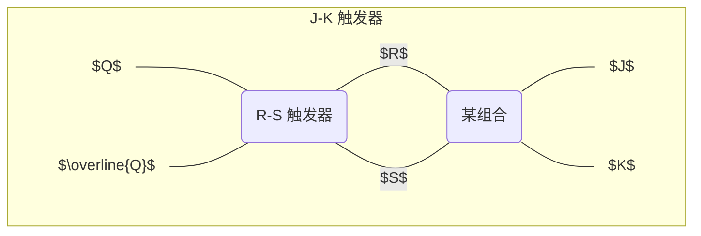
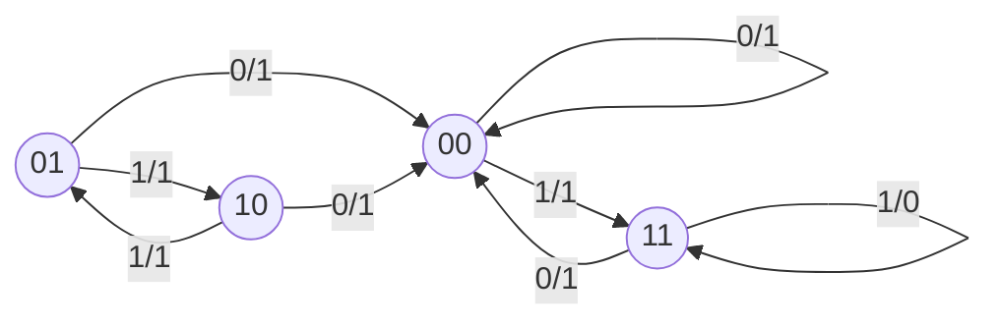
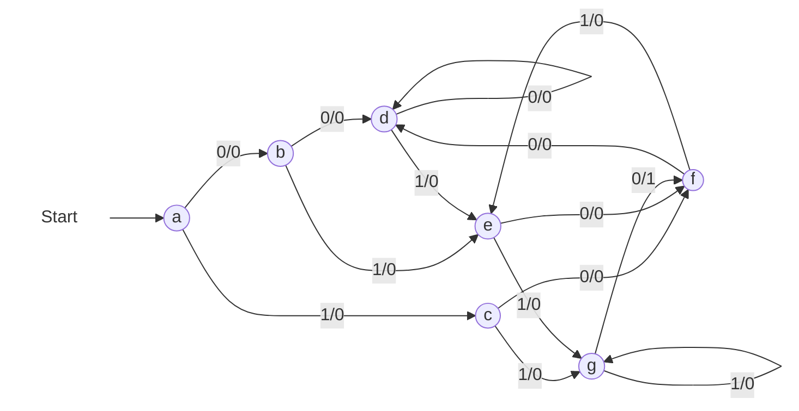
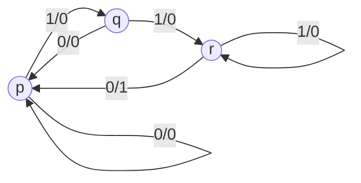
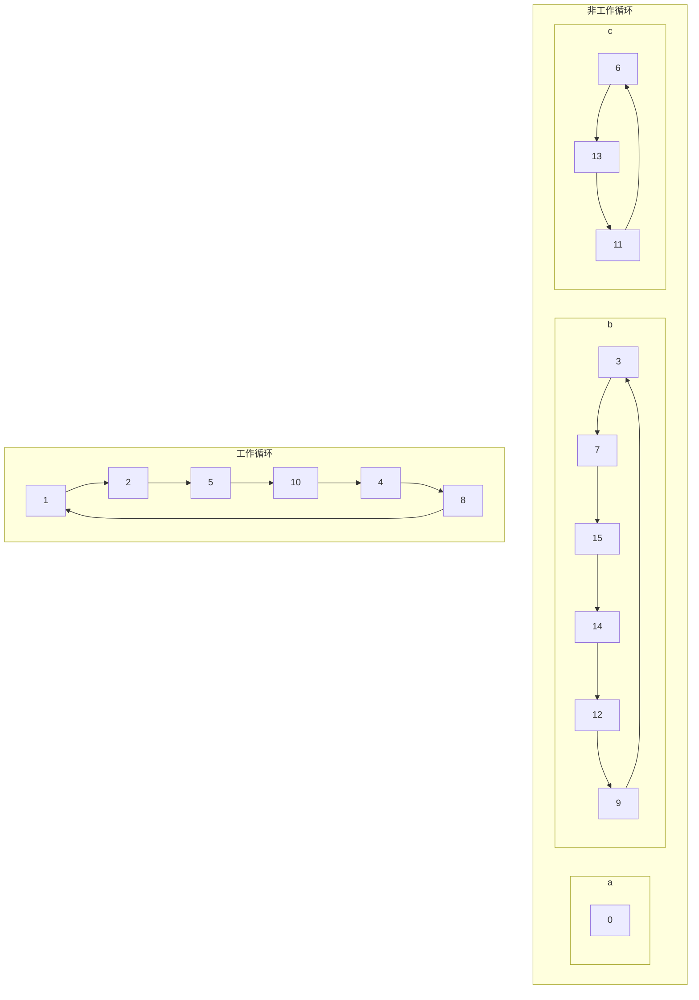
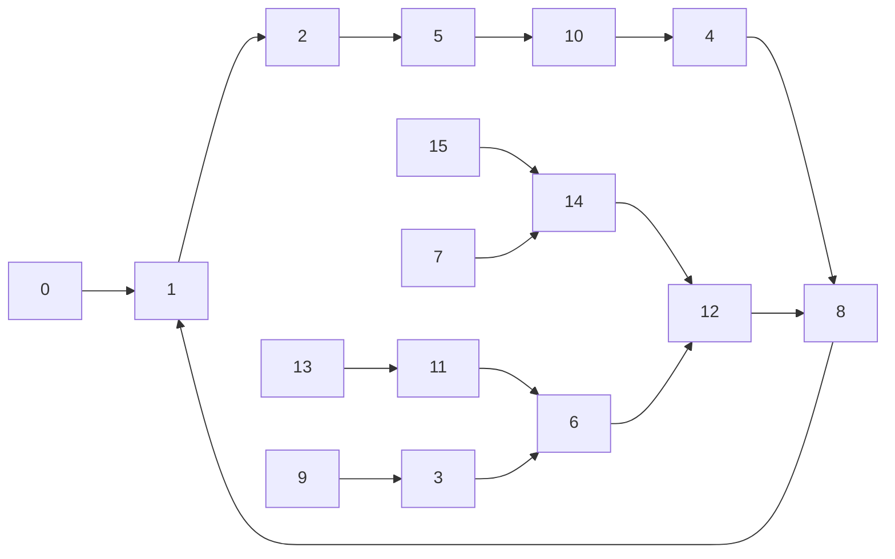

这是《数字逻辑与数字集成电路（第2版）》的学习笔记。

> 你知道全加器的四种画法吗？

> 2023 年春季学期考过一次全加器，2024 年春应该不会再考一次了吧？

<!--more-->

## 第 1 章 数制和编码

### 十进制数的二进制编码

#### 8421 码（BCD 码）

8421 码是一种有权码，由于从高到低位权分别为 $8, 4, 2, 1$ 而得名。二进制数 $1010 \sim 1111$ 在 8421 码中没有意义。

#### 5421 码

5421 码是一种有权码，由于从高到低位权分别为 $5, 4, 2, 1$ 而得名。由于部分十进制数字（例如 $5$ 到底是 $1000$ 还是 $0101$？）的表示可能**会有歧义**，故在实际运用中需要指定码表。

#### 2421 码

2421 码是一种有权码，由于从高到低位权分别为 $2, 4, 2, 1$ 而得名。歧义性同 5421 码。

#### 余三码

余三码是一种无权码，由 8421 码加 $(0011)_2$ 而命名。两个余三码 $a, b$ 相加的规则是

- 如果 $a + b \le 9$，即没有产生进位，则和为 $a + b - 0011$。
- 如果 $a + b \ge 10$，则产生进位，所以和为 $10000 + (a + b - 0011) - 1010 = a + b + 0011$。
  - 注意，这里的 $10000 = 1010$，前者的 $1$ 代表着第二个“四位一组”的最低位，由于余三码本质是逢 $10$ 进 $1$，故 $10000 = (10)_{10} = 1010$。

> 规则可以简记为：如果两个余三码相加没有进位，则和数要减 $3$；否则和数要加 $3$。

### 格雷码

格雷码是一种无权码，特点是**任何两个相邻的十进制数的格雷码仅有一位不同**（Hamming distance 为 $1$）。使用它可以减少代码变换中电路瞬间产生的错误，可靠性较好。

#### 格雷码 1

是一种**反射码**，因为 $x$ 和 $10 - x$ 恰好仅有最高位相反。

#### 典型格雷码

假设待编码数 $x = \sum_{i = 0}^{n - 1}b_i\cdot2^i$，则典型格雷码 $y = \sum_{i = 0}^{n - 1} = g_i\cdot 2^i$ 满足 $g_i = b_{i +1}\oplus b_i$。

#### 修改格雷码

修改格雷码等于典型格雷码加 $(0011)_2$。

### ASCII 码

- 数字：高三位 $011$。
- 大写字母：高三位 $100$。
- 小写字母：高三位 $110$。

~~说明人们在设计 ASCII 的时候还是动了脑子的。~~

## 第 2 章 逻辑代数及逻辑函数的化简

### 逻辑代数的基本原理

#### 基本公式

个人认为最重要的公式只有一个：
$$
(\text{consensus})\;
\begin{cases}
AB + \overline{A}C + BC = AB + \overline{A}C \\
(A+B)(\overline{A}+C)(B+C) = (A+B)(\overline{A}+C)
\end{cases}
$$
与运算的吸收律是 $B = \text{T}$ 的特例：
$$
\text{(absorption)}\; A + \overline{A}C = A + C
$$

> 使用公式法化简，最终很容易忘记使用吸收律。例如，得到答案
> $$
> AD+ BC + \overline{A}
> $$
> 是不对的，应为 $D + BC + \overline{A}$。

#### 反演规则和对偶规则

**反演规则**本质上是 De Morgan 律的使用。$\overline{F}$ 是 $F$ 经过以下操作：

- 将所有“与”替换为“或”，“或”替换为“与”
- 将所有变量替换为反变量，反变量替换为原变量
- 将所有 $0$ 替换为 $1$，$1$ 替换为 $0$

之后得到的结果。反演规则可以帮助我们方便地求出一个函数的反函数。

**对偶规则**是指，对偶式 $F'$ 是 $F$ 经过以下操作：

- 将所有“与”替换为“或”，“或”替换为“与”
- 将所有 $0$ 替换为 $1$，$1$ 替换为 $0$

之后得到的结果。关于对偶规则有一个显然的结论：如果 $F = G$，则 $F' = G'$。

显然，$(F')' = F$。

#### 附加公式（不考）

**附加公式**本质上是一种通过枚举函数 $f$ 中的某一变量 $x$ 的真假来化简函数的方法。

附加公式一：
$$
\begin{align*}
x \cdot f(x, \overline{x}, y, \cdots, z) & = x \cdot f(1, 0, y, \cdots, z) \\
\overline{x} \cdot f(x, \overline{x}, y, \cdots, z) & = \overline{x} \cdot f(0, 1, y, \cdots, z) \\
x + f(x, \overline{x}, y, \cdots, z) & = x + f(0, 1, y, \cdots, z) \\
\overline{x} + f(x, \overline{x}, y, \cdots, z) & = \overline{x} + f(1, 0, y, \cdots, z)
\end{align*}
$$
附加公式二：
$$
\begin{align*}
f(x, \overline{x}, y, \cdots, z) & = x\cdot f(x, \overline{x}, y, \cdots, z) + \overline{x} \cdot f(x, \overline{x}, y, \cdots, z) \\
& = x\cdot f(1, 0, y, \cdots, z) + \overline{x} \cdot f(0, 1, y, \cdots, z) \\
f(x, \overline{x}, y, \cdots, z) & = [x + f(x, \overline{x}, y, \cdots, z)]\cdot[\overline{x} + f(x, \overline{x}, y, \cdots, z)] \\
& = [x + f(0, 1, y, \cdots, z)]\cdot[\overline{x} + f(1, 0, y, \cdots, z)]
\end{align*}
$$

### 逻辑函数的化简

化简的要求：

1. “与”项（即乘积项）的个数最少；
2. 在满足上述条件的情况下，每个乘积项的变量数最少。

#### 公式法

个人认为最常见的是这个循环对称式：
$$
A\overline{B} + B\overline{C} + \overline{A}C
$$
事实上，它可能还会以其他形式出现：
$$
\begin{align*}
A\overline{B} + B\overline{C} + \overline{A}C & = A\overline{B} + B\overline{C} + \overline{A}C + (\overline{A}B + \overline{B}C + A\overline{C}) \\
& = A\overline{B} + B\overline{C} + \overline{A}C + \overline{A}B \\
& = \cdots
\end{align*}
$$
也就是说，这个循环对称式可以加上“所有变量取反后得到的另一个循环不变式”中的**任意子集**。

有时也会出现
$$
\overline{A}\;\overline{B} + A\overline{C} + BC,
$$
只需要看出它是 $B \gets{\overline{B}}$ 的一个代入即可。

#### Karnaugh 图法

**Karnaugh 图的构造**：二至五变量的表格横纵坐标分别为 $B\backslash A, C\backslash BA, DC\backslash BA, ED\backslash CBA$，可以看出个数是增加到行/增加到列交替进行的。横纵编号，相邻两个的变化也是有规律的：从最右侧的一位开始，考虑该位被翻转后得到的数字是否已经出现过，如果出现过则按从右到左的顺序考虑下一位；否则写下这个数字。

例如五变量 Karnaugh 图的横坐标：首先是 $000$，然后发现最右侧一位翻转得到的 $001$ 并未出现过，所以写下 $001$。$001$ 的最右侧一位翻转得到的 $000$ 出现过，所以考虑右数第二位翻转，即 $011$。此时最右侧一位翻转得到的 $010$ 并未出现过，写下 $010$。以此类推，得到
$$
000,001,011,010,110,111,101,100.
$$
**Karnaugh 图的化简**：包含一个最小项的小方块被称为 $0$ 维块，包含 $2$ 个 $n$ 维块的块被称为 $n+1$ 维块。Karnaugh 图化简的目的在于

最终覆盖所有值为 $1$ 的最小项，且所用覆盖尽可能用高维块。

- 左右边界是“循环”的，所以也相邻；
- 同理可以推出，四个角的方块也相邻；
- 五变量卡诺图注意“相重”，即左右对称。

似乎题干有误，最后一项应为 $A\overline{B}CD\overline{E}$。上述例子中重点之一在于利用“相重”写出 $ABE$ 这一项。

> 需要注意的一点是，如果一个**高维块被几个必需的低维块所覆盖**，则**不应包含**该高维块。
>
> 每次 Karnaugh 图化简完后，一定要检查是否有冗余的块！

求某一函数 $F$ 的反函数的化简也可以使用卡诺图：考虑覆盖为 $0$ 的块即可。

#### Quine-McCluskey 化简法（不考）

~~这玩意儿是真复杂，要是手算真不如 Karnaugh 图。~~

~~不考。亏我还看书看了那么长时间。~~

Quine-McCluskey 化简法遵循两个步骤：

1. 求出全部的质蕴含项；
2. 从质蕴含项中选出必要质蕴涵项。

**求出全部的质蕴含项**：

- 对于函数内出现过的最小项按照二进制数取值中 $1$ 的个数由少至多分组，每组内最小项按照从小到大排列。
- 相邻组看是否能合并，例如：
  - $0001$ 和 $0011$ 合并为 $00-1$；
  - $00-1$ 和 $10-1$ 合并为 $-0-1$。
  - 如果能合并，就在两原项后打 $\checkmark$。
- 直到无法合并为止。此时没有 $\checkmark$ 的项即为质蕴含项，记为 $P_1, P_2, \cdots$。

考虑求 $F = f(A, B, C, D) = \sum m^4(0, 4, 6, 8, 10, 11, 13, 14, 15)$ 的全部质蕴含项过程如下：

**选出必要质蕴含项**：

- 对于两**行**来说，如果 $a$ 行是 $b$ 行的**子集**，那么将 $a$ 行删去；
- 对于两**列**来说，如果 $a$ 行是 $b$ 行的**超集**，那么将 $a$ 行删去。

最终剩下的质蕴含项即为必要质蕴涵项。值得注意的是，行、列消去中先进行哪个消去并不影响简化结果。

仍使用上例，过程如下：

最终必要质蕴含项为 $P_1, P_2, P_3, P_4, P_5$。化简后的答案为
$$
F = P_1 + P_2 + P_3 + P_4 + P_5 = \overline{A}\;\overline{B}CD + \overline{B}\;\overline{C}\;\overline{D} + BC\overline{D} + A\overline{C} + AB.
$$

#### 多输出逻辑函数的 Quine-McCluskey 化简法（不考）

尽管每个函数不是最简，但是只要找到函数的公共“与”项，就能达到最佳的总体效果。

**求出各个函数的公共质蕴含项**：

在表上分别写 $F_1, F_2, \cdots$ 列，用 $\triangle$ 来表示某个最小项属于哪些函数。假设包含 $m_i$ 的函数集合为 $\mathscr{F}$，包含 $m_j$ 的函数集合为 $\mathscr{G}$，则 $m_i$ 和 $m_j$ 可以合并，当且仅当 $m_i$ 和 $m_j$ 相邻，且 $\mathscr{F} \cap \mathscr{G} \neq \varnothing$。

只有当 $\mathscr{F} \subset \mathscr{G}$ 的时候，才能在 $\mathscr{F}$ 的后面打 $\checkmark$。

**选出必要质蕴含项**：

区别在于，列消去只能在在 $F_1, F_2, \cdots$ 每组内使用，而不能跨组使用。行消去和之前的做法相同。最终得到必要质蕴含项表。

**确定每个函数的必要质蕴含项**：

属于多个函数的必要质蕴涵项中只有部分与单一函数有关，所以还需要进一步计算，从中选出每个函数的必要质蕴涵项。对于函数 $F_i$ 而言，把必要质蕴涵表中与 $F_i$ 相关的项单独列出来并进行消去，最终得到 $F_i$ 的必要质蕴涵项。

#### 包含任意项的逻辑函数的化简

**使用 Karnaugh 图**：将任意项的小方块中填入 $\phi$，它可以等于 $1$ 也可以等于 $0$，以最方便的为准（但是一旦确定了之后就必须固定下来）。比如此例中的任意项 $12$，它作为 $0$ 来考虑；而任意项 $3,9,15$ 均作为 $1$ 来考虑。

**使用 Quine-McCluskey 化简法**：将任意项当做最小项之一参与相邻项的合并，但在最后的结果中并不把任意项当做质蕴含项列出，也不参与必要质蕴涵项的筛选。

#### 不同形式逻辑函数的变换及化简（不考）

**“与或”变为“与非-与非”**：两次求反。例如 $F = AB+AC+AD$，
$$
F = \overline{\overline{F}} = \overline{\overline{AB+AC+AD}} = \overline{\overline{AB} \cdot \overline{AC} \cdot \overline{AD}}
$$
**“与或”变为“或非-或非”**：将对偶式求最简与非-与非表达式后再对	回来。例如 $F = AB+A\overline{C}+\overline{A}C$，
$$
\begin{align*}
F' & = (A+B)(A+\overline{C})(\overline{A}+C) \\
& = \overline{A}B\overline{C}+AC+ABC \\
F' & = \overline{\overline{F'}} \\
& = \overline{\overline{\overline{A}B\overline{C}+AC+ABC}} \\
& = \overline{\overline{\overline{A}B\overline{C}} \cdot \overline{AC} \cdot \overline{ABC}} \\
F & = (F')' \\
& = \overline{\overline{\overline{A} + B +\overline{C}} + \overline{A + C} + \overline{A + B + C}}
\end{align*}
$$
**“与或”变为“或与非”**：（用 Karnaugh 图等方式）求出 $\overline{F}$ 的与或表达式 $G$，再求 $\overline{G}$。例如 $F = AB+\overline{B}\;\overline{C}+ AB\overline{C}+\overline{A}B\overline{C}+\overline{A}\;\overline{B}\;\overline{C}$。

用 Karnaugh 图求得 $\overline{F} = \overline{A}C+\overline{B}C$，则
$$
\begin{align*}
F & = \overline{\overline{F}} \\
& = \overline{\overline{A}C+\overline{B}C}
\end{align*}
$$
**“与或”变为“或与”**：同“或与非”，只是最后还需要再化简一次，例如上例中 $F = \overline{\overline{A}C+\overline{B}C}$。
$$
\begin{align*}
F & = \overline{\overline{A}C+\overline{B}C} \\
& = (A+\overline{C})(B+\overline{C})
\end{align*}
$$
**“或与”变为“或非-或非”**：对偶-化简-对偶-两次求反。例如 $F = (\overline{A}+\overline{B})(\overline{A}+\overline{C}+\overline{D})(A+C)(B+\overline{C})$。
$$
\begin{align*}
F' & = \overline{A}\;\overline{B} + \overline{A}\;\overline{C}\;\overline{D}+AC+B\overline{C} \\
& = \overline{A}\;\overline{B} + AC + B\overline{C} \\
F & = (F')' \\
& = (\overline{A}+\overline{B})(A+C)(B+\overline{C}) \\
F & = \overline{\overline{F}} \\
& = \overline{\overline{(\overline{A}+\overline{B})(A+C)(B+\overline{C})}} \\
& = \overline{\overline{\overline{A}+\overline{B}} + \overline{A+C} + \overline{B+\overline{C}}}
\end{align*}
$$

## 第 3 章 集成门电路与触发器

### 组合逻辑电路引言

#### 组合逻辑电路的特点

电路的输出仅与输入的当前状态有关，和过去的状态无关；区别于与过去的状态有关的**时序逻辑电路**。

#### 集成逻辑电路的分类

- 按**功能**分类：
  - 模拟电路
  - 数字电路
- 按**半导体制造工艺**分类：
  - TTL
  - MOS
- 按**封装（外形）**分类：
  - 双列直插
  - 表面封装
  - BGA（Ball Grid Array）
  - PLCC
- 按**集成规模**分类：小、中、大、超大（Very Large）、甚大（Ultra Large）规模集成电路

#### 两大类半导体制造工艺技术的特点

| 工艺技术 | 速度 | 功耗 | 集成度 |
| :------: | :--: | :--: | :----: |
|   TTL    |  快  |  大  |   低   |
|   MOS    |  慢  |  小  |   高   |

目前常用器件使用 CMOS（互补金属氧化物半导体）工艺。

### TTL 门电路

#### 正逻辑与负逻辑

**正逻辑**：高电平为 $1$，低电平为 $0$，即 $\text{H} = 1, \text{L} = 0$；

**负逻辑**：高电平为 $0$，低电平为 $1$，即 $\text{H} = 0, \text{L} = 1$。

在不同逻辑下，同一个逻辑门电路实现的功能不同，例如

|    $A$     | $B$  | $F$  |
| :--------: | :--: | :--: |
|    $\text{L}$    | $\text{L}$  | $\text{H}$  |
| $\text{H}$ | $\text{L}$  | $\text{H}$  |
|    $\text{L}$    | $\text{H}$  | $\text{H}$  |
| $\text{H}$ | $\text{H}$  | $\text{L}$  |

在正逻辑下表示与非门 $F = \overline{AB}$，但在负逻辑下表示或非门 $F = \overline{A+B}$。

> **注意**：本博客遵循教材和 PPT 的习惯，采用**正逻辑**。

#### 典型的 TTL 门电路（不考）

~~学不会；幸亏不考。~~

#### TTL 与非门电路的外部特性与级联

**技术参数**：

- 扇入：一个门的可用**输入**数目
- 扇出：一个门的输出可以**驱动**的标准门个数
- 功耗：逻辑门消耗的能量，以热的形式散发
- ……

**传输延迟**：从输入传输到输出所需要的时间。电路的处理速度与电路门的最大传输延迟成反比例关系。

- 最大值和最小值的 $50\%$ 点作为时间参考点
- 高到低（$t_{\text{PHL}}$）或低到高（$t_{\text{PLH}}$）的输出信号改变可能有不同的传输延迟：
  $$
  t_{\text{Pd}} = \dfrac{1}{2}(t_{\text{PHL}} + t_{\text{PLH}}).
  $$
- 高到低或低到高跃迁是根据**输出关系**定义的，而不是输入关系。
  - 如果是非门，则输出和输入跃迁相反
  - 如果是同相门，则输出和输入跃迁相同
  
  也就是说，看的是**输出信号**是从低到高还是从高到低跃迁。
- 测量传输延迟
  $$
  t_{\text{Pd}} = \frac{1}{\text{number of gates}} \cdot \frac{t_{\text{Pd}_1} + t_{\text{Pd}_2}}{2}.
  $$
- 传输延迟的一个应用是**自激震荡**
  
  最后一个门输出的信号与最先一个门输入的信号相反，则会产生自激震荡。
  
  > **注意**：自激振荡的周期是 $2t_{\text{Pd}} \cdot \text{number of gates}$，原因是一个门会有上升沿和下降沿两次延迟。

**转移特性**：门电路中输出电压随输入电压的变化特性。

在曲线上 $V_{\text{OUT}}$ 急剧下降时的 $V_{\text{IN}}$ 称为阈值电压 $V_{\text{T}}$，也称门槛电压。

**直流参数**：

| 输入端 |                输入电流                |               输出电流               |                     输出电压                      |
| :----: | :------------------------------------: | :----------------------------------: | :-----------------------------------------------: |
|  $0$   |  $I_{\text{IL}} \le 1.6\;\mathrm{mA}$  | $I_{\text{OH}} \le 0.4\;\mathrm{mA}$ |  $V_{\text{OH}} \ge 3\;\mathrm{V}$（10 个负载）   |
|  $1$   | $I_{\text{IH}} \le 40\;\mathrm{\mu A}$ | $I_{\text{OL}} \le 16\;\mathrm{mA}$  | $V_{\text{OL}} \le 0.35\;\mathrm{V}$（10 个负载） |

**噪音容限**：在前一级输出为最坏的情况下，为保证后一级正常工作，所允许的最大噪声幅度。噪音容限时叠加到正常输入值的最大的外部噪音电压，它不会在电路的输出产生不可预料的变化。

图中假设 $V_{\text{O}} = f(V_{\text{I}})$，则在确定 $V_{\text{ON}}$ 和 $V_{\text{OFF}}$ 后，有
$$
\begin{align*}
V_{\text{NL}} = V_{\text{OFF}} - f(V_{\text{ON}}), \\
V_{\text{NH}} = f(V_{\text{OFF}}) - V_{\text{ON}}.
\end{align*}
$$
$V_{\text{NL}}$ 的意义是，可将低电平输入信号 $\text{L}$ 破坏的最小噪声，$V_{\text{NH}}$ 的意义是，可将高电平输入信号 $\text{H}$ 破坏的最小噪声。

#### TTL 与非门电路的级联

**级联**：前一个器件的输出就是后一个器件的输入，后一个是前一个的负载，两者要相互影响。

**负载计算**：
$$
\begin{align*}
I_{\text{OH}} = N \cdot I_{\text{IH}}, \\
I_{\text{OL}} = N \cdot I_{\text{IL}}.
\end{align*}
$$
当负载数量超过理论值时，门电路进入非正常工作状态。负载大于与非门承受能力时，**低电平变高，高电平变低**。

#### 集电极开路（OC）与非门

**线与逻辑**：两个输出端（包括两个以上）直接互连就可以实现逻辑与的逻辑功能。

**普通与非门线与的问题**

普通与非门不能直接线与在一起，因为 Totem 输出结构的电路，是不能把它们的输出线与在一起的。

否则，当一门电路的输出为 $H$，另一门输出为 $L$ 时，有大电流从 $H$ 端流向 $L$ 端，电流太大，会烧坏与非门。

**集电极开路输出（OC）与非门**

缺点：由于 OC 门输出不是 Totem 结构，电路的上升延迟很大。

- T5 退饱和很慢。
- 对输出负载的充电电流只能通过外接的 $R_{\text{L}}$ 来提供。因此，输出波形的上升沿时间很大。
- 采用 OC 门只适合速度较慢的电路，对于速度要求较快（例如 CPU 的数据总线），就不能使用 OC 门。

> **注意**：OC 门**不可以**和普通与非门实现线与。

#### 三态门

**特点**：

- 三态门电路既保留了 Totem 输出结构，又具有 OC 门输出可以“线与”的特点
- 完成“线与”逻辑的**速度较快**

**功能表**：

> **注意**：这里的 $\overline{G}$ 是一个记号，是一个整体，而不是 $G$ 的补。

| $A$  | $B$  | $\overline{G}$ |         $F$          |
| :--: | :--: | :------------: | :------------------: |
|  -   |  -   |      $0$       | $\text{Z}$（高阻态） |
| $0$  | $0$  |      $1$       |    $1$（正常态）     |
| $1$  | $0$  |      $1$       |    $1$（正常态）     |
| $0$  | $1$  |      $1$       |    $1$（正常态）     |
| $1$  | $1$  |      $1$       |    $0$（正常态）     |

值得注意的是，三态门有不止一种画法，不同的三态门的功能表并不相同；但它们的共同点是，从侧面**输入**的信号如果为 $0$，则为高阻态；否则为正常态。

例如下面的第一种三态门，$\overline{G} = 1$，经过非门导致三态门的侧面输入实际为 $0$，因此为高阻态。

**应用**：

- 两个三态门和总线（BUS）通过线与相连
  
  
  - 同时只能有一个三态门处于正常态，否则门 1、2 输出间有很大的浪涌电流从而影响 BUS 正常工作
    - 因此，三态电路由正常态转到高阻态的延迟，应小于由高阻态转到正常态的延迟
    - 状态转换时应**先将正常态的一方转为高阻态**，**再将高阻态的一方转为正常态**
  
- 1 位双向总线驱动器（Transceiver，收发器）
  
  
  图中箭头方向即为数据传输方向，也是电流传输方向。
  
- 4 位双向总线驱动器
  
  
  > **注意**：此例中 $E = 0$ 为读操作，$E = 1$ 为写操作；与上一例子相反。 
  
  

  整体的规律是：
  
  - 首先判断哪个三态门是输入的工作端（正常态）
  - 然后判断总线是高电平还是低电平
    - 如果是高电平（$1$ 态），则其余（包括高阻态）电流都朝外
    - 如果是低电平（$0$ 态），则其余（包括高阻态）电流都朝里
  - 最后标注电流符号
    - 输入端
      - 如果是正常态的三态门，则为 $I_{\text{OH}}$ 或 $I_{\text{OL}}$
      - 如果是高阻态的三态门，则为 $I_{\text{OZ}}$
    - 输出端
      - 如果是正常态的三态门，则为 $I_{\text{IH}}$ 或 $I_{\text{IL}}$
      - 如果是高阻态的三态门，则为 $I_{\text{IZ}}$
    - 这里输入端为 $I_{\text{O}}$，输出端为 $I_{\text{I}}$ 的原因是，电流符号是相对于**三态门**的。输入端与 BUS 相连的导线恰为三态门的输出，故为 $I_{\text{O}}$。

> **注意**：三态门在保证控制信号符合三态门要求的情况下可以线与，其他情况均不可以线与。

### 触发器

触发器是一种存储 1 位二进制数的记忆元件，英文缩写为 FF（Flip-flop）。

触发器可以按照触发（时钟控制）方式分类，也可以按照功能分类。

**按时钟控制分类**：

- 电位触发（Level Trigger）方式 FF
- 边沿触发（Edge Trigger）方式 FF
- 主-从触发（Master-slave，或称为 Pulse Trigger）方式 FF

**按功能分类**：

- D 触发器（Delay）
- R-S 触发器（Reset-set）
- J-K 触发器
- T 触发器（Toggle）

#### 基本 R-S 触发器

**基本组成**

R-S 触发器有两个输入端 $R, S$ 和两个输出端 $Q, \overline{Q}$。当触发器正常工作时，$Q$ 和 $\overline{Q}$ 两个输出端为互补关系。

一般规定用 $Q$ 的状态代表触发器的状态：

- 若 $Q = 0, \overline{Q} = 1$，则称触发器处于“0”状态，也称**置位**状态。
- 若 $Q = 1, \overline{Q} = 0$，则称触发器处于“1”状态，也称**复位**状态。

一般称 $S$ 为置“1”端，也称置位端；称 $R$ 为置“0”端，也称复位端。

- 实质上，与非门构成的触发器的状态变化，是由在输入端引入“0”引起的。
- 若 $S = R = 1$，则 $Q = \overline{Q} = 1$，破坏了触发器所规定的 $Q$ 和 $\overline{Q}$ 的互补关系，此时触发器**既不表示“1”状态，也不表示“0”状态**。

  > **注意**：此时当 $S, R$ 同时由“0”跳变成“1”时，触发器究竟变成“0”还是“1”状态是随机的，触发器状态将是不确定的。
- 正常工作条件：$\overline{R}\;\overline{S} = 0$。

**逻辑图**

**功能表**

| $R$  | $S$  |  $Q$  |  $\overline{Q}$  |
| :--: | :--: | :---: | :--------------: |
| $1$  | $0$  |  $0$  |       $1$        |
| $0$  | $1$  |  $1$  |       $0$        |
| $1$  | $1$  | $Q_0$ | $\overline{Q_0}$ |
| $0$  | $0$  | $1^*$ |      $1^*$       |

> **注意**：R-S 触发器也有不同的画法，例如将上例中的与非门改为或非门（或是，改为与或非门）。此时，功能表也会有相应的变化。可以通过观察 $R = S = 1$ 和 $R = S = 0$ 判断出哪一种输入描述的是非法工作状态，以及此时 $Q = \overline{Q} = 0$ 还是 $Q = \overline{Q} = 1$。

#### 电位触发方式的触发器

当触发器的同步控制信号 $E$ 为约定的状态时，触发器接收数据，输入数据的任何变化都会在输出端得到反映。

当 $E$ 为非约定状态时，触发器的状态保持不变。

**某种电位触发器**

此例中，$E = 0$ 为约定状态。

功能表：

| $E$  | $R$  | $S$  |  $Q$  |  $\overline{Q}$  |
| :--: | :--: | :--: | :---: | :--------------: |
| $1$  |  -   |  -   | $Q_0$ | $\overline{Q_0}$ |
| $0$  | $1$  | $1$  | $Q_0$ | $\overline{Q_0}$ |
| $0$  | $0$  | $1$  |  $1$  |       $0$        |
| $0$  | $1$  | $0$  |  $0$  |       $1$        |
| $0$  | $0$  | $0$  | $1^*$ |      $1^*$       |

**R-S 型电位触发器**

为了保证结构的一致性，增加控制端后构成的 R-S 触发器也**全用与非门**。$E = 1$ 为约定状态。

> **注意**：此时 $S$ 和 $R$ 在输入后经过了一级与非门，所以输出端 $Q$ 和 $\overline{Q}$ 的位置与之前有所不同。

功能表：

| $E$  | $R$  | $S$  |  $Q$  |  $\overline{Q}$  |
| :--: | :--: | :--: | :---: | :--------------: |
| $0$  |  -   |  -   | $Q_0$ | $\overline{Q_0}$ |
| $1$  | $0$  | $0$  | $Q_0$ | $\overline{Q_0}$ |
| $1$  | $0$  | $1$  |  $1$  |       $0$        |
| $1$  | $1$  | $0$  |  $0$  |       $1$        |
| $1$  | $1$  | $1$  | $1^*$ |      $1^*$       |

- 特点：当 $E = 0$ 时能保持触发器状态不被破坏。
- 问题：当 $ERS = 1$ 时，同样存在不定状态。

**电位型 D 触发器**

> 如何解决 R-S 型电位触发器 $ERS = 1$ 时仍存在不定状态的问题呢？
>
> **分析**：
>
> - 控制端可以保证状态保持；
> - 当 $\overline{R}\;\overline{S} = 1$ 时，状态保持，其功能与控制端重复；
> - 当 $R \oplus S = 1$ 时，为正常工作状态。
>
> **解决办法**：
>
> - 控制端控制状态保持；
> - 输入端保证 $R \oplus S = 1$。
>
> **设计**：
>
> - R-S 型电位触发器的输入由 $R, S$ 双端输入改为单端输入，则不会出现不定状态。

> **存在的问题**：从 $D$ 输入到 $Q$ 和 $\overline{Q}$ 稳定需要**四级门延迟**。尽可能减小延迟可以提高触发器的工作速度。

- $E = 1$，$D$ 以互补形式进入，进行 store 操作。
- $E = 0$，$D$ 被封锁，进行 hold 操作。

> **注意**：此时 $D$ 作为原来的 set 端（即 $S$），没有经过一级与非门，所以输出端 $Q$ 和 $\overline{Q}$ 的位置恢复从前。

功能表：

| $E$  | $D$  |  $Q$  |  $\overline{Q}$  |
| :--: | :--: | :---: | :--------------: |
| $1$  | $D$  |  $D$  |  $\overline{D}$  |
| $0$  |  -   | $Q_0$ | $\overline{Q_0}$ |

- 特点：
  - 电位型 D 触发器在控制电位 $E$ 的控制下接收数据，消除了不定状态。
  - $E = 1$ 电位一到，触发器就接收数据，所以叫“电位触发器”，也叫“锁存器”。
- 问题：
  - 抗干扰能力差，容易发生空翻现象。
    - 如何解决？
    - 考虑使用边沿触发方式的触发器：接收使能（时钟）脉冲某一跳变来到时，输出才变化为输入的值。

#### 边沿触发方式的触发器

- 触发器只有在时钟输入 $\text{CP}$ 的某一约定跳变（正跳变 $\uparrow$ 或负跳变 $\downarrow$）到来时，才接收输入数据。
- 当 $\text{CP}$ 没有跳变期间（$\text{CP} = 0$ 或 $\text{CP} = 1$），输入数据的变化不会引起触发器输出状态的变化。
- 当 $\text{CP}$ 的非约定跳变到来时，触发器也不会接收输入数据。

**正边沿触发的 D 型触发器**

逻辑图：

- 最左侧线被称为**维持“0”阻塞“1”线**，这是因为若正边沿跳变时有 $D = 0$，则门 3 输出由 $1$ 变为 $0$，这导致门 5 的输出自此恒为 $1$，无论 $D$ 如何改变。顶部的 R-S 触发器维持着 $Q = 0$。
- 最右侧线被称为**维持“1”阻塞“0”线**，这是因为若正边沿跳变时有 $D = 1$，则门 4 输出由 $1$ 变为 $0$，这导致门 6 的输出自此恒为 $1$，无论 $D$ 如何改变。顶部的 R-S 触发器维持着 $Q = 1$。

总而言之，时钟正边沿跳变后，在 $\text{CP} = 1$ 时，$Q$ 只由那一时刻 $D$ 的状态决定；输出的状态不再受 $D$ 变化的影响。

功能表：

|        $\text{CP}$         | $D$  |  $Q$  |  $\overline{Q}$  |
| :------------------------: | :--: | :---: | :--------------: |
|         $\uparrow$         | $D$  |  $D$  |  $\overline{D}$  |
| $0$ 或 $1$ 或 $\downarrow$ |  -   | $Q_0$ | $\overline{Q_0}$ |

**带有异步置位端的正边沿 D 型触发器**

功能表：

| $\overline{R_D}$ | $\overline{S_D}$ |        $\text{CP}$         | $D$  |  $Q$  |  $\overline{Q}$  |
| :--------------: | :--------------: | :------------------------: | :--: | :---: | :--------------: |
|       $0$        |       $1$        |             -              |  -   |  $0$  |       $1$        |
|       $1$        |       $0$        |             -              |  -   |  $1$  |       $0$        |
|       $1$        |       $1$        |         $\uparrow$         | $0$  |  $0$  |       $1$        |
|       $1$        |       $1$        |         $\uparrow$         | $1$  |  $1$  |       $0$        |
|       $1$        |       $1$        | $0$ 或 $1$ 或 $\downarrow$ |  -   | $Q_0$ | $\overline{Q_0}$ |

只要 $\overline{R_D} = 0$，触发器就有 $Q = 0, \overline{Q} = 1$；只要 $\overline{S_D} = 0$，触发器就有 $Q = 1, \overline{Q}= 0$。

> **疑问**：如果 $\overline{R_D}$ 和 $\overline{S_D}$ 同时为 $0$ 呢？
>
> **解答**：一般它们在工业设计上会控制它们互锁。

**负边沿触发的 J-K 触发器**

负边沿 J-K 触发器是利用触发器**内部门电路的延迟时间不同**来实现负沿触发的。

要求：$t_{\text{Pd, nand gate}} > 2\times t_{\text{Pd, and-or-not gate}}$。这是因为当负边沿触发时，置 $0$ 或置 $1$ 操作时，$K$ 或 $J$ 所连接的与非门接收到了 $\text{CP}$ 的信号，但是输出端需要在新的 $Q$ 或 $\overline{Q}$ 信号传递到与非门时再更新；而该过程需要经过两个与或非门。

功能表：

| $\overline{R_D}$ | $\overline{S_D}$ |       $\text{CP}$        | $J$  | $K$  |       $Q$        |  $\overline{Q}$  | 功能       |
| :--------------: | :--------------: | :----------------------: | :--: | :--: | :--------------: | :--------------: | :--------- |
|       $0$        |       $1$        |            -             |  -   |  -   |       $0$        |       $1$        | 异步清 $0$ |
|       $1$        |       $0$        |            -             |  -   |  -   |       $1$        |       $0$        | 异步置 $1$ |
|       $1$        |       $1$        |       $\downarrow$       | $0$  | $1$  |       $0$        |       $1$        | 置 $0$     |
|       $1$        |       $1$        |       $\downarrow$       | $1$  | $0$  |       $1$        |       $0$        | 置 $1$     |
|       $1$        |       $1$        |       $\downarrow$       | $0$  | $0$  |      $Q_0$       | $\overline{Q_0}$ | 保持       |
|       $1$        |       $1$        |       $\downarrow$       | $1$  | $1$  | $\overline{Q_0}$ |      $Q_0$       | 翻转       |
|       $1$        |       $1$        | $0$ 或 $1$ 或 $\uparrow$ |  -   |  -   |      $Q_0$       | $\overline{Q_0}$ | 保持       |

#### 电位触发器和边沿触发器间的比较

1. 输入数据
   - 对于**电位触发器**，只要 $E$ 为约定的接收数据电平，数据来到后就立即被接受；但是，如果电位触发器的输入数据在 $E$ 的约定电平期间撤除，那么，触发器的状态也将随之改变。
     - 因此，若要保持电位触发器状态不变，则输入数据就不应在 $E$ 的约定电平期间撤除，而应使其延迟直到 $E$ 的约定电平消失后再撤除数据信号。
   - 对于**边沿触发器**，为了使数据可靠地被接收，其输入数据必须比使触发器接收数据的约定时钟跳变提前到达数据输入端。
     - 与电位触发器不同，边沿触发器待时钟约定跳变把输入数据送入触发器后，输入数据即可撤除。
2. 数据端的干扰
   - 对于**电位触发器**，在 $E$ 的约定电平期间出现在数据端的干扰很容易被触发器接收。
   - 对于**边沿触发器**，在 $\text{CP} = 0$ 或 $\text{CP} = 1$ 期间，出现在触发器数据输入端的正向及负向干扰均不会被接收。因此，它具有很强的抗干扰能力。
3. “空翻现象”
   - **空翻现象**指的是在时钟脉冲的高电平作用下，触发器的状态发生两次或更多次的翻转。这通常发生在电平触发的情况下，即在时钟脉冲为高电平期间，如果数据输入端连续发生变化，触发器也会随之连续变化，直到时钟脉冲变为低电平才会停止。
   - 由于边沿触发器在约定时钟跳变来到后的电平期间，数据的变化是不会被接收的，因此，用边沿触发器组成计数器或移位寄存器时不存在“空翻现象”。
4. 应用场景
   - 对于**电位触发器**，由于“空翻现象”，故只能用来组成寄存器，而不能用作计数器和移位寄存器。
   - 对于**边沿触发器**，不存在“空翻现象”，故除了可用来组成寄存器外，还可用来组成计数器和移位寄存器。

#### 主-从触发方式的触发器（不考）

主-从触发方式的触发器由两级**电位触发器**（主触发器和从触发器）串联而成。

- 当 $\text{CP} = 1$ 期间，主触发器接收**输入数据**，从触发器封锁；
- 当 $\text{CP} = 0$ 期间，从触发器接收**主触发器的输出数据**，主触发器封锁。

> 注意，当 $\text{CP} = 0$ 时，从触发器接收的不是此时的**输入数据**。

**主-从 R-S 触发器**

功能表：

| $R_D$ | $S_D$ |                         $\text{CP}$                          | $R$  | $S$  |  $Q$  |  $\overline{Q}$  |
| :---: | :---: | :----------------------------------------------------------: | :--: | :--: | :---: | :--------------: |
|  $0$  |  $1$  |                              -                               |  -   |  -   |  $0$  |       $1$        |
|  $1$  |  $0$  |                              -                               |  -   |  -   |  $1$  |       $0$        |
|  $1$  |  $1$  | $\underset{\rightarrow}{}\uparrow\overset{\rightarrow}{}\downarrow\underset{\rightarrow}{}$ | $1$  | $0$  |  $0$  |       $1$        |
|  $1$  |  $1$  | $\underset{\rightarrow}{}\uparrow\overset{\rightarrow}{}\downarrow\underset{\rightarrow}{}$ | $0$  | $1$  |  $1$  |       $0$        |
|  $1$  |  $1$  | $\underset{\rightarrow}{}\uparrow\overset{\rightarrow}{}\downarrow\underset{\rightarrow}{}$ | $0$  | $0$  | $Q_0$ | $\overline{Q_0}$ |
|  $1$  |  $1$  | $\underset{\rightarrow}{}\uparrow\overset{\rightarrow}{}\downarrow\underset{\rightarrow}{}$ | $1$  | $1$  | $1^*$ |      $1^*$       |

**主-从 J-K 触发器**

逻辑图：

考虑怎么从主-从 R-S 触发器构造出主-从 J-K 触发器。

功能表：

| $R_D$ | $S_D$ |                         $\text{CP}$                          | $R$  | $S$  |       $Q$        |  $\overline{Q}$  |
| :---: | :---: | :----------------------------------------------------------: | :--: | :--: | :--------------: | :--------------: |
|  $0$  |  $1$  |                              -                               |  -   |  -   |       $0$        |       $1$        |
|  $1$  |  $0$  |                              -                               |  -   |  -   |       $1$        |       $0$        |
|  $1$  |  $1$  | $\underset{\rightarrow}{}\uparrow\overset{\rightarrow}{}\downarrow\underset{\rightarrow}{}$ | $0$  | $1$  |       $0$        |       $1$        |
|  $1$  |  $1$  | $\underset{\rightarrow}{}\uparrow\overset{\rightarrow}{}\downarrow\underset{\rightarrow}{}$ | $1$  | $0$  |       $1$        |       $0$        |
|  $1$  |  $1$  | $\underset{\rightarrow}{}\uparrow\overset{\rightarrow}{}\downarrow\underset{\rightarrow}{}$ | $0$  | $0$  |      $Q_0$       | $\overline{Q_0}$ |
|  $1$  |  $1$  | $\underset{\rightarrow}{}\uparrow\overset{\rightarrow}{}\downarrow\underset{\rightarrow}{}$ | $1$  | $1$  | $\overline{Q_0}$ |      $Q_0$       |

> **注意**：
>
> - 主-从 J-K 触发器的功能表的前提是，在 $\text{CP} = 1$ 的情况下，$J, K$ 均未发生变化。
> - 如果 $J, K$ 在 $\text{CP} = 1$ 期间变化的话，触发器的状态就可能不满足功能表。
> - 主-从 J-K 触发器抗干扰能力差。

画出 J-K 触发器的 Karnaugh 图如下：

| $Q_0\backslash JK$ | $00$ | $01$ | $11$ | $10$ |
| :----------------: | :--: | :--: | :--: | :--: |
|        $0$         | $0$  | $0$  | $1$  | $1$  |
|        $1$         | $1$  | $0$  | $0$  | $1$  |

因此 R-S 触发器需要满足（单元格内为对应 $RS$ 取值）：

| $Q_0\backslash JK$ | $00$ | $01$ | $11$ | $10$ |
| :----------------: | :--: | :--: | :--: | :--: |
|        $0$         | $X0$ | $X0$ | $01$ | $01$ |
|        $1$         | $0X$ | $10$ | $10$ | $0X$ |

可以发现：
$$
\begin{cases}
R & = KQ, \\
S & = J\;\overline{Q}.
\end{cases}
$$

> 主-从 J-K 触发器和负边沿 J-K 触发器的区别：
>
> - 主-从 J-K 触发器，主触发器在 $\text{CP} = 1$ 期间接收数据，但当 $\text{CP} = 0$ 时从触发器才会接收主触发器的状态，这似乎意味着主-从 J-K 触发器的状态在 $\text{CP}$ 负跳变到来时才会发生变化，似乎就等价于一个负边沿 J-K 触发器；
> - 但实际上，负边沿 J-K 触发器在约定时钟跳变（负跳变）到来时，输出反映的是触发器的**输入数据**作为输入得到的结果，但主-从 J-K 触发器反映的是**主触发器的输出数据**作为从触发器输入得到的结果，并不一定与此时的输入 $J, K$ 有关。

主-从 J-K 触发器的时钟配合方式：

- 触发器功能特点决定了时钟配合方式
- 使用窄脉宽的CP信号，高电平时间缩短，可以保证 J-K 触发器正常工作

#### T 触发器

- 不设数据输入端，只要来一个时钟脉冲，触发器就翻转一次。
- T 触发器可由 D 触发器或 J-K 触发器等构成。
- T 触发器一般都是**边沿触发器**。这是因为如果用电位触发器，当 $T = 1$ 时会有“空翻现象”。

图中 (c) 为可控 T 触发器，当控制端 $C = 1$ 时，T 触发器工作；当 $C = 0$ 时，T 触发器保持。

### 触发器的开关特性

> **注意**：以下以**正沿 D 触发器**为例进行说明。负边沿触发器的各个开关特性位于的电平时间与其**相反**。

#### $\text{CP}$ 到输出的传输延迟 $t_{\text{Pd}_{\text{CP}\to Q}}$

$\text{CP}$ 到输出的传输延迟 $t_{\text{Pd}_{\text{CP}\to Q}}$ 是指从边沿触发器的约定时钟跳变开始，到 $Q$ 发生变化为止所需的平均延迟时间。

$t_{\text{Pd}_{\text{CP}\to Q}}$ 必须在时钟的**高电平**期间。

#### 数据建立（setup）时间 $t_{\text{su}}$

在 $\text{CP}$ 正跳变期间，门 3 和门 4 需要接收数据，而最慢的一个数据是从 D 输入到门 5，再经过门 6 输出至门 4 的，因此必须有
$$
t_{\text{su}} \ge t_{\text{Pd}_5} + t_{\text{Pd}_6}.
$$

$t_{\text{su}}$ 必须在时钟的**低电平**期间。

#### 数据保持（hold）时间 $t_{\text{h}}$

在 $\text{CP}$ 正边沿到来后，

- 若 $D = 0$，则需要等待门 3 需要封锁住门 5 后才能撤除 $D$；
- 若 $D = 1$，则需要等待门 4 需要封锁住门 3 和门 6 后才能撤除 $D$。

因此必须有：
$$
t_{\text{h}} \ge \max\{t_{\text{Pd}_3}, t_{\text{Pd}_4}\}.
$$

$t_{\text{h}}$​ 必须在时钟的**高电平**期间。

#### 最高时钟工作频率 $f_{\max_{\text{CP}}}$

触发器的最短时钟正周期 $T_{\min_\text{CP}}^{+}$ 和最短时钟负周期 $T_{\min_\text{CP}}^{-}$ 如下：
$$
\begin{align*}
T_{\min_\text{CP}}^{+} & = \max\{t_{\text{h}}, t_{\text{Pd}_{\text{CP}\to Q}}\}, \\
T_{\min_\text{CP}}^{-} & = t_{\text{su}}.
\end{align*}
$$
此时最高时钟工作频率 $f_{\max_{\text{CP}}}$ 为
$$
f_{\max_{\text{CP}}} = \dfrac{1}{T_{\min_\text{CP}}} = \dfrac{1}{T_{\min_\text{CP}^+} + T_{\min_\text{CP}}^-} = \dfrac{1}{\max\{t_{\text{h}}, t_{\text{Pd}_{\text{CP}\to Q}}\} + t_{\text{su}}}.
$$
需要注意的是，$f_{\max_{\text{CP}}}$ 是**触发器的**最高时钟频率，而不是**系统的**最高工作频率。

如果在两个触发器间加入控制门，引入信号传输延迟 $t_{\text{Pd}_G}$，则 $t_{\text{Pd}_G}$ 可以**跨高电平或低电平**。此时最短时钟正周期为
$$
T_{\min_{CP}}^+ = \max\{t_{\text{h}}, t_{\text{Pd}_{\text{CP}\to Q}} + t_{\text{Pd}_G}\}.
$$
因此可得到**系统的**最高工作频率：
$$
f_{\max_{\text{CP}}} = \dfrac{1}{T_{\min_\text{CP}}} = \dfrac{1}{T_{\min_\text{CP}^+} + T_{\min_\text{CP}}^-} = \dfrac{1}{\max\{t_{\text{h}}, t_{\text{Pd}_{\text{CP}\to Q}} + t_{\text{Pd}_G}\} + t_{\text{su}}}.
$$

## 第 4 章 组合逻辑电路

### 译码器

#### 功能分类

- 变量译码器：用来表示变量状态的全部组合
  - $N$ 位输入，$2^N$ 位输出。常见的集成化译码器有 2-4、3-8、4-16 译码器等。
- 码制译码器：如 8421 码变换为循环码
- 显示译码器：控制数码管显示

#### 2-4 变量译码器

**变量译码器的原理**

假设 $A, B$ 是变量输入端，其中 $A$ 为地位，$B$ 为高位；$Y_0 \sim Y_3$ 为译码器的输出。则可以写出表达式：
$$
\begin{align*}
Y_0 & = \overline{\overline{A}\;\overline{B}}, \\
Y_1 & = \overline{A\;\overline{B}}, \\
Y_2 & = \overline{\overline{A}\;B}, \\
Y_3 & = \overline{AB}.
\end{align*}
$$
输出端有 $Y_i = 0, Y_j = 1(j \neq i)$，当且仅当输入端有 $(BA)_2 = i$。

为了减轻前一级电路驱动 $A, B$ 端的负担，设置了 $A, B$ 输入缓冲反相门，以形成译码器所需要的 $A$ 和 $\overline{A}$、$B$ 和 $\overline{B}$ 的互补输入。

**使能端**

可以添加一个“使能”端 $\overline{E}$ 作为控制端，当 $\overline{E} = 1$ 时，译码器的四个输出均为 $1$，译码器的工作被禁止；只有当 $\overline{E} = 0$ 的时候，译码器才处于正常的工作状态。

> **注意**：与 $\overline{G}$ 类似，这里的 $\overline{E}$ 是一个记号，是一个整体，而不是 $E$ 的补。

- 用于多片扩展
  - 搭建 3-8 译码器需要 2 片 2-4 译码器
    - 
  - 搭建 4-16 译码器需要 5 片 2-4 译码器
    - 
    - 其中有一片的使能端 $\overline{E}$​ 作为 4-16 译码器的使能端。
    - 本质上是进行在 $4$ 个 2-4 译码器里进行四选一。
  - 如何搭建 32-2^{32} 译码器？
    - ~~问得好，我也不会~~
- 用作选通：解决门电路的传输延迟造成的竞争、冒险问题
  - **尖峰**：
    - 由于缓冲与非门有延迟导致 $\overline{A}$ 的改变滞后于 $A$。例如 $A(1 \to 0)$ 时，$A\;\overline{A}$ 在某一时段，$\overline{A}$ 还没反应过来，仍为 $1$，导致 $A\;\overline{A} = 1$。分为负向尖峰和正向尖峰。
  - **零重叠**：
    - 两次缓冲导致的与非门 $A' = \overline{\overline{A}}$ 相对于 $A$ 有传输延迟。这会导致 $\overline{A'B'}$ 和 $\overline{\overline{A}\;\overline{B}}$ 在某个时间段内会同时为 $0$。
  - 
  - 如果两输入信号 $A, B$ 间相对还有传输延迟，则尖峰会加宽。
  - 因此，需要使能端 $\overline{E}$ 强加一个能覆盖输入变化的正脉冲 $\overline{E} = 1$，使得在 $A, B$ 变化期间 $Y_0 \sim Y_3$ 恒为 $1$，即可消除干扰。抑制尖峰和零重叠的使能正信号应先于（或同时）译码器的变量输入变化前到来，正信号撤除应滞后于变量输入的变化（至少滞后 $1$ 级缓冲的延迟）。但也不能太宽，否则速度会慢。
- 用作数据分配器
  - $\overline{E}$ 的值决定了 $C_1$ 和 $C_2$ 共同控制的输出中的那一位到底是 $0$ 还是 $1$。
  - 

#### 3-8 变量译码器

- 用无使能端的 3-8 译码器扩展成 4-16 译码器
  - 
- 具有多个使能端的 3-8 译码器扩展成 4-16 译码器
  - 多使能端 $E_1, \overline{E}_{2A}, \overline{E}_{2B}$：
    - 当 $E_1 = 1$ 且 $\overline{E}_{2A} = \overline{E}_{2B} = 0$ 时，译码器处于工作状态
    - 当 $E_1 = 0$ 或 $\overline{E}_{2A} = 1$ 或 $\overline{E}_{2B} = 1$ 时，译码器处于禁止状态
  - 
  - 上图中，本质上是通过 $D$ 进行译码器的选择，分别接入 $\overline{E}_{2A}$ 和 $E_1$。至于左块的 $E_1$ 和右块的 $\overline{E}_{2A}$，其实没有用。

#### 4-16 变量译码器

多使能端 $\overline{E}_1, \overline{E}_2$：

- 当 $\overline{E}_1 = \overline{E}_2 = 0$ 时，译码器处于工作状态
- 当 $\overline{E}_1 = 1$ 或 $\overline{E}_2 = 1$ 时，译码器处于禁止状态

**存在的问题**：

- 缓冲门的负载较大：
  - 第一级缓冲门（反变量）负载 $9$ 个负载，第二级缓冲门（原变量）负载 $8$ 个负载
- 使能端与门的负载有 $16$ 个，必须在制造芯片时增大驱动能力
    > 当译码器的输入变量数 $N$ 增大时，用单级译码器不能实现。
    >
    > - 译码部分与非门的输入端数会增多
    >   - 每个与非门的输入端数均为 $N+1$ 个（包含使能端）
    > - 二级缓冲的每个输出负载加重
    >   - 负载：第一级为 $2^{N-1}+1$，第二级为 $2^{N-1}$，使能端为 $2^{N}$。例如，当 $N = 11$ 时，这么多负载，这是不可实现的。
    >   - 原变量和反变量应该各占 $2^{N}$ 的一半；但是，第一级为 $2^{N-1}+1$，原因是第一级还有到第二级的一根负载。
    >
    > 采用多级译码技术可以减少负载：用在大容量存储器片内的译码结构。

#### 多级译码

采用“中间变量”的方式来减少负载。

#### 码制译码器

码制译码器是一种将一种编码变换为另外一种编码的逻辑电路。

**不完全译码的 BCD 译码器**

当输入 $ABCD$ 出现 $0101 \sim 1111$（左为最低位）时，译码器输出 $Y_0 \sim Y_9$ 均为任意值。

画包含任意项的 Karnaugh 图可以得到：
$$
\begin{align*}
Y_0 & = \overline{\overline{A}\;\overline{B}\;\overline{C}\;\overline{D}}, \\
Y_1 & = \overline{A\;\overline{B}\;\overline{C}\;\overline{D}}, \\
Y_2 & = \overline{\overline{A}\;B\;\overline{C}}, \\
Y_3 & = \overline{A\;B\;\overline{C}}, \\
Y_4 & = \overline{\overline{A}\;\overline{B}\;C}, \\
Y_5 & = \overline{A\;\overline{B}\;C}, \\
Y_6 & = \overline{\overline{A}\;B\;C}, \\
Y_7 & = \overline{A\;B\;C}, \\
Y_8 & = \overline{\overline{A}\;\overline{D}}, \\
Y_9 & = \overline{A\;D}.
\end{align*}
$$
逻辑图：

**完全译码的 BCD 译码器**

当输入 $ABCD$ 出现 $0101 \sim 1111$ 时，译码器输出 $Y_0 \sim Y_9$ 均为 $1$。

画 Karnaugh 图可以得到：
$$
\begin{align*}
Y_0 & = \overline{\overline{A}\;\overline{B}\;\overline{C}\;\overline{D}}, \\
Y_1 & = \overline{A\;\overline{B}\;\overline{C}\;\overline{D}}, \\
Y_2 & = \overline{\overline{A}\;B\;\overline{C}\;\overline{D}}, \\
Y_3 & = \overline{A\;B\;\overline{C}\;\overline{D}}, \\
Y_4 & = \overline{\overline{A}\;\overline{B}\;C\;\overline{D}}, \\
Y_5 & = \overline{A\;\overline{B}\;C\;\overline{D}}, \\
Y_6 & = \overline{\overline{A}\;B\;C\;\overline{D}}, \\
Y_7 & = \overline{A\;B\;C\;\overline{D}}, \\
Y_8 & = \overline{\overline{A}\;\overline{B}\;\overline{C}\;D}, \\
Y_9 & = \overline{A\;\overline{B}\;\overline{C}\;D}.
\end{align*}
$$
逻辑图：

#### 显示译码器

**七段数码管**

一个七段数码管有 $7$ 个控制端输入 $a\sim g$，分别对应与数码管的 $7$ 段。有些数码管是 $8$ 个输入，在右下方有一个小数点。七段数码管分为两类：

- 共阳极显示：低电平（$0$）亮，高电平（$1$）灭
- 共阴极显示：高电平亮，低电平灭

**注意**：本博客遵循教材和 PPT 的习惯，采用**共阳极显示数码管**。

**显示译码器**

显示译码器本质上是一个 BCD 码到一个特殊的七进制数码管编码的码制译码器。

各个变量的逻辑表达式：
$$
\begin{align*}
a & = BD + \overline{A}C + A\overline{B}\;\overline{C}\;\overline{D}, \\
b & = BD + A \overline{B}C, \\
c & = \overline{A}B\overline{C} + CD, \\
d & = A \overline{B}\;\overline{C} + \overline{A}\;\overline{B}C + ABC, \\
e & = A + \overline{B}C, \\
f & = A\overline{C}\;\overline{D} + AB + B\overline{C}, \\
g & = \overline{B}\;\overline{C}\;\overline{D} + ABC.
\end{align*}
$$
LT、RBI、BI/BRO 是显示译码器控制功能的输入，主要用于对数码管进行测试。

### 数据选择器

在选择控制的信号作用下，能从多个输入数据中选择一个或多个作为输出。

- 多输入单输出数据选择器
- 多输入多输出数据选择器

#### 4 选 1 数据选择器

$$
Y = \overline{S}_0\;\overline{S}_1D_0 + S_0\overline{S}_1D_1 + \overline{S}_0S_1D_2 + S_0S_1D_3.
$$

通过控制 $S_0$ 和 $S_1$ 来选择 $D_0 \sim D_3$ 中的数据。

左右两侧的数据选择器一模一样；输出的结构中，既有正信号 $Y$ 也有反信号 $W$。

**数据选择器的扩展**

例：用双通道 4 选 1 数据选择器扩展成 16 选 1 数据选择器

有两种不同的扩展方案：可以先选择低两位，也可以先选择高两位。

#### 译码器与数据选择器实现逻辑函数

**译码器**

译码器可以看成是 $N$ 个输入变量组成的 $2^N$ 个最小项。如果再加一级与非门，可组成“与非-与非”逻辑，也可表达“与-或”逻辑。即可用译码器实现“与-或”逻辑函数。

**数据选择器**

数据选择器本身的逻辑结构就是“与-或”表达式。数据选择器可以看成是 $N$ 个控制端的 $2^N$ 个最小项和 $2^N$ 个输入组成的“与-或”表达式。选择某些输入为 $1$，就是选中这些最小项组成逻辑函数。

“1”端取的是 Karnaugh 图中的“1”块，“0”端取的是 Karnaugh 图中的“0”块。

> **注意**：8 选 1 数据选择器也可以实现 4 变量函数。
>
> 4 个变量，其中 3 个用在选择端；第 4 个变量放在**数据输入端**。
>
> 

### 编码器

**功能**：将译码器反过来，对应输入的每一个状态，输出一个编码。

**常用编码器**：

- 4-2 编码，将输入的 4 个状态，编成 2 位二进制数码
- 8-3 编码，将输入的 8 个状态，编成 3 位二进制数码
- BCD 编码（8421 码），将输入的 10 个状态，编成 4 位 BCD 码

#### 4-2 编码器

**功能表**

| $I_0$ | $I_1$ | $I_2$ | $I_3$ | $A_0$ | $A_1$ |
| :---: | :---: | :---: | :---: | :---: | :---: |
|  $0$  |  $1$  |  $1$  |  $1$  |  $0$  |  $0$  |
|  $1$  |  $0$  |  $1$  |  $1$  |  $1$  |  $0$  |
|  $1$  |  $1$  |  $0$  |  $1$  |  $0$  |  $1$  |
|  $1$  |  $1$  |  $1$  |  $0$  |  $1$  |  $1$  |

输出的逻辑表达式：
$$
\begin{align*}
A_0 & = I_0\overline{I_1}I_2I_3 + I_0I_1I_2\overline{I_3} = \overline{\overline{I_0}I_1I_2I_3 + I_0I_1\overline{I_2}I_3}, \\
A_1 & = I_0I_1\overline{I_2}I_3 + I_0I_1I_2\overline{I_3} = \overline{\overline{I_0}I_1I_2I_3 + I_0\overline{I_1}I_2I_3}.
\end{align*}
$$

#### 8421 码编码器

**功能表**

| $X_9$ | $X_8$ | $X_7$ | $X_6$ | $X_5$ | $X_4$ | $X_3$ | $X_2$ | $X_1$ | $X_0$ | $Y_3$ | $Y_2$ | $Y_1$ | $Y_0$ |
| :---: | :---: | :---: | :---: | :---: | :---: | :---: | :---: | :---: | :---: | :---: | :---: | :---: | :---: |
|  $0$  |  $0$  |  $0$  |  $0$  |  $0$  |  $0$  |  $0$  |  $0$  |  $0$  |  $1$  |  $0$  |  $0$  |  $0$  |  $0$  |
|  $0$  |  $0$  |  $0$  |  $0$  |  $0$  |  $0$  |  $0$  |  $0$  |  $1$  |  $0$  |  $0$  |  $0$  |  $0$  |  $1$  |
|  $0$  |  $0$  |  $0$  |  $0$  |  $0$  |  $0$  |  $0$  |  $1$  |  $0$  |  $0$  |  $0$  |  $0$  |  $1$  |  $0$  |
|  $0$  |  $0$  |  $0$  |  $0$  |  $0$  |  $0$  |  $1$  |  $0$  |  $0$  |  $0$  |  $0$  |  $0$  |  $1$  |  $1$  |
|  $0$  |  $0$  |  $0$  |  $0$  |  $0$  |  $1$  |  $0$  |  $0$  |  $0$  |  $0$  |  $0$  |  $1$  |  $0$  |  $0$  |
|  $0$  |  $0$  |  $0$  |  $0$  |  $1$  |  $0$  |  $0$  |  $0$  |  $0$  |  $0$  |  $0$  |  $1$  |  $0$  |  $1$  |
|  $0$  |  $0$  |  $0$  |  $1$  |  $0$  |  $0$  |  $0$  |  $0$  |  $0$  |  $0$  |  $0$  |  $1$  |  $1$  |  $0$  |
|  $0$  |  $0$  |  $1$  |  $0$  |  $0$  |  $0$  |  $0$  |  $0$  |  $0$  |  $0$  |  $0$  |  $1$  |  $1$  |  $1$  |
|  $0$  |  $1$  |  $0$  |  $0$  |  $0$  |  $0$  |  $0$  |  $0$  |  $0$  |  $0$  |  $1$  |  $0$  |  $0$  |  $0$  |
|  $1$  |  $0$  |  $0$  |  $0$  |  $0$  |  $0$  |  $0$  |  $0$  |  $0$  |  $0$  |  $0$  |  $0$  |  $0$  |  $1$  |

输出的逻辑表达式：
$$
\begin{align*}
Y_0 & = X_1 + X_3 + X_5 + X_7 + X_9, \\
Y_1 & = X_2 + X_3 + X_6 + X_7, \\
Y_2 & = X_4 + X_5 + X_6 + X_7, \\
Y_3 & = X_8 + X_9.
\end{align*}
$$
逻辑图：

#### 8-3 优先编码器

> **问题**：以 4-2 编码器为例，当 $I_0 = I_1 = 0$ 时，仍能得到 $A_0 = A_1 = 1$。
>
> **原因**：2-4 译码器的输出并没有包含所有四输入的可能组合。只有**互斥**输入时，才能使用这种编码器。在任意时刻所有输入线中最多**只允许有一个**为 $0$（4-2 编码器）或 $1$（8421 码编码器），否则编码器会发生混乱。
>
> **解决办法**：使用优先编码器。

**优先编码器**：当两条或两条以上的输入线为 $0$ 时，**优先按照输入编号最大的信号进行编码**，称为优先编码器。

**8-3 优先编码器**：

- **输出为反码**，即用 $000$ 来表示 $7$，用 $111$ 来表示 $0$​。

  > **注意**：8-3 优先编码器输出为**反码**。一定要牢记在心。

- 输入使能端 $\overline{E}_1$：当 $\overline{E}_1 = 0$ 时，允许电路编码；当 $\overline{E}_1 = 1$ 时，禁止电路编码（输出全 $1$，包括 $E_0$ 和 $G_s$）。

- 输出的编码是否有效 $G_s$：当 $G_s = 0$ 时，表示当前编码有效；当 $G_s = 1$ 时，表示当前编码无效。

- 输出使能端 $E_0$：只有当输入数据（$0 \sim 7$）中出现 $0$ 时，或是“禁止电路编码”时，才为 $1$；其余情况（即，允许电路编码，且输入中无 $0$ 时）为 $0$。

输出的逻辑表达式：
$$
\begin{align*}
A_0 & = \overline{\overline{\overline{E}_1} \cdot \overline{7} + \overline{\overline{E}_1} \cdot 6 \cdot\overline{5} + \overline{\overline{E}_1} \cdot 6 \cdot 4 \cdot \overline{3} + \overline{\overline{E}_1} \cdot 6 \cdot 4 \cdot 2 \cdot \overline{1}}, \\ 
A_1 & = \overline{\overline{\overline{E}_1} \cdot \overline{7} + \overline{\overline{E}_1} \cdot \overline{6} + \overline{\overline{E}_1} \cdot 5 \cdot 4 \cdot \overline{3} + \overline{\overline{E}_1} \cdot 5 \cdot 4 \cdot \overline{2}}, \\
A_2 & = \overline{\overline{\overline{E}_1} \cdot \overline{7} + \overline{\overline{E}_1} \cdot \overline{6} + \overline{\overline{E}_1} \cdot \overline{5} + \overline{\overline{E}_1} \cdot \overline{4}}, \\
E_0 & = \overline{\overline{\overline{E}_1} \cdot 7 \cdot 6\cdot 5 \cdot 4 \cdot 3 \cdot 2 \cdot 1 \cdot 0}, \\
G_s & = \overline{\overline{\overline{E}_1}\cdot E_0}.
\end{align*}
$$
**将 8-3 优先编码器扩展成 16-4 优先编码器**

为什么把高位片和低位片的 $A_i$ 与起来作为最终输出呢？因为

- 当高位片无 $0$ 的时候，高位片有 $A_0 =A_1 = A_2= A_3 = 1$，输出取决于低位片的 $A_0 \sim A_3$。
- 当高位片有 $0$ 的时候，高位片有 $E_0 = 1$，将高位片的 $E_0$ 作为低位片的 $\overline{E}_1$ 以**禁止低位片**。输出取决于高位片的 $A_0 \sim A_3$。

**优先编码器的应用**：

- 设备按照优先等级编码，用于中断响应
- 键盘输入的读取

### 数据比较器

数据比较器是数字系统中能够完成**数据比较功能**的部件。

#### 比较条件

假设给定两数码 $A, B \in \{0, 1\}$，则

- $A < B$ 的条件：$A = 0, B = 1$，即 $\overline{A}B = 1$，等价地，$W = B\overline{AB} = 1$。
- $A = B$ 的条件：$A \oplus B = 0$，等价地，$Y = \overline{A\overline{AB} + B\overline{AB}} = 1$。
- $A > B$ 的条件：$A = 1, B = 0$，即 $A\overline{B} = 1$，等价地，$Z = A\overline{AB} = 1$。

逻辑图如下：

按照从高到低每位决定大小，则可以写出 4 位比较器的输出表达式：
$$
\begin{align*}
[A < B] & = \overline{Z_3 + Y_3Z_2 + Y_3Y_2Z_1 + Y_3Y_2Y_1Z_0 + Y_3Y_2Y_1Y_0}, \\
[A = B] & = Y_3Y_2Y_1Y_0, \\
[A > B] & = \overline{W_3 + Y_3W_2 + Y_3Y_2W_1 + Y_3Y_2Y_1W_0 + Y_3Y_2Y_1Y_0}.
\end{align*}
$$

> **注意**：$[A<B]$ 枚举的实际上是 $A \ge B$的条件；$[A>B]$ 枚举的实际上是 $A \le B$ 的条件。

根据输出表达式画出 4 位比较器的原理图如下：

#### 分段比较

分段比较是多片比较器构成更长位数的方法。比较器不仅输出比较结果，**还要能接受其它片输出的结果**。

### 奇偶校验器

奇偶校验器通过检测数据中包含奇数个 $1$ 还是偶数个 $1$，来检查数据传输后和数码记录中是否有错误的一种电路。但是它只能发现“一位错”，而且不能纠错。要想产生更强的检错和纠错能力，需要增加校验位数。

#### 异或电路

- 异或电路能“成对地”消去 $1$，因此可用来检测两位数码的奇偶性质。
- 异或电路塔状连接能对多位数据进行奇偶检测。

#### 用“异或非”门作基本检测元件的奇偶检测电路

- 采用“异或非”门而不是“异或”门，是为了简化线路和提高速度。
- 输入端 $I_0 \sim I_9$ 均设置了**隔离反相门**，但这一措施不会影响奇偶校验的本质，因为 $i\oplus j \equiv \overline{i}\oplus \overline{j}$。
- 该电路的缺点是**传输延迟较长**，输入信号需要经过 4 级“异或非”门、1 级反相门和 1 级“或非”门才能达到 $0$ 输出。

#### 奇偶检测电路的应用和扩展

左片的 $I_{81}$ 被称为“奇偶码”，假设奇偶码被设为 $I_{81} = 1$：

- 左片的输出为奇偶检测码 $O_1$，与输入数据 $I_{01}\sim I_{71}$ 的异或和 $I_1 = \oplus_{i = 0}^{i=7}I_{i1}$ 相反。
- $O_1$ 作为右片的 $I_{82}$ 作为输入，则右片的输出 $O_2 = O_1 \oplus I_2 = O_1 \oplus(\oplus_{i=0}^{i=7}I_{i2}) = \overline{\oplus_{i=0}^{i=7}(I_{i1}\oplus I_{i2})}$。
- 若 $O_2 = 1$，则输出正确；若 $O_2 = 0$​，则输出错误。

可以看出，运输过程中信息正确，当且仅当 $O_2 = I_{81}$。

### 算术逻辑运算单元

#### 1 位半加器

不考虑低位进位输入和向高位的进位输出，两数码 $X_n, Y_n$ 相加，称**半加**。

表达式如下：
$$
H_n = X_n\overline{Y_n} + \overline{X_n}Y_n = X_n \oplus Y_n.
$$

#### 1 位全加器

将输入 $X_n, Y_n$ 以及低位进位 $C_{n-1}$ 相加，并将进位输出 $C_n$，称**全加**。

功能表如下：

| $X_n$ | $Y_n$ | $C_{n-1}$ | $F_n$ | $C_n$ |
| :---: | :---: | :-------: | :---: | :---: |
|  $0$  |  $0$  |    $0$    |  $0$  |  $0$  |
|  $1$  |  $0$  |    $0$    |  $1$  |  $0$  |
|  $0$  |  $1$  |    $0$    |  $1$  |  $0$  |
|  $1$  |  $1$  |    $0$    |  $0$  |  $1$  |
|  $0$  |  $0$  |    $1$    |  $1$  |  $0$  |
|  $1$  |  $0$  |    $1$    |  $0$  |  $1$  |
|  $0$  |  $1$  |    $1$    |  $0$  |  $1$  |
|  $1$  |  $1$  |    $1$    |  $1$  |  $1$  |

**全加器的四种形式**

(a)：不化简，全部用最小项实现，$C_n$ 和 $F_n$ 均需要 **3 级门延迟**。
$$
\begin{align*}
F_n & = X_n\overline{Y_n}\;\overline{C_{n-1}} + \overline{X_n}Y_n\overline{C_{n-1}} + \overline{X_n}\;\overline{Y_n}C_{n-1} + X_nY_nC_{n-1}, \\
C_n & = X_nY_n\overline{C_{n-1}} + X_n\overline{Y_n}C_{n-1} + \overline{X_n}Y_nC_{n-1} + X_nY_nC_{n-1}.
\end{align*}
$$

(b)：变换后，$C_n$ 和 $F_n$ 均需要 **2 级门延迟**。
$$
\begin{align*}
F_n & = \overline{X_nY_n\overline{C_{n-1}} + X_n\overline{Y_n}C_{n-1} + \overline{X_n}Y_nC_{n-1} + \overline{X_n}\;\overline{Y_n}\;\overline{C_{n-1}}} , \\
C_n & = \overline{\overline{X_n}\;\overline{Y_n} + \overline{X_n}\;\overline{C_{n-1}} + \overline{Y_n}\;\overline{C_{n-1}}}.
\end{align*}
$$

> 分析全加器中 $F_n$ 和 $C_n$ 间的关系，可以发现 $F_n$ 在两种情况下可以为 $1$：
>
> 1. $X_n = Y_n = C_{n-1} = 1$；
> 2. $X_n$、$Y_n$ 和 $C_{n-1}$ 中至少有一个为 $1$，且 $C_n = 0$。
>
> 因此，可以用 $C_n$ 表示 $F_n$，**先组合出 $C_n$，再表示出 $F_n$**。

(c)：$C_n$ 需要 **2 级门延迟**，$F_n$ 需要 **3 级门延迟**。
$$
\begin{align*}
F_n & = X_nY_nC_{n-1} + X_n\overline{C_n} + Y_n\overline{C_n} + C_{n-1}\overline{C_n}, \\
C_n & = X_nY_n + X_nC_{n-1} + Y_nC_{n-1}.
\end{align*}
$$

(d)：$C_n$ 需要 **2 级门延迟**，$F_n$ 需要 **3 级门延迟**。
$$
\begin{align*}
F_n & = \overline{\overline{X_n}\;\overline{Y_n}\;\overline{C_{n-1}} + \overline{X_n}C_n + \overline{Y_n}C_n + \overline{C_{n-1}}C_n}, \\
C_n & = \overline{\overline{X_n}\;\overline{Y_n} + \overline{X_n}\;\overline{C_{n-1}} + \overline{Y_n}\;\overline{C_{n-1}}}.
\end{align*}
$$

> **注意**：由原理可知，$F_n$ 需要的级数等于 $C_n$ 需要的级数 + 1 级。

#### 4 位串行进位加法器

将四个 1 位全加器串联起来，前一级输出的 $C_{n-1}$ 作为后一级输入的 $C_{n-1}$，即可得到 4 位串行进位加法器。

1. 若仅使用 (b)，计算 $F_n$ 需要 2 级，$C_n$ 需要 2 级，设 $C_{i-1}, X_i, Y_i$ 同时到达。
   - $F_1$ 需要 2 级，$C_1$ 需要 2 级。
   - $F_2$ 需要 4 级，$C_2$ 需要 4 级。
   - $F_3$ 需要 6 级，$C_3$ 需要 6 级。
   - **$F_4$ 需要 8 级，$C_4$ 需要 8 级**。
2. 若仅使用 (c) 或 (d)，计算 $F_n$ 需要 3 级，$C_n$ 需要 2 级，设 $C_{i-1}, X_i, Y_i$ 同时到达。
   - $F_1$ 需要 3 级，$C_1$ 需要 2 级。
   - $F_2$ 需要 5 级，$C_2$ 需要 4 级。
   - $F_3$ 需要 7 级，$C_3$ 需要 6 级。
   - **$F_4$ 需要 9 级，$C_4$ 需要 8 级**。
3. 使用 (c) (d) **交叉串联**可以更快。
   - 由于 (c) 输出的进位是以**反码**形式出现的，故接下来接 (d) 可以省去输入 $C_{1}$ 时额外的与非门。这样输出 $C_2$ 总共只经过 2 级门延迟。以此类推。
   - 
   - $F_1$ 需要 3 级，$C_1$ 需要 2 级。
   - $F_2$ 需要 3 级，$C_2$ 需要 2 级（原本的串联 2 + 2，再减去省下的 2，故为 2）。
   - $F_3$ 需要 5 级，$C_3$ 需要 4 级。
   - **$F_4$ 需要 5 级，$C_4$​ 需要 4 级**。
   
   > **注意**：类似于 (c) (d) 的原理，$F_n$ 需要的级数等于 $C_n$ 需要的级数 + 1 级。

**问题**：

- 由于前一个加法完成并提供进位后，下一个加法器才能开始运算。
- 延迟长，速度慢。
- 位数越多，加法完成的时间越长。

#### 4 位并行加法器

> 是否可以用**专用的进位电路**提高速度？

并行加法器（超前进位加法器）各位的进位不是由前一级全加器的进位输出来提供的，而是由**专门的进位门**来提供的。

写出各位进位如下：
$$
\begin{align*}
C_1 & = \overline{\overline{X_1 + Y_1} + \overline{X_1Y_1}\;\overline{C_{0}}}, \\
C_2 & = \overline{\overline{X_2 + Y_2} + \overline{X_2Y_2}\;\overline{X_1 + Y_1} + \overline{X_2Y_2}\;\overline{X_1Y_1}\;\overline{C_0}}, \\
C_3 & = \overline{\overline{X_3 + Y_3} + \overline{X_3Y_3}\;\overline{X_2 + Y_2} + \overline{X_3Y_3}\;\overline{X_2Y_2}\;\overline{X_1 + Y_1} + \overline{X_3Y_3}\;\overline{X_2Y_2}\;\overline{X_1Y_1}\;\overline{C_0}}, \\
C_4 & = \overline{\overline{X_4 + Y_4} + \overline{X_4Y_4}\;\overline{X_3 + Y_3} + \overline{X_4Y_4}\;\overline{X_3Y_3}\;\overline{X_2 + Y_2} + \overline{X_4Y_4}\;\overline{X_3Y_3}\;\overline{X_2Y_2}\;\overline{X_1 + Y_1} + \overline{X_4Y_4}\;\overline{X_3Y_3}\;\overline{X_2Y_2}\;\overline{X_1Y_1}\;\overline{C_0}}.
\end{align*}
$$
引入进位传递函数 $P_i$ 和进位产生函数 $G_i$ 如下：
$$
\begin{cases}
P_i = X_i + Y_i, \\
G_i = X_iY_i.
\end{cases}
$$
则各位进位可以被表示为：
$$
\begin{align*}
C_1 & = \overline{\overline{P_1} + \overline{G_1}\;\overline{C_0}}, \\
C_2 & = \overline{\overline{P_2} + \overline{G_2}\;\overline{P_1} + \overline{G_2}\;\overline{G_1}\;\overline{C_0}}, \\
C_3 & = \overline{\overline{P_3} + \overline{G_3}\;\overline{P_2} + \overline{G_3}\;\overline{G_2}\;\overline{P_1} + \overline{G_3}\;\overline{G_2}\;\overline{G_1}\;\overline{C_0}}, \\
C_4 & = \overline{\overline{P_4} + \overline{G_4}\;\overline{P_3} + \overline{G_4}\;\overline{G_3}\;\overline{P_2} + \overline{G_4}\;\overline{G_3}\;\overline{G_2}\;\overline{P_1} + \overline{G_4}\;\overline{G_3}\;\overline{G_2}\;\overline{G_1}\;\overline{C_0}}.
\end{align*}
$$

> **注意**：$G_i \oplus P_i = X_i \oplus Y_i$。

$P_i$ 表示的是两个加数中是否已经有 $1$；$G_i$ 表示的是此位是否已经产生进位。因此，没有产生进位的条件是：

- 当前加数没有 $1$，即 $\overline{P_i}$；或
- 当前位没有进位且上一位加数中没有 $1$，即 $\overline{G_i}\;\overline{P_{i-1}}$；或
- 当前位没有进位且上一位没有进位，且上上一位加数中没有 $1$，即 $\overline{G_i}\;\overline{G_{i-1}}\;\overline{P_{i-2}}$；或
- ……

$C_i$ 延迟级数与位数无关，都是 2 级；$F_i$ 延迟级数基本为 3 级（$F_1$ 为特例，只需 2 级）。

> 如果写出各位进位如下：
> $$
> \begin{align*}
> C_1 & = X_1Y_1 + (X_1 + Y_1)C_0, \\
> C_2 & = X_2Y_2 + (X_2 + Y_2)X_1Y_1 + (X_2 + Y_2)(X_1 + Y_1)C_0, \\
> C_3 & = X_3Y_3 + (X_3 + Y_3)X_2Y_2 + (X_3 + Y_3)(X_2 + Y_2)X_1Y_1 \\
> & \quad + (X_3 + Y_3)(X_2 + Y_2)(X_1 + Y_1)C_0, \\
> C_4 & = X_4Y_4 + (X_4 + Y_4)X_3Y_3 + (X_4 + Y_4)(X_3 + Y_3)X_2Y_2 \\
> & \quad + (X_4 + Y_4)(X_3 + Y_3)(X_2 + Y_2)X_1Y_1 \\
> & \quad + (X_4 + Y_4)(X_3 + Y_3)(X_2 + Y_2)(X_1 + Y_1)C_0,
> \end{align*}
> $$
> 则各位进位可以被表示为：
> $$
> \begin{align*}
> C_1 & = G_1 + P_1C_0, \\
> C_2 & = G_2 + P_2G_1 + P_2P_1C_0, \\
> C_3 & = G_3 + P_3G_2 + P_3P_2G_1 + P_3P_2P_1C_0, \\
> C_4 & = G_4 + P_4G_3 + P_4P_3G_2 + P_4P_3P_2G_1 + P_4P_3P_2P_1C_0.
> \end{align*}
> $$
> 将 $P_i$ 和 $G_i$的定义代入上述式子中，可能会更容易理解。产生进位的条件是：
>
> - 当前位已经进位，即 $G_i$；或
> - 上一位已经进位，且这一位加数中有 $1$，即 $P_iG_{i-1}$；或
> - 上上一位已经进位，且上一位和这一位加数中都有 $1$，即 $P_iP_{i-1}G_{i-2}$；或
> - ……

#### 16 位加法器

> 如果将四块 4 位加法器串联组成 16 位加法器，虽然各片内的进位是采用超前进位的，但是**片间进位仍是逐片传递的**，所以仍然有延迟长、速度慢的问题。
>
> 因此，可以考虑类似超前进位加法器的原理形成各组间进位 $C_4, C_8, C_{12}, C_{16}$，从而形成各片间的快速进位。

记
$$
\begin{align*}
G_{m_i} & = G_i + P_iG_{i-1} + P_iP_{i-1}G_{i-2} + P_iP_{i-1}P_{i-2}G_{i-3}, \\
P_{m_i} & = P_iP_{i-1}P_{i-2}P_{i-3},
\end{align*}
$$
则 $C_4, C_8, C_{12}, C_{16}$ 可被表示为
$$
\begin{align*}
C_4 & = G_{m_1} + P_{m_1}C_0, \\
C_8 & = G_{m_2} + P_{m_2}G_{m_1} + P_{m_2}P_{m_1}C_0, \\
C_{12} & = G_{m_3} + P_{m_3}G_{m_2} + P_{m_3}P_{m_2}G_{m_1} + P_{m_3}P_{m_2}P_{m_1}C_0, \\
C_{16} & = G_{m_4} + P_{m_4}G_{m_3} + P_{m_4}P_{m_3}G_{m_2} + P_{m_4}P_{m_3}P_{m_2}G_{m_1} + P_{m_4}P_{m_3}P_{m_2}P_{m_1}C_0.
\end{align*}
$$
实际上，只要把 $C_1\sim C_4$ 表达式中的 $P_i, G_i$ 替换为 $P_{m_i}, G_{m_i}$，就可变为 $C_4, C_8, C_{12}, C_{16}$ 的表达式。

四位并行加法器的输出提供 $P_{m_i}, G_{m_i}$ 需 2 级延迟。

- 产生 $C_4, C_8, C_{12}, C_{16}$ 需 3 级延迟。
- 产生 $F_1 \sim F_4$ 需要 3 级延迟，产生 $F_5 \sim F_{16}$ 需要 6 级延迟。

#### 算术逻辑运算单元（ALU）

ALU 是 CPU 的核心，不仅能完成算术运算（加法、减法等），而且能完成逻辑运算（比较、与、或、非、移位等）。

**4 位算术逻辑运算单元**

4 位 ALU 的核心是 4 位并行加法器，通过控制加法器的一些逻辑门或改变进位逻辑门能够获得多种功能。

运算能力的两种获得方法：

- 方法一：封锁 4 位加法器中的一些逻辑门
  - 比较简单
  - 只能得到种类较少的运算
- 方法二：改变加法器的进位产生函数 $G_i$ 及进位传递函数 $P_i$
  - 可以获得种类较多的运算
  - 运算单元结构复杂

方法一：在控制信号 $C_{\text{INH}}, E_{\text{INH}}$ 的作用下，可以完成 4 位数的加、比较和逻辑乘（与）运算。

方法二：$M$ 为状态控制端。当 $M = \text{H}$ 时，电路执行逻辑运算；当 $M = \text{L}$ 时，电路执行算术运算。

## 第 5 章 同步时序电路

### 时序逻辑电路和组合逻辑电路的区别

- 组合逻辑电路某一时刻的输出只取决于此时刻的输入。
- 时序逻辑电路某一时刻的稳定输出不仅取决于当时的输入，还取决于过去的输入（历史状态）。
  - **记忆元件**（Memory Device）是时序逻辑电路的基本元件。
  - 计算机中的实现记忆存储功能的元件有多种：磁存储、光存储、半导体存储（电存储）。
    - 时序逻辑电路中的记忆元件一定要是可修改、可控制的。这种元件被称为“触发器”。

### 同步时序电路的结构

#### 概念

- 激励函数：**次态和中间变量**关于**现态、中间变量和其他输入**的函数。
- 激励表：功能表经行列重排后的表格，以**现态**和**次态**为**自变量**，**输入**为**因变量**。
- 状态表：以输入和现态为自变量，次态为因变量的表格。
- 状态图：将状态表转化为类似 DFA 形式的图形。

#### 触发器的状态方程

牢记三种触发器的状态方程，可以辅助我们快速写出时序电路的激励函数。

- D 触发器的状态方程为 $Q_{n+1} = D$。
- J-K 触发器的状态方程为 $Q_{n+1} = J\overline{Q_n}+\overline{K}Q_n$。
- T 触发器的状态方程为 $Q_{n+1} = T \oplus Q_n$。

#### 特点

- 各触发器使用同一个 CP。
- 只有约定时钟到来，电路状态才能改变。
- 一个脉冲只能改变一次状态。

### 同步时序电路的分析

#### 分析步骤

1. 根据电路图列出触发器激励函数表达式和电路输出函数（分析由于触发器输入的变化而引起次态的变化以及输出的变化，所以必须要明确触发器的输入变化）；
1. 根据电路输入和触发器激励函数建立次态表达式和状态表（分析触发器状态的变化规律）；
1. 画出状态图和时序图（能够更直观分析状态的变化规律）；
1. 分析输出序列和输入序列的关系，说明时序电路的逻辑功能。

#### 例题

> 作出以下同步时序电路的状态表和状态图，$X$ 的输入序列为 $0110110$ 时的时序图，所用触发器为主-从型 J-K 触发器。
>
> 

写出电路的输出函数和触发器的激励函数如下：
$$
\begin{cases}
Z & = \overline{Q_1 J_1}, \\
J_0 & = X, \\
K_0 & = \overline{Q_1 X}, \\
J_1 & = Q_0 X + \overline{Q_1}X, \\
K_1 & = \overline{X} + \overline{Q_0}Q_1.
\end{cases}
$$
又有 J-K 触发器的状态方程如下：
$$
\begin{cases}
Q_{1, n+1} & = J_1\overline{Q_{1, n}} + \overline{K_1}Q_{1, n}, \\
Q_{0, n+1} & = J_0\overline{Q_{0, n}} + \overline{K_0}Q_{0, n}.
\end{cases}
$$
整理得：
$$
\begin{cases}
Q_{1, n+1} & = \overline{Q_{1, n}}X + Q_{1, n}Q_{0, n}X, \\
Q_{0, n+1} & = \overline{Q_{0, n}}X + Q_{1, n}Q_{0, n}X, \\
Z & = \overline{Q_{1, n}Q_{0, n}X}
\end{cases}
$$
因此，写出状态表如下（表中状态为 $Q_{0, n+1}Q_{1, n+1}/Z$）：

| $Q_{0, n}Q_{1, n}\backslash X$ |  $0$   |  $1$   |
| :----------------------------: | :----: | :----: |
|              $00$              | $00/1$ | $11/1$ |
|              $01$              | $00/1$ | $10/1$ |
|              $11$              | $00/1$ | $11/0$ |
|              $10$              | $00/1$ | $01/1$ |

状态图如下（转移边为 $X/Z$）：

由于使用的是**主-从 J-K 触发器**，因此输入 $X$ 的变化在 $\text{CP} = 0$ 时进行，输出波形的变化发生在 $\text{CP}$ 负跳变到来的时候。时序图如下（$X$ 的输入序列为 $0110110$）：

### 同步时序电路的设计

#### 设计步骤

1. **确定输入变量和输出变量**
2. **作原始状态表**：根据给定的电路设计条件构成原始状态表。
3. **状态化简**：原始状态表通常不是最小化状态表，它一般包含多余的状态，因此要对原始状态表进行化简。
   - 使用类似 DFA 最小化的方法进行化简
   - 定义**对应输出不同**的状态是*可区分的*
   - 然后检测后继是否为可区分的，来判断当前状态对是否是可区分的
   - 见[【学习笔记】自动机理论、语言和计算导论 | Clever_Jimmy 的博客](https://leverimmy.top/2023/09/17/IATLC/#自动机的等价性和最小化)
4. **状态分配**：给简化后的状态用一个二进制数来编码。
5. **求出激励函数和输出函数**：根据选用的触发器激励表和电路的状态表，综合出电路中各个触发器的激励函数和电路的输出函数。
6. **画逻辑图**

#### 例题

> 用与非门和 D 触发器设计一个同步时序逻辑电路，以检测输入信号序列是否为连续的 $110$。

**第一步：确定输入变量和输出变量**

由题知：

- 只有一个输入变量，记为 $X$，$X$ 是一个二进制序列。
- 只有一个输出变量，记为 $Z$。$Z = 0$ 表示没有连续的 $110$ 序列；$Z = 1$ 表示有连续的 $110$ 序列。

**第二步：作原始状态表**

状态图（本质为一个 DFA）如下：

假设初始状态为 `a`。

> 状态图也有另外一种方式来表示：
>
> 

原始状态表如下（表中元素为 $(Q_{N+1}, Z)$：

| $Q_N\backslash X$ |   $0$    |   $1$    |
| :---------------: | :------: | :------: |
|        $a$        | $(b, 0)$ | $(c, 0)$ |
|        $b$        | $(d, 0)$ | $(e, 0)$ |
|        $c$        | $(f, 0)$ | $(g, 0)$ |
|        $d$        | $(d, 0)$ | $(e, 0)$ |
|        $e$        | $(f, 0)$ | $(g, 0)$ |
|        $f$        | $(d, 0)$ | $(e, 0)$ |
|        $g$        | $(f, 1)$ | $(g, 0)$ |

**第三步：状态化简**

注意到 $\{b, d, f\}$ 三行完全相同，$\{c, e\}$ 两行完全相同，故将它们分别作为整体；之后发现 $a$ 和 $p_0 = \{b, d, f\}$ 两行完全相同，故组合为
$$
\begin{align*}
p & = \{a, b, d, f\}, \\
q & = \{c, e\}, \\
r & = \{g\}.
\end{align*}
$$
化简后的状态表为（表中元素为 $(Q_{N+1}, Z)$：

| $Q_N\backslash X$ |   $0$    |   $1$    |
| :---------------: | :------: | :------: |
|        $p$        | $(p, 0)$ | $(q, 0)$ |
|        $q$        | $(p, 0)$ | $(r, 0)$ |
|        $r$        | $(p, 1)$ | $(r, 0)$ |

状态图如下：

**第四步：状态分配**

一共有 $p, q, r$ 三种状态，故需要 $\left\lceil\log_2(3)\right\rceil = 2$ 个触发器。假设用 $p = 00, q = 10, r = 11$ 来编码，则可以画出 $110$ 序列检测器的组成框图如下：

**第五步：求出激励函数和输出函数**

- 输入为 $X, Q_1, \overline{Q_1}, Q_2, \overline{Q_2}$
- 输出为 $Z, D_1, D_2$

写出激励函数和输出函数表格如下：

| $X$  | $Q_{2N}$  | $Q_{1N}$ | $Q_{2, N+1}$ | $Q_{1, N+1}$ | $D_2$ | $D_1$ | $Z$ |
| :--: | :--: | :--: | :--: | :--: | :--: | :--: | :--: |
| $0$ |  $0$    | $0$     |    $0$  |   $0$   |  $0$    |   $0$   |   $0$   |
| $0$ | $1$ | $0$ | $0$ | $0$ | $0$ | $0$ | $0$ |
| $0$ | $1$ | $1$ | $0$ | $0$ | $0$ | $0$ | $1$ |
| $1$ | $0$ | $0$ | $1$ | $0$ | $1$ | $0$ | $0$ |
| $1$ | $1$ | $0$ | $1$ | $1$ | $1$ | $1$ | $0$ |
| $1$ | $1$ | $1$ | $1$ | $1$ | $1$ | $1$ | $0$ |
| - | $0$ | $1$ | - | - | - | - | - |

得到 $D_2 = X, D_1 = XQ_{2N}, Z = \overline{X}Q_{1N}$。

**第六步：画逻辑图**

### 计数器

#### D 触发器实现的 4 位二进制计数器

**状态方程**
$$
\begin{align*}
D_0 & = Q_{0, N+1} = \overline{Q_{0, N}}, \\
D_1 & = Q_{1, N+1} = Q_{1, N} \oplus Q_{0, N}, \\
D_2 & = Q_{2, N+1} = Q_{2, N} \oplus Q_{1, N}Q_{0, N}, \\
D_3 & = Q_{3, N+1} = Q_{3, N} \oplus Q_{2, N}Q_{1, N}Q_{0, N}.
\end{align*}
$$

#### J-K 触发器实现的 4 位二进制计数器

**状态方程**
$$
\begin{align*}
J_0 & = K_0 = 1, \\
J_1 & = K_1 = Q_0, \\
J_2 & = K_2 = Q_1Q_0, \\
J_3 & = K_3 = Q_2Q_1Q_0.
\end{align*}
$$

#### 可逆计数器

基本结构为 $Q_{1} = XF^{-} + \overline{X}\;F^{+}$，当 $X$ 为 $0$ 时正向计数；当 $X = 1$ 时反向计数。

#### 集成化的 4 位二进制计数器

**集成化的计数器具有的基本功能**

- 异步/同步清零：初始化
  - 异步清零有两种方式：(1) 用触发器提供的异步清零 (2) 在输出时用组合逻辑限定 $\overline{R_D}\cdot Q$
  - 方法 (2) 在使用时需要慎重，因为这只是从输出上（外表上）清零了，计数器仍然在工作，可能会出现 $0000$ 后直接出现 $0011$ 这类的情况。
- 同步置数：开始计数的初值
  - 有的时候不希望只能从 $0$ 开始计数。
- 计数：正常工作
- 保持：计数到某个特定的计数值保持
  - 假设低位片进位到了高位片，低位片清零。此时低位片继续开始计数，高位片需要保持。 
- 扩展性：相同的计数器级联更多位数的计数器
- 进位传递：扩展时进位传递到高位片

**用负边沿 D 触发器构成的 4 位二进制计数器**

| $\overline{R_D}$ | $\text{CLR}$ | $L$  | $T$  | $P$  | $\text{CP}$  | 功能                          |
| :--------------: | :----------: | :--: | :--: | :--: | :----------: | ----------------------------- |
|       $0$        |      -       |  -   |  -   | $X$  |      -       | 清零（异步）                  |
|       $1$        |     $0$      |  -   |  -   |  -   | $\downarrow$ | 清零（同步）                  |
|       $1$        |     $1$      | $0$  |  -   |  -   | $\downarrow$ | Load（并行数据输入）          |
|       $1$        |     $1$      | $1$  | $1$  | $1$  | $\downarrow$ | Count（计数）                 |
|       $1$        |     $1$      | $1$  | $0$  |  -   |      -       | Hold（保持），$\text{RC} = 0$ |
|       $1$        |     $1$      | $1$  | $1$  | $0$  |      -       | Hold（保持）                  |

- $\text{CLR}$
  - 只要 $\text{CLR} = 0$，在下一个时钟跳变的时候输出均应该为 $0$。
    $$
    \begin{align*}
    D_A & = \text{CLR} \cdot \overline{Q_A}, \\
    D_B & = \text{CLR} \cdot (Q_B \oplus Q_A), \\
    D_C & = \text{CLR} \cdot (Q_C \oplus Q_BQ_A), \\
    D_D & = \text{CLR} \cdot (Q_D \oplus Q_CQ_BQ_A).
    \end{align*}
    $$
- $L$
  - 本质上 $L$ 控制的是“接受新的数据输入”和“原激励不变”之间进行数据二选一。
    $$
    \begin{align*}
    D_A & = \text{CLR} \cdot (\overline{L}\; A + L\;\overline{Q_A}), \\
    D_B & = \text{CLR} \cdot (\overline{L}\; B + L\;(Q_B \oplus Q_A)), \\
    D_C & = \text{CLR} \cdot (\overline{L}\; C + L\;(Q_C \oplus Q_BQ_A)), \\
    D_D & = \text{CLR} \cdot (\overline{L}\; D + L\;(Q_D \oplus Q_CQ_BQ_A)).
    \end{align*}
    $$
- $T$
  - 设计 $\text{RC}$ 表示进位标志：
    - 四位二进制计数器 $\text{RC} = Q_DQ_CQ_BQ_A$；
    - 十进制计数器 $\text{RC} = Q_D\overline{Q_C}\overline{Q_B}Q_A$。
  - 当 $T = 0$ 时，触发器保持；当 $T = 1$ 时才允许计数，这也是一个数据二选一。
    $$
    \begin{align*}
    D_A & = \text{CLR} \cdot (\overline{L}\; A + L\;(\overline{T}\; Q_A + T\;\overline{Q_A}), \\
    D_B & = \text{CLR} \cdot (\overline{L}\; B + L\;(\overline{T}\; Q_B + T\;(Q_B \oplus Q_A))), \\
    D_C & = \text{CLR} \cdot (\overline{L}\; C + L\;(\overline{T}\; Q_C + T\;(Q_C \oplus Q_BQ_A))), \\
    D_D & = \text{CLR} \cdot (\overline{L}\; D + L\;(\overline{T}\; Q_D + T\;(Q_D \oplus Q_CQ_BQ_A))), \\
    \text{RC} & = Q_DQ_CQ_BQ_AT.
    \end{align*}
    $$
  - 此时的问题是片间进位信号是通过 $\text{RC}$ 串行逐片传递的，这会导致计数频率不能很高。

  

- $P$
  - 为了提高计数频率，再引入输入 $P$。当 $TP = 1$ 时触发器才开始计数。这样，$P = 0$ 能够限制多片进位时间，使得它们能够同时进位。
  $$
    \begin{align*}
    D_A & = \text{CLR} \cdot (\overline{L}\; A + L\;(\overline{TP}\; Q_A + TP\;\overline{Q_A}), \\
    D_B & = \text{CLR} \cdot (\overline{L}\; B + L\;(\overline{TP}\; Q_B + TP\;(Q_B \oplus Q_A))), \\
    D_C & = \text{CLR} \cdot (\overline{L}\; C + L\;(\overline{TP}\; Q_C + TP\;(Q_C \oplus Q_BQ_A))), \\
    D_D & = \text{CLR} \cdot (\overline{L}\; D + L\;(\overline{TP}\; Q_D + TP\;(Q_D \oplus Q_CQ_BQ_A))).
    \end{align*}
  $$
  - 此时的问题是最高位的 RC 为高电平并不表示整体进位！此时各个位的 RC 全部与起来，如果为高电平，才表示整体进位。
  
  

> **注意**：在应用 74163（或 74161）集成化 4 位二进制计数器的时候，记得将 $\text{CP}$ 连上时钟信号，同时令 $\text{CLR} = T = P = 1$。

### 寄存器

#### 基本寄存器

寄存器的基本功能是存储。

> **注意**：对  $\overline{R_d}$ 和 $\text{CP}$ 多接两次与非门是为了**减少对外的负载**。

输入数据为 $D$，通过 $\overline{E}$ 来控制保持还是置数，通过输入输出使能端 $\overline{OE}$ 来实现有控制的输入输出。

**功能表**

| $\overline{R_d}$ | $\overline{E}$ | $\text{CP}$ | $D$  | $\overline{OE}$ |   $Q_{n+1}$   | 功能         |
| :--------------: | :------------: | :---------: | :--: | :-------------: | :-----------: | :----------- |
|       $0$        |       -        |      -      |  -   |        -        |      $0$      | 异步置零     |
|       $1$        |      $1$       | $\uparrow$  |  -   |       $0$       |     $Q_n$     | 保持         |
|       $1$        |      $0$       | $\uparrow$  | $D$  |       $0$       |      $D$      | 置数         |
|       $1$        |       -        |      -      |  -   |       $1$       | $Z$（高阻态） | 拒绝输入输出 |

**逻辑图**

#### 移位寄存器

在计算机中使用的寄存器需要支持**移位功能**，例如在乘法运算中，需要将部分积移位，在除法运算中，需要将余数移位；移位寄存器应运而生。

**移位寄存器**指的是，每来一个时钟脉冲（移位命令），寄存器中的数据就按照顺序左（右）移动一位。因此，必须采用**边沿触发器**或**主从触发器**。

**串入-并出移位寄存器**

逻辑图：

**并入-并出移位寄存器**

功能表：

| $\overline{R_D}$ | $S_0$ | $S_1$ | $D_i$ | $\text{CP}$ | $Q_{n+1}$  | 功能     |
| :--------------: | :---: | :---: | :---: | :---------: | :--------: | :------- |
|       $0$        |   -   |   -   |   -   |      -      |    $0$     | 异步置零 |
|       $1$        |  $0$  |  $0$  |   -   | $\uparrow$  |   $Q_n$    | 保持     |
|       $1$        |  $1$  |  $0$  |   -   | $\uparrow$  | $Q_{L, n}$ | 右移     |
|       $1$        |  $0$  |  $1$  |   -   | $\uparrow$  | $Q_{R, n}$ | 左移     |
|       $1$        |  $1$  |  $1$  |  $D$  | $\uparrow$  |    $D$     | 置数     |

状态方程：
$$
Q_{n+1} = \overline{S_0}\;\overline{S_1}Q_n + S_0\overline{S_1}Q_{L,n} + \overline{S_0}S_1Q_{R, n}+ S_0S_1D
$$
逻辑图：

**应用举例：用移位寄存器设计信号发生器**

- 信号发生器的用途
  - 通讯设备的同步系统中，需要产生一些顺序码，用于设备间的同步
  - 复杂的控制系统，需要有特定的信号序列
- 设计方法
  - 能确定与 $D$ 相连的组合逻辑函数
  - **无堵塞**：能自行进入工作循环

假设需要产生信号长度为 $m = 6$ 的信号序列 $101000$，则寄存器的位数 $n$ 必须满足 $2^n \ge m$。

取 $n = 3$，则发现 $010$ 的下一态不确定是 $100$ 还是 $101$，故考虑 $n = 4$。

| $Q_0$ | $Q_1$ | $Q_2$ | $Q_3$ |
| :---: | :---: | :---: | :---: |
|  $1$  |  $0$  |  $0$  |  $0$  |
|  $0$  |  $1$  |  $0$  |  $0$  |
|  $1$  |  $0$  |  $1$  |  $0$  |
|  $0$  |  $1$  |  $0$  |  $1$  |
|  $0$  |  $0$  |  $1$  |  $0$  |
|  $0$  |  $0$  |  $0$  |  $1$  |

$D_i$ 影响的是 $Q_0$，因此写出每一行对下一行 $Q_0$ 的影响的卡诺图。

| $Q_3Q_2\backslash Q_1Q_0$ | $00$ | $01$ | $11$ | $10$ |
| :-----------------------: | :--: | :--: | :--: | :--: |
|           $00$            |  -   | $0$  |  -   |  1   |
|           $01$            | $0$  | $0$  |  -   |  -   |
|           $11$            |  -   |  -   |  -   |  -   |
|           $10$            | $1$  |  -   |  -   |  0   |

化简后，可以得到
$$
D_i = Q_1\overline{Q_3} + \overline{Q_1}Q_3 = Q_1 \oplus Q_3.
$$
可惜的是，这样的信号发生器并不能自启动。

> **注意**：如果信号发生器启动时进入非工作循环状态，则必须经过若干个时钟周期以后能进入工作循环。
>
> **改动思路**：对于所有的非工作循环，取其中一个或多个非工作循环状态，令其的次态为工作循环。

这本质上是在限制 Karnaugh 图中的任意项为具体的值。

例如，将 $0000$ 纳入工作循环，可以得到卡诺图：

| $Q_3Q_2\backslash Q_1Q_0$ | $00$ | $01$ | $11$ | $10$ |
| :-----------------------: | :--: | :--: | :--: | :--: |
|           $00$            | $1$  | $0$  |  -   | $1$  |
|           $01$            | $0$  | $0$  |  -   |  -   |
|           $11$            |  -   |  -   |  -   |  -   |
|           $10$            | $1$  |  -   |  -   | $0$  |

类似这样的步骤，将所有非工作循环纳入工作循环中，可以得到
$$
D_i = Q_1\overline{Q_3} + \overline{Q_0}\;\overline{Q_1}\;\overline{Q_2}.
$$
修改后的工作循环为

## 第 7 章 可编程逻辑电路

“软件固化”和“以存代算”的理念催生了“用软件设计硬件”的新思路，进而诞生了多种硬件设计语言（Hardware Design Language，HDL）。随着硬件设计技术的进步，我们获得了显著的优势：用户可编程性使得设计修改变得便捷，设计本身也变得更加灵活，更易于转化为现实产品。

可编程逻辑器件（Programmable Logic Device，PLD）是一大类集成电路的总成，包括：

- ROM（Read-only Memory）：只读存储器
- PLA（Programmable Logic Array）：可编程逻辑阵列
- PAL（Programmable Array Logic）：可编程阵列逻辑
- GAL（General Array Logic）：通用阵列逻辑
- ……

### 只读存储器（ROM）

#### 存储器的性质

- 只读存储器（ROM）
  - 一旦信息写入，在运行机器上只读
  - 存放固定信息，例如程序，常数，指令等
  - 信息“非易失”（nonvolatile）
  - 结构简单，规律性强，容量大
- 随机存储器（RAM）
  - 在运行机器上可读可写

#### ROM 的类别

- 掩模型 ROM（Mask ROM）（工厂编程）
  - 用户提交码点，在工厂编程
  - 与阵列、或阵列均固定
- 可编程 ROM（PROM）（用户一次编程）
  - 出厂保留全部熔丝，用户可编程但不可改写
  - 与阵列固定，或阵列可编程
- 可改写 ROM（EPROM）（用户多次编程）
  - 光可改写（UV EPROM）
  - 电可改写（EEPROM）

上例中的与阵列表示：
$$
\begin{align*}
W_0 & = \overline{A_0}\;\overline{A_1}, \\
W_1 & = A_0\overline{A_1}, \\
W_2 & = \overline{A_0}A_1, \\
W_3 & = A_0A_1,
\end{align*}
$$
或阵列表示：
$$
\begin{align*}
B_0 & = W_0 + W_2, \\
B_1 & = W_1 + W_3, \\
B_2 & = W_0 + W_3, \\
B_3 & = W_2.
\end{align*}
$$

上例 PROM 中的与阵列表示：
$$
\begin{align*}
W_0 & = \overline{A_0}\;\overline{A_1}, \\
W_1 & = A_0\overline{A_1}, \\
W_2 & = \overline{A_0}A_1, \\
W_3 & = A_0A_1.
\end{align*}
$$
或阵列可以通过包含不同的与阵列项，来得到不同的输出结果。

> **注意**：推荐 ROM 中与阵列的画法：
>
> - 一二行，一下一上一下一上；
> - 三四行，两下两上两下两上；
> - 五六行，四下四上四下四上；
> - 七八行，八下八上八下八上；
> - ……

### 可编程逻辑阵列（PLA）

> ROM 的特点为**输入地址和存储信息一一对应**，这导致与阵列表示的译码器包括了**全部最小项**，信息表完全。
>
> 为了提高芯片的利用率，与阵列不一定产生所有的最小项，只需产生逻辑函数所需的乘积项即可。
>
> PLA 针对这一点，进行**逻辑压缩**。

#### 用 PLA 实现 8421 码到格雷码的转换

8421 码表示为 $B_3B_2B_1B_0$，格雷码表示为 $G_3G_2G_1G_0$。

#### PLA 的性质

- 与阵列可编程，形成 $P$ 项（不一定是最小项，但是一定为“与项”）
- 或阵列可编程
- PLA 的读出方式：一组地址可以选中多个 $P$ 项
- PLA 和 ROM 的区别：
  - ROM 的信息表原封不动，全译码
  - PLA 做了逻辑压缩，信息表改动很大，但**逻辑上等价**
- PLA 的容量表示：（输入数 $2N$）$\times$（$P$ 项数）$\times$（输出数 $M$​）
  - $2N$ 是上半部分行数
  - $P$ 是列数
  - $M$ 是下半部分行数

### PROM、PLA、PAL 对比

- PROM
  - **与阵列固定，或阵列可编程**，实现组合逻辑
  - 实现时序逻辑电路需要外加触发器
- PLA
    - **与或阵列均可编程**，实现组合逻辑
    - 实现时序逻辑电路需要外加触发器
- PAL
    - **与阵列可编程，或阵列固定**
    - 不同的芯片可实现不同的逻辑，有些 PAL 只能实现组合逻辑电路，有些只能实现时序逻辑电路
    - 一次性编程
    

> PROM、PLA、PAL 共同存在的问题：不存在只用一种芯片，既可以实现组合逻辑电路，又可以实现时序逻辑电路。
>
> GAL（General Array Logic，通用阵列逻辑）是为解决这一问题而产生的芯片。
>
> **注意**：GAL 的基本逻辑结构与 PAL 相同，**与阵列可编程，或阵列固定**。

### 可编程器件工艺演化过程

- PROM $\to$ PLA
  - 从只有或阵列可编程变为与、或阵列都可编程
  - 更加灵活，能节省码点
- PLA $\to$ PAL
  - 工艺：简化工艺，降低成本（熔丝工艺，一次编程）
  - 结构：输入/输出共用
  - PAL 是专用词，MMI 公司的产品
- PAL $\to$ GAL
  - 工艺：电可擦除，多次编程
  - 结构：输出宏单元，更通用
  - GAL 是 Lattice 公司 1985 年专利

## 补充

### 设计中的实用化技术

#### 负载问题

1. 输入缓冲：减少外部负载
2. 内部负载分配
3. 输出的扇出最大化（用 $\overline{Q}$ 反馈到内部）

#### 可靠性问题

1. 设计的电路结构规则：如设计电路中有时用“异或”而不用“与或”

   传输延迟可预测，可读性好，布线方便

2. 添加冗余电路：消除竞争与冒险

#### 扩展问题

设计所有的集成电路都要考虑扩展，没有可扩展性的设计是没有生命力的。

#### 线与问题

1. 总线的接口电路采用三态结构
2. 集开极电路的“线与”问题

#### 自启动问题

自启动问题是所有时序电路都必须解决的问题，否则设计出来的产品是废品。

