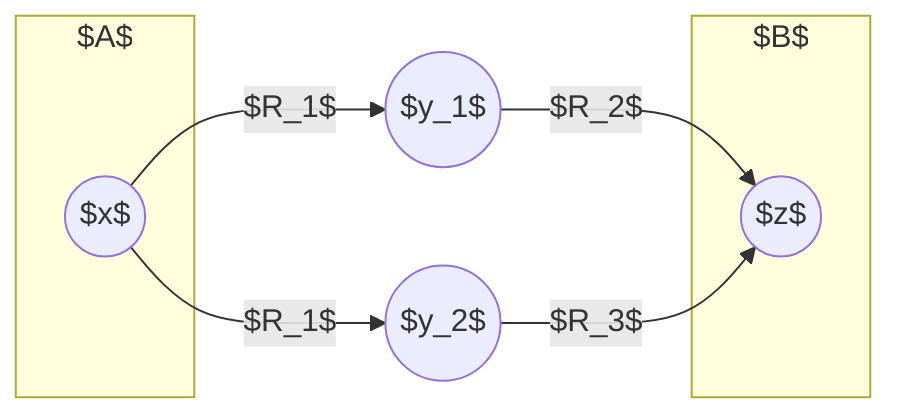
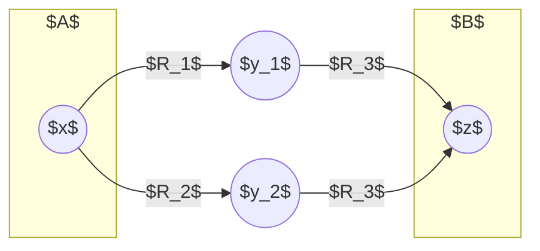
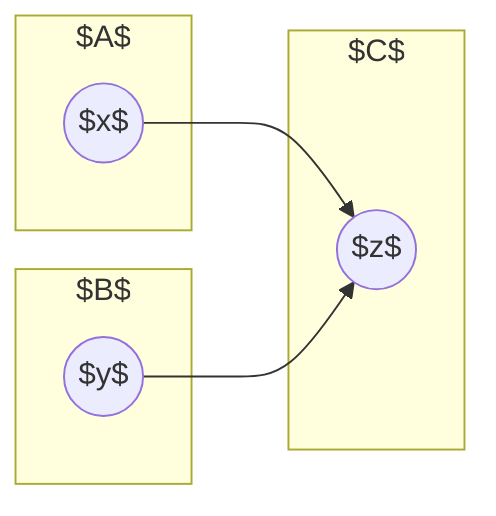

这是《数理逻辑与集合论（第2版）》的学习笔记。

<!--more-->

## 第 1 章 命题逻辑的基本概念

### 代入规则



#### 注意：代入规则

1. 公式中被代换的只能是 **命题变元**，而不能是复合命题。
   例如，可以用 $(R\land S)$ 来代替某公式中的 $P$，记作 $\frac{P}{(R\land S)}$，但不能反过来将公式中的 $(R\land S)$ 以 $P$ 代之。

2. 对公式中某命题变项施以代入，必须对该公式中出现的所有同一命题变项代换同一公式。
   其实就是说，要代换就所有都代换完。对于重言式 $(P\lor\lnot P)$，仅仅代换前一部分的 $P \gets \lnot Q$，那么就变成了 $(\lnot Q \lor \lnot P)$，这并非重言式。



### 波兰式与逆波兰式

简而言之，如果将一个合式公式用二叉树来表示，那么

- 波兰式就是前缀表达式，即先序遍历，先输出自己，再依次遍历左、右子树。

- 逆波兰式就是后缀表达式，即后序遍历，先依次遍历左、右子树，再输出自己。



#### 注意：波兰式与逆波兰式

越 **先运算** 的式子的深度应该越 **深**。

> 例1.1 将下列公式写成波兰式。
> $\lnot\lnot P \lor(W\land R)\lor \lnot Q$

这题的正确答案应该是 $\lor\lor\lnot\lnot P \land W R \lnot Q$。（而不是 $\lor\lnot\lnot P\lor\land W R \lnot Q$！）



## 第 2 章 命题逻辑的等值和推理演算

### 等值公式



#### 公式：等值公式

1. $(P \to Q) \to R \neq P \to (Q \to R)$

2. $P \leftrightarrow (Q \leftrightarrow R) \neq (P \leftrightarrow Q) \leftrightarrow (P \leftrightarrow Q)$

3. $P \to \lnot P = \lnot P, \lnot P \to P = P$

4. $P \leftrightarrow Q = (P \land Q) \lor (\lnot P \land \lnot Q)$

5. $P \leftrightarrow Q = (P \lor \lnot Q) \land (\lnot P \lor Q)$

6. $P \to (Q \to R) = (P \land Q) \to R$

7. $(P \to R) \land (Q \to R) = (P \lor Q) \to R$



~~妈的，与和或之间没有交换律。~~

**定理 1**：不知道逻辑上这两者不等的原因是什么，但显然左式是 $P \land \lnot Q \lor R$，但右式是 $\lnot P \lor \lnot Q \lor R$，二者不等。

**定理 2**：当 $P = Q = R = \mathrm{F}$ 时，左式为假，右式为真。

**定理 3**：十分合理，拆开发现是俩相同东西的或。

**定理 4**：这可解释为 $P \leftrightarrow Q$ 为真，有两种可能的情形，即 $(P \land Q)$ 为真，或 $(\lnot P \land \lnot Q)$ 为真。其实就是 $P$ 和 $Q$ 二者同真同假。

**定理 5**：这可解释为 $P \leftrightarrow Q$ 为假，有两种可能的情形，即 $(P \lor \lnot Q)$ 为假，或 $(\lnot P \lor Q)$ 为假。其实就是 $P$ 和 $Q$ 二者真假不同。

**定理 6**：$P$ 是 $(Q \to R)$ 的前提，$Q$ 是 $R$ 的前提，于是可将两个前提的合取 $(P \land Q)$ 作为总的前提。

**定理 7**：左端说明由 $P$ 而且由 $Q$ 都有 $R$ 成立，从而可以说明由 $P$ 或由 $Q$ 就有 $R$ 成立，即右端。

### 对偶式



#### 定义：对偶式

假定命题公式 $A$ 中仅出现 $\lnot, \lor, \land$ 三个联结词。将 $A$ 中出现的 $\lor, \land, \text{T}, \text{F}$ 分别以 $\land, \lor, \text{F}, \text{T}$ 代换，得到公式 $A^*$，则称 $A^*$ 是 $A$ 的 **对偶式**，或说 $A$ 和 $A^*$ 互为对偶式。





#### 性质：对偶式

为方便，若 $A = A(P_1, P_2, \cdots, P_n)$，令 $A^- = A(\lnot P_1, \lnot P_2, \cdots, \lnot P_n)$。

1. $\lnot(A^*) = (\lnot A)^*, \lnot(A^-) = (\lnot A)^-$
2. $(A^*)^* = A, (A^-)^- = A$
3. $\lnot A = A^{*-}$



证明的思路是对 $A$ 中出现的联结词个数进行归纳证明。

### 范式



#### 性质：极小项与极大项

**极小项**：

1. 对一个含有 $n$ 个变项的公式来说，所有可能的极小项个数和该公式的解释个数一样多，都是 $2^n$。

2. 每个极小项只在一个解释下为真。

3. 极小项两两不等值，而且 $m_i \land m_j = \text{F}(i \neq j)$。

4. 恰由 $2^n$ 个极小项的析取构成的公式，必为重言式。即
   $$
   \bigvee_{i = 0}^{2^n-1}m_i = \text{T}
   $$

**极大项**：

1. 对一个含有 $n$ 个变项的公式来说，所有可能的极大项个数和该公式的解释个数一样多，都是 $2^n$。

2. 每个极大项只在一个解释下为假。

3. 极大项两两不等值，而且 $M_i \lor M_j = \text{T}(i \neq j)$。

4. 恰由 $2^n$ 个极大项的合取构成的公式，必为矛盾式。即
   $$
   \bigwedge_{i = 0}^{2^n-1}M_i = \text{F}
   $$



可以理解为极小项（极大项）构成了含 $n$ 个命题变项的命题组成的空间的一组基底，极小项（极大项）两两不等值且与（或）得到的结果为 $\text{F}$（$\text{T}$）类似于基底中基向量的正交性。

#### 填满变量的简便方法

例如 $\lnot P \lor Q$，可以将 $\lnot P$ 看做 $m^{0x}$，$Q$ 看做 $m^{x1}$。其中 $x$ 表示任意值。

因此 $\lnot P \lor Q = m^{00} \lor m^{01} \lor m^{01} \lor m^{11} = m_0 \lor m_1\lor m_3$。

#### 主合取范式与主析取范式之间的转换

若已知 $A$ 的主析取范式，如
$$
\begin{aligned}
A & = \lor_{0, 1, 4, 5, 7} \\
& = \land_{(\{0, 1, \cdots, 7\} - \{0, 1, 4, 5, 7\})_\text{ 补}} \\
& = \land_{\{2, 3, 6\}_{\text{ 补}}} \\
& = \land_{5, 4, 1}
\end{aligned}
$$
若已知 $A$ 的主合取范式，如
$$
\begin{aligned}
A & = \land_{1, 4, 5} \\
& = \lor_{(\{0, 1, \cdots, 7\} - \{1, 4, 5\})_\text{ 补}} \\
& = \lor_{\{0, 2, 3, 6, 7\}_\text{ 补}} \\
& = \lor_{7, 5, 4, 1, 0}
\end{aligned}
$$

取补是为了求出命题变项的否定。在此例中，$2^n-1 = 7$，所以取补就是用 $7$ 减去其他的值。



#### 注意：空公式

永真式的主合取范式为空公式。

矛盾式的主析取范式为空公式。



### 推理演算



#### 注意：推理形式

前提真，结论必真的推理形式为正确的推理形式。

$A \implies B$ 表示一种 $A$ 和 $B$ 之间的真值关系，$\implies$ 不是逻辑联结词，$A \implies B$ 也不是合式公式。

$A \implies B$ 说明推理形式 $A \to B$ 是正确的。





#### 公式：基本的推理公式

1. $P \land Q \implies P$
2. $\lnot(P \to Q) \implies P$
3. $\lnot(P \to Q) \implies \lnot Q$
4. $P \implies P \lor Q$
5. $\lnot P \implies P \to Q$
6. $Q \implies P \to Q$
7. $\lnot P \land (P \lor Q) \implies Q$
8. $P \land (P \to Q)\implies Q$
9. $\lnot Q \land (P \to Q) \implies \lnot P$
10. $(P \to Q) \land (Q \to R) \implies P \to R$
11. $(P \leftrightarrow Q) \land (Q \leftrightarrow R) \implies P \leftrightarrow R$
12. $(P \to R) \land (Q \to R) \land (P \lor Q) \implies R$
13. $(P \to Q) \land (R \to S) \land (P \lor R) \implies Q \lor S$
14. $(P \to Q) \land (R \to S) \land (\lnot Q \lor \lnot S) \implies \lnot P \lor \lnot R$
15. $(Q \to R) \implies ((P \lor Q) \to (P \lor R))$
16. $(Q \to R) \implies ((P \to Q) \to (P \to R))$



公式 8 常称作假言推理，或称作分离规则，是最常使用的推理公式。

公式 10 常称作三段论。

公式 15 和 公式 16 值得玩味。

#### 证明推理公式的方法



#### 定理：$A \implies B$ 的充要条件

1. $A \implies B$ 等价于 $A \to B$ 是重言式。
2. $A \implies B$ 等价于 $A \land \lnot B$ 是矛盾式。





#### 规则：推理规则

1. 前提引入规则

   在推理过程中，可以随时引入前提。

2. 结论引用规则

   在推理过程中所得到的中间结论，可作为后续推理的前提。

3. 代入规则

   在推理过程中，对重言式中的命题变项可使用代入规则。

4. 置换规则

   在推理过程中，命题公式中的任何部分公式都可以用与之等值的命题公式来置换。

5. 分离规则（假言推理）

   如果已知命题公式 $A \to B$ 和 $A$，则有命题公式 $B$。

6. 条件证明规则

   $A_1 \land A_2 \implies B$ 与 $A_1 \implies A_2 \to B$ 是等价的。



规则 6 将 $A_1 \implies A_2 \to B$ 的证明化为 $A_1 \land A_2 \implies B$ 的证明。意思是说，可以将要证明的结论 $A_2 \to B$ 中的 $A_2$ 作为条件来使用，从而简化了证明。



#### 注意：推理规则

在证明过程中，将 $P \lor Q$ 写成 $\lnot P \to Q$ 更便于推理。



### 归结推理法



#### 定义：归结式

设 $C_1 = L \lor C_1', C_2 = \lnot L \lor C_2'$ 为两个子句，有互补对 $L$ 和 $\lnot L$。则新子句
$$
R(C_1, C_2) = C_1' \lor C_2'
$$
称作 $C_1, C_2$ 的 **归结式**。





#### 定理：归结证明

设 $C_1 = L \lor C_1', C_2 = \lnot L \lor C_2'$ 为两个子句，有互补对 $L$ 和 $\lnot L$。则
$$
C_1 \land C_2 \implies R(C_1, C_2)
$$
这说明归结式 $R(C_1, C_2)$ 是子句 $C_1$ 和 $C_2$ 的逻辑推论，从而归结是正确推理规则。



设在任意解释下 $C_1$ 和 $C_2$ 均为真，则若 $L$ 为真，则 $\lnot L$ 为假，$C_2'$ 必为真，$R(C_1, C_2)$ 为真。反之则 $L$ 为假，$C_1'$ 必为真，$R(C_1, C_2)$ 仍为真。

#### 归结证明过程

1. 为证明 $A \to B$ 是重言式，这等价于证明 $A \land \lnot B$ 是矛盾式。使用归结证明法，就是从 $A \land \lnot B$ 出发。

2. 建立子句集 $S$

   将 $A \land \lnot B$ 化成合取范式，如
   $$
   P \land (P \lor R) \land (\lnot P \lor \lnot Q) \land (\lnot P \lor R)
   $$
   进而将所有子句（析取式）构成子句集
   $$
   S = \{P, (P \lor R), (\lnot P \lor \lnot Q), (\lnot P \lor R)\}
   $$
   以集合来描述合取范式，这种表示法对归结过程的阐明是方便的。

3. 对 $S$ 作归结

   进而对 $S$ 的子句作归结（消互补对），如子句 $P \lor R$ 与 $\lnot P \lor \lnot Q$ 作归结，得归结式 $R \lor \lnot Q$，并将这归结式仍放入 $S$ 中。重复此过程。

4. 直至归结出矛盾式 $\square$。



#### 注意：归结推理法

一般情况下推理规则和归结不能混用。因为它俩本质上是同一回事。



## 第 3 章 命题逻辑的公理化

### 罗素公理系统



#### 公理：罗素公理系统

1. $\vdash((P \lor P) \to P)$
2. $\vdash (P \to (P \lor Q))$
3. $\vdash((P \lor Q)\to(Q \lor P))$
4. $\vdash((Q \to R)\to((P \lor Q)\to(P \lor R))$





#### 规则：罗素公理系统

1. 代入规则

   将合式公式 $A$ 中出现的某一符号 $\pi$ 到处都代以某一合式公式 $B$，得到合式公式 $A \dfrac{\pi}{B}$ 叫代入。代入规则说，如果 $\vdash A$，那么 $\vdash A \dfrac{\pi}{B}$。

2. 分离规则

   如果 $\vdash A, \vdash A \to B$，那么 $\vdash B$。

3. 置换规则

   定义的左右两方可以互相替换。设公式 $A$，替换后为 $B$。置换规则说，如果 $\vdash A$，那么 $\vdash B$。





#### 定理：罗素公理系统

1. $\vdash (Q \to R)\to((P \to Q) \to (P \to R))$
2. $\vdash P \to P$
3. $\vdash \lnot P \lor P$
4. $\vdash P \lor \lnot P$
5. $\vdash P \to \lnot\lnot P$
6. $\vdash \lnot\lnot P \to P$
7. $\vdash (P \to Q)\to(\lnot Q \to \lnot P)$



~~懒得推。~~

一般形如 $\vdash\square_1 \to \square_2$ 的定理，先会化简 $\square_1$，中间都会有一步 $\vdash(P \lor Q)\to(Q \lor P)$， 然后化简 $\square_2$ 发现能凑出逻辑链。

### 公理系统的完备性

设 $A$ 是任意一个重言式，需要说明它在公理系统中是可证明的。先将 $A$ 写成与之等值的合取范式 $A_1 \land A_2 \land \cdots \land A_n$。其中 $A_i(i = 1, 2, \cdots, n)$ 必为 $\pi \lor \lnot \pi \lor B$ 的形式，$\pi$ 是命题变项。依公理系统 $\vdash P \lor \lnot P, \vdash P \lor \lnot P \lor Q$ 都成立，从而有 $\vdash A_i$。

又因为 $\vdash P \to (Q \to P \land Q)$，使用分离规则可得 $\vdash A_1\land A_2 \land \cdots \land A_n$。故 $A$ 是可证明的。

### 王浩算法



#### 定义：初始符号

1. $A, B, \cdots, X, Y, Z$ 表示命题
2. $\lnot, \land, \lor, \to, \leftrightarrow$ 表示联结词
3. $(, ), ,$ 圆括号和逗点
4. $\alpha, \beta, \gamma, \cdots$ 表示公式串





#### 定义：相继式

1. 如果 $\alpha$ 和 $\beta$ 都是公式串，则称
   $$
   \alpha \overset{s}{\to} \beta
   $$
   是 **相继式**，$\alpha$ 为前件，$\beta$ 为后件。

2. 规定 $\overset{s}{\to}$ 前件中的”$,$“以 $\land$ 表示，后件中的”$,$“以 $\lor$ 表示，便可将 $\alpha \overset{s}{\to} \beta$ 化为 $\gamma \to \delta$。

3. 相继式 $\alpha \overset{s}{\to} \beta$ 为真，便以 $\alpha \overset{s}{\implies} \beta$ 表示。





#### 规则：变形规则

**前件规则**：

1. $\lnot\implies$

   如果 $\alpha, \beta \overset{s}{\implies}X, \gamma$，那么 $\alpha, \lnot X, \beta \overset{s}{\implies}\gamma$。

2. $\land\implies$

   如果 $X, Y, \alpha, \beta \overset{s}{\implies}\gamma$，那么 $\alpha, X\land Y, \beta \overset{s}{\implies}\gamma$。

3. $\lor\implies$

   如果 $X, \alpha, \beta \overset{s}{\implies}\gamma$ 而且 $Y, \alpha, \beta \overset{s}{\implies}\gamma$，那么 $\alpha, X \lor Y, \beta \overset{s}{\implies}\gamma$。

4. $\to\implies$

   如果 $Y, \alpha, \beta \overset{s}{\implies}\gamma$ 而且 $\alpha, \beta \overset{s}{\implies}X, \gamma$，那么 $\alpha, X \to Y, \beta \overset{s}{\implies}\gamma$。

5. $\leftrightarrow\implies$

   如果 $X, Y, \alpha, \beta \overset{s}{\implies}\gamma$ 而且 $\alpha, \beta \overset{s}{\implies}X, Y, \gamma$，那么 $\alpha, X \leftrightarrow Y, \beta \overset{s}{\implies}\gamma$。

**后件规则**：

1. $\implies\lnot$

   如果 $X, \alpha\overset{s}{\implies}\beta, \gamma$，那么 $\alpha\overset{s}{\implies}\beta, \lnot X, \gamma$。

2. $\implies\land$

   如果 $\alpha \overset{s}{\implies} X, \beta, \gamma$ 而且 $\alpha \overset{s}{\implies} Y, \beta, \gamma$，那么 $\alpha \overset{s}{\implies}\beta, X\land Y, \gamma$。

3. $\implies\lor$

   如果 $\alpha \overset{s}{\implies} X, Y, \beta, \gamma$，那么 $\alpha \overset{s}{\implies} \beta, X\lor Y, \gamma$。

4. $\implies\to$

   如果 $X, \alpha\overset{s}{\implies}Y, \beta, \gamma$，那么 $\alpha\overset{s}{\implies}\beta, X \to Y, \gamma$。

5. $\implies\leftrightarrow$

   如果 $X, \alpha\overset{s}{\implies}Y, \beta, \gamma$ 而且 $Y, \alpha\overset{s}{\implies}X, \beta, \gamma$，那么 $\alpha \overset{s}{\implies} \beta, X \leftrightarrow Y, \gamma$。



在符号 $\overset{s}{\implies}$ 两边移动符号 $X$ 会导致其取反，这是因为
$$
\begin{aligned}
\alpha \land \beta \implies& X \lor \gamma \\
\alpha \land \beta \implies& \lnot X \to \gamma \\
\alpha \land \beta \land \lnot X \implies& \gamma \\
\alpha, \beta, \lnot X \overset{s}{\implies}& \gamma
\end{aligned}
$$

### 命题逻辑的自然演绎系统



#### 定义：初始符号

$$
\Gamma = \{A_1, A_2, \cdots, A_n\} = A_1, A_2, \cdots, A_n
$$

表示有限个命题公式的集合。
$$
\Gamma \vdash A
$$
表示 $\Gamma, A$ 间有形式推理关系，$\Gamma$ 为形式前提，$A$ 为形式结论，或说使用推理规则可由 $\Gamma$ 得 $A$。





#### 规则：变形规则

1. $A_1, A_2, \cdots, A_n \vdash A_i(i = 1, 2, \cdots, n)$。肯定前提律。

   推理过程中前提总是被肯定的，前提中任何命题都可作为结论。

2. 如果 $\Gamma \vdash A, A \vdash B$，则 $\Gamma \vdash B$。传递律。

3. 如果 $\Gamma, \lnot A \vdash B$，且 $\Gamma, \lnot A \vdash \lnot B$，则 $\Gamma \vdash A$。反证律。

   在前提 $\Gamma$ 下，再假设 $A$ 是假的，若可推出矛盾命题，则可由前提 $\Gamma$ 推出 $A$。

4. $A \to B, A \vdash B$。蕴涵词消去律（分离规则）。

5. 如果 $\Gamma, A \vdash B$，则 $\Gamma \vdash A \to B$。蕴涵词引入律。

   在前提 $\Gamma$ 下，又知 $A$ 为真，可得 $B$。那么在原前提 $\Gamma$ 下可推得如果 $A$ 那么 $B$。



## 第 4 章 谓词逻辑的基本概念

### 合式公式



#### 注意：合式公式

1. 如果 $A, B$ 是合式公式，而无变元 $x$ 在 $A, B$ 的一个中是约束的而在另一个中是自由的，则 $A \land B, A \lor B, A \to B, A \leftrightarrow B$ 也算是合式公式。
2. 如果 $A$ 是合式公式，而 $x$ 在 $A$ 中是自由变元，则 $(\forall x)A, (\exists x)A$ 也是合式公式。



第 1 点说明 $(\forall x)P(x) \lor Q(x)$ 不是合式公式。一个恰当的写法是 $(\forall x)P(x) \lor Q(y)$。

第 2 点说明 $(\exists x)((\forall x)F(x))$ 不是合式公式，因为内层 $x$ 并不是自由变元。

### 自然语句的形式化

#### “所有的有理数都是实数”的形式化

以 $P(x)$ 表示 $x$ 是有理数，$Q(x)$ 表示 $x$ 是实数。则“所有的有理数都是实数”可以被形式化地描述为
$$
(\forall x)(P(x) \to Q(x))
$$
注意，这句话并不能表示为 $(\forall x)(P(x) \land Q(x))$。当论域包含不是有理数的东西的时候，$(\forall x)(P(x) \land Q(x))$ 恒为假，这不是我们希望看到的。

#### ”有的实数是有理数“的形式化

以 $P(x)$ 表示 $x$ 是有理数，$Q(x)$ 表示 $x$ 是实数。则“有的实数是有理数”可以被形式化地描述为
$$
(\exists x)(Q(x) \land P(x))
$$
注意，这句话并不能表示为 $(\exists x)(Q(x) \to P(x))$。当论域包含不是实数的东西的时候，$x$ 取这些事物时恒有 $Q(x)$ 为假，那么 $(\exists x)(Q(x) \to P(x))$ 恒为真，这也不是我们希望看到的。

#### “没有无理数是有理数”的形式化

以 $A(x)$ 表示 $x$ 是无理数，$B(x)$ 表示 $x$ 是有理数。则“没有无理数是有理数”可以被形式化地描述为
$$
\lnot (\exists x)(A(x) \land B(x))
$$

#### “有的实数不是有理数”的形式化

以 $A(x)$ 表示 $x$ 是实数，$B(x)$ 表示 $x$ 是有理数。则“有的实数不是有理数”可以被形式化地描述为
$$
(\exists x)(A(x) \land \lnot B(x))
$$

#### 自然数集的形式描述

自然数集的定义：

1. 对每个数，有且仅有一个相继后元。
2. 没有这样的数，$0$ 是其相继后元。
3. 对除 $0$ 以外的数，有且仅有一个相继前元。

一个比较常用的描述唯一性的方法是，“如果有两个则它们必相等”。即若对每个 $x$ 都存在 $y$，使得 $y$ 是 $x$ 的相继后元，且对任意 $z$，如果 $z$ 也是 $x$ 的相继后元，则 $z = y$。

引入谓词 $\mathsf{E}(x, y)$ 表示 $x = y$。函数 $f(x)$ 表示个体 $x$ 的相继后元，即 $f(x) = x + 1$。函数 $g(x)$ 表示个体 $x$ 的相继前元，即 $g(x) = x - 1$。

1. $(\forall x)(\exists y)(\mathsf{E}(y, f(x))\land (\forall z)(\mathsf{E}(z, f(x)) \to \mathsf{E}(y, z)))$
2. $\lnot (\exists x)\mathsf{E}(0, f(x))$
3. $(\forall x)(\lnot\mathsf{E}(x, 0) \to (\exists y)(\mathsf{E}(y, g(x)) \land (\forall z)(\mathsf{E}(z, g(x)) \to \mathsf{E}(y, z))))$



#### 注意：对谓词变元多次量化的分析

1. $(\forall x)(\forall y)P(x, y) = (\forall y)(\forall x)P(x, y)$
2. $(\exists x)(\exists y)P(x, y) = (\exists y)(\exists x)P(x, y)$
3. $(\forall x)(\exists y)P(x, y) \neq (\exists y)(\forall x)P(x, y)$



注意第 3 点左式表明 $y$ 是 $x$ 的函数 $y(x)$，也就是 $x_1$ 可以对应存在 $y_1$，$x_2$ 对应存在 $y_2$……但右式要求一个固定的 $y$ 对所有的 $x$ 都成立。

事实上，$(\exists y)(\forall x)P(x, y) \implies (\forall x)(\exists y)P(x, y)$。

### 公式的普遍有效性和判定问题



#### 定义：普遍有效性

对一个谓词公式：

1. 如果在它的任一解释 $I$ 下真值都为真，便称它是 **普遍有效的**。
2. 如果在它的某个解释 $I$ 下真值为真，便称它是 **可满足的**。
3. 如果在它的任一解释 $I$ 下真值都为假，便称它是 **不可满足的**。



有限域上一个公式的可满足性和普遍有效性仅依赖于个体域个体的数目。即在某个含 $k$ 个元素的 $k$ 个体域上普遍有效（可满足），则在任一 $k$ 个体域上也普遍有效（可满足）。

如果某公式在 $k$ 个体域上普遍有效，则在 $k - 1$ 个体域上也普遍有效。

如果某公式在 $k$ 个体域上可满足，则在 $k + 1$ 个体域上也可满足。

#### 判定问题

1. 谓词逻辑是不可判定的。

   对任一谓词公式而言，没有可行方法能判明它是否是普遍有效的。但这并不排除谓词公式有子类是可判定的。判定问题的困难在于个体域是个无穷集以及对谓词设定的任意性。

2. 只含有一元谓词变项的公式是可判定的。

3. $$
   (\forall x_1)(\forall x_2)\cdots(\forall x_n)P(x_1, x_2, \cdots, x_n)
   $$

   和
   $$
   (\exists x_1)(\exists x_2)\cdots(\exists x_n)P(x_1, x_2, \cdots x_n)
   $$
   型公式，若 $P$ 中无量词和其他自由变项时是可判定的。

## 第 5 章 谓词逻辑的等值和推理演算

### 量词分配等值式



#### 公式：量词对 $\to$ 的分配律

1. $(\forall x)(P(x) \to q) = (\exists x)P(x) \to q$
2. $(\exists x)(P(x) \to q) = (\forall x)P(x) \to q$
3. $(\forall x)(p \to Q(x)) = p \to (\forall x)Q(x)$
4. $(\exists x)(p \to Q(x)) = p \to (\exists x)Q(x)$

其中 $p, q$ 为命题变项，与个体变元 $x$ 无关。



~~这应该如何感性地理解？~~

### 范式



#### 定义：前束范式

说公式 $A$ 是一个 **前束范式**，如果 $A$ 中一切量词都位于该公式的最左边（不含否定词）且这些量词的辖域都延伸到公式的末端。

前束范式 $A$ 的一般形式为
$$
(Q_1 x_1)(Q_2 x_2)\cdots(Q_n x_n)M(x_1, x_2, \cdots, x_n)
$$
其中 $Q_i(i = 1, 2, \cdots, n)$ 为量词 $\forall$ 或 $\exists$，$M$ 称为公式 $A$ 的母式，$M$ 中不再有量词。



#### 求前束范式的步骤

例如求 $\lnot((\forall x)(\exists y)P(a, x, y) \to (\exists x)(\lnot(\forall y)Q(y, b) \to R(x)))$ 的前束范式。

1. 消去联结词 $\to, \leftrightarrow$。
   $$
   \lnot(\lnot(\forall x)(\exists y)P(a, x, y) \lor (\exists x)(\lnot\lnot(\forall y)Q(y, b) \lor R(x)))
   $$

2. $\lnot$ 内移（反复使用摩根律）。
   $$
   (\forall x)(\exists y)P(a, x, y) \land (\forall x)((\exists y)\lnot Q(y, b) \land \lnot R(x)))
   $$

3. 量词左移（使用分配等值式）。
   $$
   (\forall x)((\exists y)P(a, x, y) \land (\exists y)\lnot Q(y, b) \land \lnot R(x))
   $$

4. 变元易名（使用变元易名分配等值式）。
   $$
   \begin{aligned}
   &(\forall x)((\exists y)P(a, x, y) \land (\exists y)\lnot Q(y, b) \land \lnot R(x)) \\
   = & (\forall x)((\exists y)P(a, x, y) \land (\exists z)\lnot Q(z, b) \land \lnot R(x)) \\
   = & (\forall x)(\exists y)(\exists z)(P(a, x, y) \land \lnot Q(z, b) \land \lnot R(x)) \\
   = & (\forall x)(\exists y)(\exists z)S(a, b, x, y, z)
   \end{aligned}
   $$



#### 定义：$\exists$ 前束范式

一个公式的 **$\exists$ 前束范式** 为
$$
(\exists x_1)(\exists x_2)\cdots(\exists x_i)(\forall x_{i+1})\cdots(\forall x_n)M(x_1, x_2, \cdots, x_n)
$$
即存在量词都在全称量词的左边，且可保持至少有一个存在量词（$i \ge 1$），其中 $M(x_1, x_2, \cdots, x_n)$ 中不再含有量词也无自由个体变项。





#### 性质：$\exists$ 前束范式

谓词逻辑的任一公式 $A$，都可化成相应的 $\exists$ 前束范式，并且 $A$ 是普遍有效的当且仅当其 $\exists$ 前束范式是普遍有效的。



#### 求 $\exists$ 前束范式的步骤

例如求 $(\exists x)(\forall y)(\exists u)P(x, y, u)$ 的 $\exists$ 前束范式。

将一公式化为 $\exists$ 前束范式，必须先求出前束范式，再做 $\exists$ 前束范式。

首先将全称量词 $(\forall y)$ 改写为存在量词 $(\exists y)$，其次引入谓词 $S$ 和一个变元 $z$ 得 $S(x, z)$，建立公式
$$
(\exists x)((\exists y)(\exists u)(P(x, y, u) \land \lnot S(x, y)) \lor (\forall z)S(x, z))
$$
进而将 $(\forall z)$ 左移，便得 $\exists$ 前束范式
$$
(\exists x)(\exists y)(\exists u)(\forall z)((P(x, y, u) \land \lnot S(x, y)) \lor S(x, z))
$$


#### 定义：Skolem 标准型

**Skolem 标准型** 是仅保留全称量词的前束范式。





#### 性质：Skolem 标准型

谓词逻辑的任一公式 $A$，都可化成相应的 Skolem 标准型，并且 $A$ 是不可满足的当且仅当其 Skolem 标准型是不可满足的。



#### 求 Skolem 标准型的步骤

例如求 $(\exists x)(\forall y)(\forall z)(\exists u)(\forall v)(\exists w)P(x, y, z, u, v, w)$ 的 Skolem 标准型。

将一个公式化成 Skolem 标准型，首先也得化成前束范式。

首先将最左侧的 $(\exists x)$ 消去，而将谓词 $P$ 中出现的所有变元 $x$ 均以论域中的某个常项 $a$（未在 $P$ 中出现过）代入。进而消去从左数第二个存在量词 $(\exists u)$，因 $(\exists u)$ 左侧有两个全称量词 $(\forall y)(\forall z)$，所以需要将谓词 $P$ 中出现的所有变元 $u$ 均以 $y, z$ 的某个二元函数 $f(y, z)$（未在 $P$ 中出现过）代入。最后按照同样的方法消去存在量词 $(\exists w)$，因 $(\exists w)$ 得左边有全称量词 $(\forall y)(\forall z)$ 和 $(\forall v)$，所以需要将谓词 $P$ 中出现的所有变元 $w$ 均以 $y, z, w$ 的某个三元函数 $g(y, z, w)$（未在 $P$ 中出现过也不同于 $f$）代入。这样便会得到 Skolem 标准型
$$
(\forall y)(\forall z)(\forall v)P(a, y, z, f(y, z) v, g(y, z, v))
$$


#### 注意：Skolem 标准型

虽然 Skolem 标准型和原式 **不等值**，但在不可满足的意义下两者是一致的。



### 推理演算



#### 公式：基本的推理公式

1. $(\forall x)P(x) \lor (\forall x)Q(x) \implies (\forall x)(P(x)\lor Q(x))$
2. $(\exists x)(P(x) \land Q(x)) \implies (\exists x) P(x) \land (\exists x) Q(x)$
3. $(\forall x)(P(x) \to Q(x)) \implies (\forall x) P(x) \to (\forall x) Q(x)$
4. $(\forall x)(P(x) \to Q(x)) \implies (\exists x) P(x) \to (\exists x) Q(x)$
5. $(\forall x)(P(x) \leftrightarrow Q(x)) \implies (\forall x)P(x) \leftrightarrow (\forall x)Q(x)$
6. $(\forall x)(P(x) \leftrightarrow Q(x)) \implies (\exists x)P(x) \leftrightarrow (\exists x)Q(x)$
7. $(\forall x)(P(x) \to Q(x)) \land (\forall x)(Q(x) \to R(x)) \implies (\forall x)(P(x) \to R(x))$
8. $(\forall x)(P(x) \to Q(x)) \land P(a) \implies Q(a)$
9. $(\forall x)(\forall y)P(x, y) \implies (\exists x)(\forall y)P(x, y)$
10. $(\exists x)(\forall y)P(x, y) \implies (\forall y)(\exists x)P(x, y)$



这些推理公式的逆都是不成立的，因为它们都减弱了推理的强度。



#### 规则：推理规则

1. 全称量词消去规则
   $$
   (\forall x)P(x) \implies P(y)
   $$
   其中 $y$ 是论域中任一个体，且 $y$ 不在 $P(x)$ 中被约束。

2. 全称量词引入规则
   $$
   P(y) \implies (\forall x)P(x)
   $$
   其中 $y$ 是论域中任一个体，且 $x$ 不在 $P(y)$ 中被约束。

3. 存在量词消去规则
   $$
   (\exists x)P(x) \implies P(c)
   $$
   其中 $c$ 是论域中一个个体常项，且 $(\exists x)P(x)$ 中没有自由个体，且 $P(x)$ 中不含有 $c$。

4. 存在量词引入规则
   $$
   P(c) \implies (\exists x)P(x)
   $$
   其中 $c$ 是论域中一个个体常项，且 $x$ 不出现在 $P(c)$ 中。



这四条规则的共性是，引入或消去量词时，被约束的变量不能和已有变量相关导致产生更多隐性约束。

### 谓词逻辑的归结推理法

#### 归结证明过程

1. 为证明 $A \to B$ 是重言式，这等价于证明 $G = A \land \lnot B$ 是矛盾式。使用归结证明法，就是从 $A \land \lnot B$ 出发。注意此时的 $A, B$ 都是谓词公式。

2. 建立子句集 $S$

   如何消去 $G$ 中量词（尤其是存在量词），是建立子句集 $S$ 的关键。

   解决办法是首先将 $G$ 化成等值的前束范式，进而将前束范式化成 Skolem 标准型，得到 **仅含全称量词** 的公式 $G^*$。由于 $G$ 和 $G^*$ 在不可满足的意义下是一致的，从而对 $G$ 的不可满足性，可以由 $G^*$ 的不可满足性来求得。

   再将 $G^*$ 中的全称量词省略，并把 $\land$ 替换为“$,$”，便得到了 $G^*$ 的子句集 $S$。

   实际操作时常常直接求出 $A$ 和 $\lnot B$ 的子句集之后取并。

3. 对 $S$ 作归结

4. 直至归结出 $\square$。

## 第 9 章 集合

### 集合间的关系



#### 定义：子集关系

定义 **子集关系** $\subseteq$ 如下：
$$
A \subseteq B \iff (\forall x)(x \in A \to x \in B)
$$



由此我们可以推出

$$
\begin{aligned}
A = B & \iff (\forall x)(x \in A \leftrightarrow x \in B) \\
A \neq B & \iff (\exists x)\lnot(x \in A \leftrightarrow x \in B) \\
\end{aligned}
$$



#### 注意：子集关系

在子集关系中，如果 $A = \varnothing$，则前件 $x \in A$ 恒为假，所以对任意集合 $B$ 都有 $\varnothing \subseteq B$。





#### 性质：子集关系

1. $A \subseteq B \implies (A \cup C) \subseteq (B \cup C)$
2. $A \subseteq B \implies (A \cap C) \subseteq (B \cap C)$
3. $A \subseteq B \land C \subseteq D \implies (A \cup C) \subseteq (B \cup D)$
4. $A \subseteq B \land C \subseteq D \implies (A \cap C) \subseteq (B \cap D)$
5. $A \subseteq B \land C \subseteq D \implies (A - D) \subseteq (B - C)$
6. $C \subseteq D \implies (A - D) \subseteq (A - C)$



上述的 6 个性质中，我们可以发现 $\subseteq$ 与 $\le$ 类似。



#### 性质：幂集合

1. $A \subseteq B \iff P(A) \subseteq P(B)$
2. $P(A) \in P(B) \implies A \in B$
3. $P(A) \cap P(B) = P(A \cap B)$
4. $P(A) \cup P(B) = P(A \cup B)$
5. $P(A - B) \subseteq (P(A) - P(B)) \cup \{\varnothing\}$



性质 1 的推论是 $A = B \iff P(A) = P(B)$。

**性质 2**：
$$
\begin{aligned}
P(A) \in P(B) & \iff P(A) \subseteq B \\
& \iff (P(A) \subseteq B) \land (A \in P(A)) \\
& \implies A \in B
\end{aligned}
$$

性质 2 的逆定理不成立。

性质 4 的左式缺少的是同时含 $A$ 和 $B$ 中元素的集合。

性质 5 的右式要并上 $\{\varnothing\}$，是因为左式的差运算把 $\{\varnothing\}$ 消去了。左式缺少的是同时含 $A - B$ 和 $A \cap B$ 中元素的集合。



#### 定义：传递集合

若集合的集合 $A$ 的任意元素都是 $A$ 的元素，则称 $A$ 为 **传递集合**。形式化地表述，$A$ 是传递集合等价于
$$
(\forall x)(\forall y)((x \in y \land y \in A) \to x \in A)
$$


由定义可知，$A$ 的任意元素都是 $A$ 的子集。



#### 性质：传递集合

1. $A$ 是传递集合等价于 $A \subseteq P(A)$。
2. $A$ 是传递集合等价于 $P(A)$ 是传递集合。



**性质 1**：

必要性：显然。

充分性：已知 $A \subseteq P(A)$。
$$
\begin{aligned}
x \in y \land y \in A & \implies x \in y \land y \in P(A) \\
& \iff x \in y \land y \subseteq A \\
& \implies x \in A
\end{aligned}
$$
**性质 2**：

必要性：已知 $A$ 是传递集合。
$$
\begin{aligned}
x \in y \land y \in P(A) & \iff x \in y \land y \subseteq A \\
& \implies x \in A \\
& \iff x \subseteq P(A) \\
& \iff x \in P(A)
\end{aligned}
$$
充分性：已知 $P(A)$ 是传递集合。
$$
\begin{aligned}
x \in y \land y \in A & \iff x \in y \land \{y\} \subseteq A \\
& \iff x \in y \land y \in \{y\} \land \{y\} \in P(A) \\
& \implies x \in y \land y \in P(A) \\
& \iff x \in y \land y \subseteq A \\
& \implies x \in A
\end{aligned}
$$

### 集合的运算



#### 性质：差运算

1. $A - B = A - (A \cap B)$
2. $A - B = A \cap -B$
3. $A \cup (B - A) = A \cup B$
4. $A \cap (B - C) = (A \cap B) - C$



用 $A - B = A \cap -B$ 的代换可以在推导过程中消去差运算。



#### 定义：广义交和广义并

1. 定义集合 $A$ 的 **广义交** 为 $\cup A = \{x | (\exists z)(z \in A \land x \in z)\}$。
   
2. 定义集合 $A$ 的 **广义并** 为 $\cap A = \{x | (\forall z)(z \in A \to x \in z)\}$。



广义交是所有元素的公共元素组成的集合，广义并是所有元素的元素组成的集合。



#### 注意：广义交和广义并

规定 $\cup\varnothing = \varnothing$，$\cap\varnothing$ 无意义。





#### 性质：广义交和广义并

1. $A \subseteq B \implies \cup A \subseteq \cup B$
2. $A \subseteq B \implies \cap B \subseteq \cap A$
3. $\cup(A \cup B) = (\cup A)\cup(\cup B)$
4. $\cap(A \cup B) = (\cap A)\cup(\cap B)$
5. $\cup(P(A)) = A$

6. $A$ 是传递集合可以推出 $\cup A, \cap A$ 均为传递集合。
7. $A$ 的元素都是传递集合能推出 $\cup A, \cap A$ 均为传递集合。



性质 5 说明广义并是幂集的左逆运算，**但它并不是幂集的右逆运算**。

性质 6 和性质 7 说明广义并、广义交对于传递集合有封闭性。



#### 定义：有序数对

使用归纳法定义 **有序数对** 如下：

- 基础：$\left<x_1, x_2\right> = \{\{x_1\}, \{x_1, x_2\}\}$。

- 归纳：$\left<x_1, x_2, \cdots, x_n\right> = \left<\left<x_1, x_2, \cdots, x_{n-1}\right>, x_n\right>$。





#### 定义：笛卡尔积

对集合 $A, B$，定义它们的 **笛卡尔积** 为 $A \times B = \{\left<x, y\right> | x \in A \land y \in B\}$。





#### 注意：笛卡尔积

在笛卡尔积相关证明中，常常需要考虑 $x = y$ 的情况。此时 $\left<x, y\right> = \{\{x\}, \{x, y\}\}$ 退化为 $\{\{x\}\}$ 为单元素集合。





#### 性质：笛卡尔积

1. $A \times \varnothing = \varnothing \times A = \varnothing$
2. 若 $A$ 是集合，$x, y \in A$，则 $\left<x, y\right> \in PP(A)$。



性质 1 的解释是自然的，因为你无法从 $\varnothing$ 中选出元素来和 $A$ 中的元素进行组合，也就表明了这个笛卡尔积是空集。

**性质 2**：
$$
\begin{aligned}
x \in A \land y \in A & \iff \{x\}, \{x, y\} \subseteq A \\
& \iff \{x\}, \{x, y\} \in P(A) \\
& \iff \{\{x\}, \{x, y\}\} \subseteq P(A) \\
& \iff \left<x, y\right> \subseteq P(A) \\
& \iff \left<x, y\right> \in PP(A)
\end{aligned}
$$

#### 运算符优先级

符号优先级从上到下。

|    类型    |                       符号                        |
| :--------: | :-----------------------------------------------: |
| 一元运算符 |            $-A, P(A), \cap A, \cup A$             |
| 二元运算符 | $A-B, A \cap B, A \cup B, A \oplus B, A \times B$ |
| 集合关系符 |           $=, \subseteq, \subset, \in$            |
| 一元联结词 |                      $\lnot$                      |
| 二元联结词 |        $\land, \lor, \to, \leftrightarrow$        |
| 逻辑关系符 |                 $\iff, \implies$                  |

### 集合论公理系统



#### 公理：子集公理模式

$$
(\forall x)(\exists y)(\forall z)(z \in y \leftrightarrow(z \in x \land p(z)))
$$



子集公理模式是说，对任意的集合 $x$，存在 $x$ 的子集 $y$，$y$ 的元素 $z$ 都能使 $p(z)$ 成立。它能用于以下情况：已知若干满足条件 $p(z)$ 的元素 $z$，但不知道这些元素能否组成一个集合。此时找到一个集合 $A$，使得这些满足 $p(z)$ 的 $z$ 都有 $z \in A$，这样就可由 $A$ 和 $p(x)$ 用子集公理得到满足条件的集合
$$
\{x | x \in A \land p(x)\}
$$



#### 定义：极小元

对任意集合 $A$ 和 $B$，当有 $A \in B$ 且 $A \cap B = \varnothing$，就称 $A$ 为 $B$ 的一个 **极小元**。





#### 公理：正则公理

$$
(\forall x)(x \neq \varnothing \to (\exists y)(y \in x \land x \cap y = \varnothing))
$$



正则公理是说，任意非空集合都有极小元。



#### 推论：正则公理

1. 对任意的集合 $A$，$A \notin A$。
2. 对任何非空的传递集合 $A$，有 $\varnothing \in A$。



**推论 1**：

假设存在集合 $A$，使得 $A \in A$，则构造 $\{A\}$。由正则公理知 $\{A\}$ 一定有极小元，而 $\{A\}$ 是一个单元素集合，所以极小元只可能为 $A$。但是 $A \in A$ 所以 $A \cap \{A\} = A$ 不满足极小元的定义，产生矛盾。故 $A \notin A$。

**推论 2**：

假设存在一个非空传递集合 $A$ 满足 $\varnothing \notin A$。由正则公理知 $A$ 中一定存在极小元 $y$，满足 $y \in A \land y \cap A = \varnothing$。因为 $\varnothing \notin A$，故 $y \neq \varnothing$。由正则公理知 $y$ 中一定存在极小元 $z$，满足 $z \in y \land z \cap y = \varnothing$。由于 $A$ 是传递集合，且 $z \in y \land y \in A$，所以 $z \in A$。又因为 $z \in y$，因此 $y \cap A$ 至少包含 $z$，则 $y \cap A \neq \varnothing$，不满足极小元的定义，产生矛盾。故 $\varnothing \in A$。



#### 定义：奇异集合

如果集合 $A$ 中有集合的序列 $A_0 \in A, A_1 \in A, \cdots, A_n \in A$，使得
$$
\cdots \in A_{n + 1} \in A_n \in A_{n - 1} \in \cdots \in A_2 \in A_1 \in A_0
$$
则称 $A$ 为 **奇异集合**。





#### 性质：奇异集合

1. 奇异集合不满足正则公理。
2. 若非空集合 $A$ 不是奇异集合，则 $A$ 满足正则公理。



**性质 1**：

设 $A$ 为奇异集合，取序列 $A_0 \in A, A_1 \in A, \cdots, A_n \in A$，使得
$$
\cdots \in A_{n + 1} \in A_n \in A_{n - 1} \in \cdots \in A_2 \in A_1 \in A_0
$$
构造 $A$ 的非空子集 $B = \{A_0, A_1, \cdots, A_n, \cdots\}$。假设 $B$ 中有极小元 $A_i(i \ge 0)$，则 $A_i \cap B \neq \varnothing$，然而由于 $A_{i + 1} \in A_{i}$ 且 $A_{i + 1} \in B$，所以 $A_i \cap B$ 至少包含 $A_{i + 1}$，这说明 $A_i \cap B \neq \varnothing$，矛盾。故 $B$ 没有极小元，不满足正则公理。所以 $A$ 为奇异集合，不满足正则公理。

**性质 2**：

假设 $A$ 中没有极小元，则 $\forall A_0 \in A$，都应该存在 $A_1 \in A_0$ 满足 $A_1 \in A$。但 $A_1$ 也不是 $A$ 的极小元，故存在 $A_2 \in A_1$ 满足 $A_2 \in A$。以此类推得 $A$ 中应有元素 $A_0, A_1, \cdots, A_n, \cdots$ 满足
$$
\cdots \in A_{n + 1} \in A_n \in A_{n - 1} \in \cdots \in A_2 \in A_1 \in A_0
$$
这说明 $A$ 是奇异集合，与已知矛盾。故 $A$ 一定满足正则公理。

## 第 10 章 关系

### 关系运算



#### 定义：限制和象

- $R$ 在 $A$ 上的限制 $R \upharpoonright A = \{\left<x, y\right> | \left<x, y\right> \in R \land x \in A\}$。
- $A$ 在 $R$ 下的象 $R[A] = \{y | (\exists x)(x \in A \land \left<x, y\right> \in R)\}$。





#### 性质：关系运算

1. $R_1 \circ (R_2 \cup R_3) = R_1 \circ R_2 \cup R_1 \circ R_3$
1. $R_1 \circ (R_2 \cap R_3) \subseteq R_1 \circ R_2 \cap R_1 \circ R_3$
1. $(R_1 \cup R_2) \circ R_3 = R_1 \circ R_3 \cup R_2 \circ R_3$
1. $(R_1 \cap R_2) \circ R_3 \subseteq R_1 \circ R_3 \cup R_2 \circ R_3$



**性质 2**：

左式缺少下图的 $\left<x, z\right>$，因为 $\left<y_1, z\right>$ 和 $\left<y_2, z\right>$ 在 $R_2 \cap R_3$ 的过程中被除去了；但右式含有 $\left<x, z\right>$。

**性质 4**：

左式缺少下图的 $\left<x, z\right>$，因为 $\left<x, y_1\right>$ 和 $\left<x, y_2\right>$ 在 $R_1 \cap R_2$ 的过程中被除去了；但右式含有 $\left<x, z\right>$。



#### 性质：象

1. $R[A \cup B] = R[A] \cup R[B]$
2. $R[\cup A] = \cup\{R[B] | B \in A\}$
3. $R[A \cap B] \subseteq R[A] \cap R[B]$
4. $R[\cap A] \subseteq \cap\{R[B] | B \in A\}$
5. $R[A] - R[B] \subseteq R[A - B]$



**性质 3**：

左式缺少下图的 $z$，因为 $x$ 和 $y$ 在 $A \cap B$ 的过程中被除去了；但右式含有 $z$。

**性质 5**：

左式缺少下图的 $z$，因为 $z$ 在 $R[A] - R[B]$ 的过程中因为重复而被除去了；但 $A - B$ 仍含有 $x$，故右式含有 $z$。

### 关系的性质



#### 定义：自反性、对称性和传递性

对 $A$ 上的关系 $R$：

- 自反性

  - 若 $(\forall x)(x \in A \to x R x)$，则称 $R$ 是 **自反的**。
  - 若 $(\forall x)(x \in A \to x \not R x)$，则称 $R$ 是 **非自反的**。

- 对称性

  - 若 $(\forall x)(\forall y)((x \in A \land y \in A \land xRy) \to yRx)$，则称 $R$ 是 **对称的**。
  - 若 $(\forall x)(\forall y)((x \in A \land y \in A \land xRy \land yRx) \to x = y)$，则称 $R$ 是 **反对称的**。

- 传递性

  若 $(\forall x)(\forall y)(\forall z)((x \in A \land y \in A \land z \in A \land xRy \land yRz) \to xRz)$，则称 $R$ 是 **传递的**。



自反性的充要条件是 $I_A \subseteq R$，也就是每个顶点上都得有自环。需要注意的是，“自反的”和“非自反的”并不构成命题上的否定。

对于交、并、补等运算而言，需要注意的是 $R_1$ 和 $R_2$ 是传递的并不能推出 $R_1 \cup R_2$ 是传递的，因为可能 $R_1$ 中的 $\left<x, y\right>$ 和 $R_2$ 中的 $\left<y, z\right>$ 接上之后得出的 $\left<x, z\right> \notin R_1 \cup R_2$。 $R_1$ 和 $R_2$ 是反对称的也不能推出 $R_1 \cup R_2$ 是反对称的。反对称等价于每个顶点上都不能有长度为 $2$ 的不经过自己的环，$R_1 \cup R_2$ 之后可能会有两个半环刚好拼起来变成一个整的环，导致 $R_1 \cup R_2$ 并非是反对称的。



#### 性质：自反性、对称性和传递性

1. $R$ 对称等价于 $R = R^{-1}$。
2. $R$ 反对称等价于 $R \cap R^{-1} \subseteq I_A$。



### 闭包



#### 定义：闭包

对非空集合 $A$ 上的关系 $R$，若 $A$ 上有另一关系 $R'$ 满足：

1. $R'$ 是自反的（对称的，传递的）
2. $R \subseteq R'$
3. 对 $A$ 上任何自反的（对称的，传递的）关系 $R''$ 均有 $R\subseteq R'' \to R' \subseteq R''$

则称 $R'$ 为 $R$ 的**自反（对称，传递）闭包**，记作 $r(R)(s(R), t(R))$。



闭包就是 $A$ 上满足该性质的 $R$ 的最小的超集合。



#### 性质：闭包

1. 若 $R_1 \subseteq R_2$，则 $r(R_1) \subseteq r(R_2)$。
2. 若 $R_1 \subseteq R_2$，则 $s(R_1) \subseteq s(R_2)$。
3. 若 $R_1 \subseteq R_2$，则 $t(R_1) \subseteq t(R_2)$。
4. $r(R_1)\cup r(R_2) = r(R_1 \cup R_2)$
5. $s(R_1)\cup s(R_2) = s(R_1 \cup R_2)$
6. $t(R_1)\cup t(R_2) \subseteq t(R_1 \cup R_2)$



性质 6 之所以是 $\subseteq$，是因为传递性并不能通过并集传递。

#### 闭包的构造方法

- $r(R) = R \cup R^{0}$
- $s(R) = R \cup R^{-1}$
- $t(R) = R \cup R^2 \cup \cdots \cup R^{n} \cup \cdots = R^{+}$



#### 性质：闭包的复合

1. 若 $R$ 是自反的，则 $s(R), t(R)$ 是自反的。
2. 若 $R$ 是对称的，则 $r(R), t(R)$ 是对称的。
3. 若 $R$ 是传递的，则 $r(R)$ 是传递的。



因此 $rs(R) = sr(R), rt(R) = tr(R), st(R) \subseteq ts(R)$。



#### 注意：复合闭包的顺序

由于 $R$ 传递并不能推出 $s(R)$ 传递，所以如果想求出 $R$ 的自反、对称且传递的闭包，则应求 $tsr(R)$。



### 相容关系和覆盖



#### 定义：相容关系

对非空集合 $A$ 上的关系 $R$，如果 $R$ 是自反的、对称的，则称 $R$ 为 $A$ 上的 **相容关系**。





#### 定义：相容类

- 对非空集合 $A$ 上的相容关系 $R$，若 $C \subseteq A$ 且 $C$ 中任意两个元素 $x, y$ 都有 $xRy$，则称 $C$ 是由相容关系 $R$ 产生的 **相容类**。
- 一个相容类若不是任何相容类的真子集，就称为 **最大相容类**，记为 $C_R$。



在相容关系的简化图中，如果一个子图是完全图，那么这些顶点的集合是一个最大相容类；如果两个点的连线并不是完全图的边，那么这两个点的集合也是最大相容类。



#### 定理：最大相容类的存在性

对非空集合 $A$ 上的相容关系 $R$，若 $C$ 是一个相容类，则存在一个最大相容类 $C_R$，使 $C \subseteq C_R$。



设 $A = \{a_1, a_2, \cdots, a_n\}$，构造相容类的序列 $C_0 \subset C_1 \subset C_2 \subset \cdots$ 使得 $C_0 = C, C_{i + 1} = C_i \cup \{a_j\}$，其中 $j$ 是满足 $a_j \notin C_i$ 且 $a_j$ 与 $C_i$ 中各元素都有关系 $R$ 的最小下标。

由于 $|A| = n$，所以至多进行 $n - |C|$ 步，过程就结束，而且序列中最后一个相容类是 $C_R$。



#### 定义：覆盖

对非空集合 $A$，若存在集合 $\Omega$ 满足下列条件：

1. $(\forall x)(x \in \Omega \to x \subseteq A)$
2. $\varnothing \notin \Omega$
3. $\cup\Omega = A$

则称 $\Omega$ 是 $A$ 的一个 **覆盖**，称 $\Omega$ 中的元素为 $\Omega$ 的 **覆盖块**。



对任意的 $a \in A$，有相容类 $\{a\}$。它必定包含在某个 $C_R$ 中。所以，$C_R$ 的集合覆盖住 $A$。



#### 定理：完全覆盖的唯一性

对非空集合 $A$ 上的相容关系 $R$，最大相容类的集合是 $A$ 的一个覆盖，称为 $A$ 的完全覆盖，记作 $C_R(A)$，$C_R(A)$ 唯一。



### 偏序关系



#### 定义：偏序关系

对非空集合 $A$ 上的关系 $R$，如果 $R$ 是自反的、反对称的和传递的，则称 $R$ 为 $A$ 上的 **偏序关系**。





#### 定义：拟序关系

对非空集合 $A$ 上的关系 $R$，如果 $R$ 是非自反的和传递的，则称 $R$ 为 $A$ 上的 **拟序关系**。





#### 性质：拟序关系

对非空集合 $A$ 上的拟序关系 $R$，$R$ 是反对称的。



假设 $R$ 不是反对称的，则存在 $x, y \in A$ 满足 $x \neq y$，使得 $\left<x, y\right> \in R$ 且 $\left<y, x\right> \in R$。由传递性可得 $\left<x, x\right> \in R$，这与非自反性矛盾。



#### 定义：盖住关系

对偏序集 $\left<A, \le\right>$，如果 $x, y \in A, x \le y, x \neq y$，且不存在元素 $z \in A$ 使得 $x \le z$ 且 $z \le y$，则称 $y$ 盖住 $x$。$A$ 上的 **盖住关系** 定义为：
$$
\text{cov}A = \{\left<x, y\right> | x \in A \land y \in A \land y \text{ 盖住 }x\}
$$


#### 哈斯图

对偏序集 $\left<A, \le\right>$，$A$ 上的盖住关系 $\text{cov}A$ 是唯一的。可以用盖住关系画偏序集的哈斯图：

1. 每个顶点代表 $A$ 的一个元素。
2. 若 $x \le y$ 且 $x \neq y$，则顶点 $y$ 在顶点 $x$ 上方。
3. 若 $\left<x, y\right> \in \text{cov}A$，则 $x, y$ 间连无向边。

对 $A = \{a, b, c\}$，$\left<P(A), \subseteq\right>$ 是偏序集，它的哈斯图如下：



#### 定义：最大元、最小元、极大元、极小元

对偏序集 $\left<A, \le\right>$，且 $B \subseteq A$，定义：

- 若 $(\exists y)(y \in B \land (\forall x)(x \in B \to y \le x))$，则称 $y$ 为 $B$ 的 **最小元**。
- 若 $(\exists y)(y \in B \land (\forall x)(x \in B \to x \le y))$，则称 $y$ 为 $B$ 的 **最大元**。
- 若 $(\exists y)(y \in B \land (\forall x)((x \in B \land x \le y) \to x = y))$，则称 $y$ 为 $B$ 的 **极小元**。
- 若 $(\exists y)(y \in B \land (\forall x)((x \in B \land y \le x) \to x = y))$，则称 $y$ 为 $B$ 的 **极大元**。



如下图所示，令 $B_1 = \{2, 4, 6, 12\}$，则 $B_1$ 的最大元和极大元是 $12$，最小元和极小元是 $2$。令 $B_2 = \{2, 3, 4, 6\}$，则 $B_2$ 的极大元是 $4$ 和 $6$，没有最大元和最小元。



#### 注意：最大元、最小元、极大元、极小元

要区分最小元和极小元。$B$ 的最小元应 **小于等于** $B$ 中其他各元，$B$ 的极小元应 **不大于** $B$ 中其他各元（可以与 $B$ 中的一部分元素不可比，例如上述例子中的 $B_2$）。最小元不一定存在，若存在必唯一。在非空有限集合 $B$ 中，极小元必存在，不一定唯一。

最大元和极大元是类似的。





#### 定义：上界、下界、上确界、下确界

对偏序集 $\left<A, \le\right>$，且 $B \subseteq A$，定义：

- 若 $(\exists y)(y \in A \land (\forall x)(x \in B \to x \le y))$，则称 $y$ 为 $B$ 的 **上界**。
- 若 $(\exists y)(y \in A \land (\forall x)(x \in B \to y \le x))$，则称 $y$ 为 $B$ 的 **下界**。
- 若集合 $C = \{y | y \text{ 是 } B \text{ 的上界}\}$，则 $C$ 的最小元称为 $B$ 的 **上确界**。
- 若集合 $C = \{y | y \text{ 是 } B \text{ 的下界}\}$，则 $C$ 的最大元称为 $B$ 的 **下确界**。



如下图所示，$B_1 = \{2, 4\}$ 的上界是 $4$ 和 $12$，上确界是 $4$，下界和下确界是 $2$。$B_2 = \{4, 6, 9\}$ 没有上下界，没有上下确界。$B_3 = \{2, 3\}$ 的上界是 $6, 12, 18$，上确界是 $6$，没有下界和下确界。



#### 注意：上界、下界、上确界、下确界

$B$ 的上下界和上下确界可能在 $B$ 中，可能不在 $B$ 中，但一定在 $A$ 中。上下界不一定存在，不一定唯一。上下确界不一定存在，若存在必唯一。

感性地看，上确界就是 LCA，下确界就是 LCD（我创造的词，Least Common Descendant，最近公共后代）。上下界即为 CA 和 CD。



### 全序关系



#### 定义：可比性

对偏序集 $\left<A, \le\right>$，如果对任意的 $x, y \in A$，都有 $x \le y$ 或者 $y \le x$，则称 $x$ 和 $y$ 是 **可比的**。





#### 定义：全序关系

对偏序集 $\left<A, \le\right>$，如果对任意的 $x, y \in A$，$x$ 和 $y$ 都可比，则称 $\le$ 为 $A$ 上的 **全序关系**，并称 $\left<A, \le\right>$ 为 **全序集**。





#### 定义：链和反链

对偏序集 $\left<A, \le\right>$，且 $B \subseteq A$，定义：

- 如果对任意的 $x, y \in B$ 都有 $x$ 和 $y$ 是可比的，则称 $B$ 为 $A$ 上的 **链**，$B$ 中元素个数称为 **链的长度**。
- 如果对任意的 $x, y \in B$ 都有 $x$ 和 $y$ 不可比，则称 $B$ 为 $A$ 上的 **反链**，$B$ 中元素个数称为 **反链的长度**。



$A$ 上的反链实际上就是有向图的点独立集。



#### 定理：Dilworth 定理

对偏序集 $\left<A, \le\right>$，设 $A$ 中最长链的长度为 $n$，则将 $A$ 中元素分成不相交的反链，反链个数至少是 $n$。



**基础**：当 $n = 1$ 时，$A$ 本身就是一条反链，定理成立。

**归纳**：假设对于 $n = k$，结论成立。考虑 $n = k + 1$ 的情况。当 $A$ 中最长链的长度为 $k + 1$ 时，令 $M$ 为 $A$ 中极大元的集合，显然 $M$ 是一条反链，而且 $A - M$ 中最长链的长度为 $k$。由归纳假设，可以把 $A - M$ 分成至少 $k$ 个不相交的反链；再加上反链 $M$，则 $A$ 可分成至少 $k +1$ 条反链。定理得证。

### 良序关系



#### 定义：良序关系

对偏序集 $\left<A, \le\right>$，如果 $A$ 的任何非空子集都有最小元，则称 $\le$ 为 $A$ 上的 **良序关系**，并称 $\left<A, \le\right>$ 为 **良序集**。



## 第 11 章 函数

### 函数的定义与性质



#### 定义：函数

对集合 $A$ 到集合 $B$ 的关系 $f$，若满足以下条件：

1. $(\forall x)(\forall y_1)(\forall y_2)((xfy_1 \land xfy_2) \to y_1 = y_2)$
2. $(\forall x)(x \in A \to (\exists y)(y \in B \land xfy))$

则称 $f$ 为从 $A$ 到 $B$ 的 **函数**。



第一个条件是为了保证 $f$ 的单值性，第二个条件是为了保证 $f$ 的定义域内的所有 $x$ 都能有象。



#### 定义：所有函数的集合

对集合 $A$ 到集合 $B$，从 $A$ 到 $B$ 的 **所有函数的集合** 记为 $A_B$。形式化地，
$$
A_B = \{f|f:A\to B\}
$$


若 $A$ 和 $B$ 都是有限集合，且 $|A| = m, |B| = n$，则 $|A_B| = n^m$。因此，$\varnothing_\varnothing = \varnothing_B = \{\varnothing\}$；当 $A \neq \varnothing$ 时 $A_\varnothing = \varnothing$。



#### 性质：函数

1. 若 $f \circ g$ 为满射，则 $f$ 为满射。
2. 若 $f \circ g$ 为单射，则 $g$ 为单射。
3. 若 $f \circ g$ 为双射，则 $f$ 为满射，$g$ 为单射。



“单看里，满看外。”性质 3 是 性质 1 和性质 2 的直接推论。

### 选择公理



#### 公理：选择公理

对任意的关系 $R$，存在函数 $f$，使得 $f \subseteq R$ 且 $\text{dom}(f) = \text{dom}(R)$。



一般的关系 $R$ 不一定有单值性，所以不一定是函数；但对每个原象，我们只选取 $R$ 中对应的一个象，将这个映射组合放到 $f$ 中。这样构造出的函数 $f$，满足 $f \subseteq R$ 且 $\text{dom}(f) = \text{dom}(R)$。

### 函数的相容性



#### 定义：函数的相容性

- 设 $f:A\to B, g:C \to D$，如果对任意的 $x \in A \cap C$ 都有 $f(x) = g(x)$，则称 $f$ 和 $g$ 是 **相容的**。
- 若函数的集合 $C$ 满足其中任意两个函数都是相容的，则称 $C$ 是相容的。





#### 定理：函数的相容性的等价条件

设 $f:A\to B, g:C \to D$，则 $f$ 和 $g$ 是相容的当且仅当 $f \cup g$ 是函数。



这两个说法都在叙述同样的一件事：两函数定义域相交的部分是单值的。

### 函数与等价关系的相容性



#### 定义：函数与等价关系的相容性

设 $R$ 是 $A$ 上的等价关系，且 $f:A \to A$，如果对任意的 $x , y \in A$ 都有 $\left<x, y\right> \in R \implies \left<f(x), f(y)\right> \in R$，则称关系 $R$ 与函数 $f$ 是相容的。



这个相容的等价关系诱导出一个 $A/R$ 上的自映射 $F = \{\left<[x]_R, [f(x)]_R\right> | x \in A\}$。感性地理解，就是等价关系将 $A$ 分成了很多个连通块，而函数 $f$ 也能被抽象成连通块间的函数（而不导致矛盾）。

### 特征函数与模糊子集



#### 定义：特征函数

设 $E$ 是全集，对 $A \subseteq E$，定义 $A$ 的 **特征函数** 为
$$
\chi_A:E \to \{0, 1\}, \chi_A(a) = \begin{cases}1, a \in A, \\ 0, a\notin A. \end{cases}
$$




#### 定义：模糊子集

设 $E$ 是论域，$E$ 上的一个**模糊子集** $\underset{\sim}{A}$ 是指：存在一个函数 $\mu_{\underset{\sim}{A}}:E \to [0, 1]$，并称 $\mu_{\underset{\sim}{A}}$ 为 $\underset{\sim}{A}$ 的 **隶属函数**。



这个定义说明，$\mu_{\underset{\sim}{A}}(x)$ 表示 $x$ 属于 $\underset{\sim}{A}$ 的程度。$\mu_{\underset{\sim}{A}}(x) = 1$ 表示 $x \in \underset{\sim}{A}$，$\mu_{\underset{\sim}{A}} = 0$ 表示 $x \notin \underset{\sim}{A}$。$0 < \mu_{\underset{\sim}{A}}(x) < 1$ 表示 $x$ 在一定程度上属于 $\underset{\sim}{A}$，此时 $x \in \underset{\sim}{A}$ 和 $x \notin \underset{\sim}{A}$ 都不成立。



#### 性质：模糊子集

设 $E$ 是全集，$F(E)$ 表示 $E$ 上全体模糊子集组成的集合，$\underset{\sim}{A}, \underset{\sim}{B} \in F(E)$，则 $\underset{\sim}{A} \cup \underset{\sim}{B}, \underset{\sim}{A} \cap \underset{\sim}{B}, -\underset{\sim}{A}$ 具有下列隶属函数：

1. $\mu_{\underset{\sim}{A} \cup \underset{\sim}{B}}(x) = \max\{\mu_{\underset{\sim}{A}}(x), \mu_{\underset{\sim}{B}}(x)\}$
2. $\mu_{\underset{\sim}{A} \cap \underset{\sim}{B}}(x) = \min\{\mu_{\underset{\sim}{A}}(x), \mu_{\underset{\sim}{B}}(x)\}$
3. $\mu_{-\underset{\sim}{A}}(x) = 1 - \mu_{\underset{\sim}{A}}(x)$



### 截集和分解定理



#### 定义：截集

设 $E$ 是全集，$\underset{\sim}{A} \in F(E)$，对 $\lambda \in [0, 1]$，集合
$$
(\underset{\sim}{A})_\lambda = \{x|\mu_{\underset{\sim}{A}}(x) \ge \lambda\}
$$
称为 $\underset{\sim}{A}$ 的 **截集**，$(\underset{\sim}{A})_\lambda$ 可以写作 $A_\lambda$。





#### 性质：截集

设 $E$ 是全集，$\underset{\sim}{A}, \underset{\sim}{B} \in F(E)$，对 $\lambda \in [0, 1]$，则

1. $(\underset{\sim}{A} \cup \underset{\sim}{B})_{\lambda} = (\underset{\sim}{A})_{\lambda} \cup (\underset{\sim}{B})_{\lambda}$
2. $(\underset{\sim}{A} \cap \underset{\sim}{B})_{\lambda} = (\underset{\sim}{A})_{\lambda} \cap (\underset{\sim}{B})_{\lambda}$





#### 定理：分解定理

设 $E$ 是全集，$\underset{\sim}{A} \in F(E), \lambda \in [0, 1]$，$\chi_{A_\lambda}$ 是 $A_\lambda$ 的特征函数，则
$$
\mu_{\underset{\sim}{A}}(u) = \sup_{\lambda \in [0, 1]}\{\inf\{\lambda, \chi_{A_\lambda}(u)\}\}
$$

$$
\begin{aligned}
\sup_{\lambda \in [0, 1]}\{\inf\{\lambda, \chi_{A_\lambda}\}\} = \max\{& \sup_{\lambda \in [0, \mu_{\underset{\sim}{A}}(u)]}\{\inf\{\lambda, \chi_{A_\lambda}(u)\}\}, \\
& \sup_{\lambda \in [\mu_{\underset{\sim}{A}}(u), 1]}\{\inf\{\lambda, \chi_{A_\lambda}(u)\}\} & \}
\end{aligned}
$$
当 $\mu_{\underset{\sim}{A}}(u) < \lambda \le 1$ 时，$u \notin A_{\lambda}$，则 $\chi_{A_\lambda}(u) = 0, \inf\{\lambda, \chi_{A_\lambda}(u)\} = 0$。所以
$$
\begin{aligned}
\sup_{\lambda \in [0, 1]}\{\inf\{\lambda, \chi_{A_\lambda}(u)\}\} & = \sup_{\lambda \in [0, \mu_{\underset{\sim}{A}}(u)]}\{\inf\{\lambda, \chi_{A_\lambda}(u)\}\} \\
& = \sup_{\lambda \in [0, \mu_{\underset{\sim}{A}}(u)]}\{\inf\{\lambda, 1\}\} \\
& = \sup_{\lambda \in [0, \mu_{\underset{\sim}{A}}(u)]}\lambda \\
& = \mu_{\underset{\sim}{A}}(u)
\end{aligned}
$$


#### 定义：支集、核和边界

设 $E$ 是全集，$\underset{\sim}{A} \in F(E)$，则
$$
\text{supp}\underset{\sim}{A} = \{u|\mu_{\underset{\sim}{A}}(u) > 0\}
$$
称为 $\underset{\sim}{A}$ 的 **支集**，截集 $A_1$ 称为 $\underset{\sim}{A}$ 的 **核**，$(\text{supp}\underset{\sim}{A}) - A_1$ 称为 $\underset{\sim}{A}$ 的 **边界**。

若核 $A_1$ 的元素完全隶属于 $\underset{\sim}{A}$，若 $A_1 \neq \varnothing$，就称 $\underset{\sim}{A}$ 为 **正规模糊集**；若 $A_1 = \varnothing$，就称 $\underset{\sim}{A}$ 为 **非正规模糊集**。



截集、支集、核、和边界如图所示：

## 第 12 章 实数集合与集合的基数

### 整数集合 $\mathbb{Z}$



#### 定义：整数集合 $\mathbb{Z}$

已知自然数集合 $\mathbb{N}$，定义：

- $\mathbb{Z}_{+} = \mathbb{N} - \{0\}$
- $\mathbb{Z}_{-} = \{\left<0, n\right> | n \in \mathbb{Z}_{+}\}$
- $\mathbb{Z} = \mathbb{Z}_{-} \cup \{0\} \cup \mathbb{Z}_{+}$

称 $\mathbb{Z}_{+}$ 的元素为 **正整数**，$\mathbb{Z}_{-}$ 的元素为 **负整数**，$\mathbb{Z}$ 的元素为 **整数**。





#### 定义：整数的相反数

一个整数 $n$ 的 **相反数** 分别是

- $-n = \left<0, n\right>$，当 $n \in \mathbb{Z}_{+}$ 时。
- $-n = 0$，当 $n = 0$ 时。
- $-\left<0, n\right> = n$，当 $n \in \mathbb{Z}_{+}$ 时。





#### 定义：$\mathbb{Z}$ 上的偏序关系

- 在集合 $\mathbb{Z}$ 上定义小于等于关系 $\le_{\mathbb{Z}}$ 为：

  对任意的 $x, y \in \mathbb{Z}$，$x \le_{\mathbb{Z}} y$ 当且仅当
  $$
  \begin{aligned}
  & (x \in \mathbb{N} \land y \in \mathbb{N} \land x \le_{\mathbb{N}} y) \\
  \lor & (x \in \mathbb{Z}_{-} \land y \in \mathbb{N}) \\
  \lor & (x \in \mathbb{Z}_{-} \land y \in \mathbb{Z}_{-} \land -y \le_{\mathbb{N}} -x)
  \end{aligned}
  $$

- 在集合 $\mathbb{Z}$ 上定义小于关系 $<_{\mathbb{Z}}$ 为：

	对任意的 $x, y \in \mathbb{Z}$，$x <_{\mathbb{Z}} y$ 当且仅当 $(x \le_{\mathbb{Z}} y) \land (x \neq y)$。



### 有理数集合 $\mathbb{Q}$



#### 定义：$\mathbb{Z}$ 上的因式的集合 $Q_1$

对整数集合 $\mathbb{Z}$，令
$$
Q_1 = \mathbb{Z} \times(\mathbb{Z} - \{0\}) = \{\left<a, b\right> | a \in \mathbb{Z} \land b \in \mathbb{Z} \land b \neq 0\}
$$
并称 $Q_1$ 是 **$\mathbb{Z}$ 上的因式的集合**。

记 $\left<a, b\right> = a/b$。在 $Q_1$ 上定义等价关系 $\simeq$ 为对任意的 $a/b, c/d \in Q_1$，有：
$$
a/b \simeq c/d \iff a\cdot d = b \cdot c
$$
其中 $\cdot$ 是在 $\mathbb{Z}$ 上定义的乘法，$=$ 是 $\mathbb{Z}$ 上的相等关系。





#### 定义：有理数集合 $\mathbb{Q}$

令 $\mathbb{Q} = Q_1 / \simeq$，即 $\mathbb{Q}$ 是集合 $Q_1$ 对等价关系 $\simeq$ 的商集，则称 $\mathbb{Q}$ 的元素为 **有理数**，称 $\mathbb{Q}$ 为 **有理数集合**。

一般用 $a/b$ 表示 $\mathbb{Q}$ 中的元素 $[\left<a, b\right>]_{\simeq}$。习惯上取 $a, b$ 为互素的整数，且 $b > 0$。





#### 定义：$\mathbb{Q}$ 上的偏序关系

- 在集合 $\mathbb{Q}$ 上定义小于等于关系 $\le_{\mathbb{Q}}$ 为：

  对任意的 $a/b, c/d \in \mathbb{Q}$，$a/b \le_{\mathbb{Q}} c/d$ 当且仅当 $a \cdot d \le_{\mathbb{Z}} b \cdot c$。

- 在集合 $\mathbb{Q}$ 上定义小于关系 $<_{\mathbb{Q}}$ 为：

	对任意的 $a/b, c/d \in \mathbb{Q}$，$a/b <_{\mathbb{Q}} c/d$ 当且仅当 $(a/b \le_{\mathbb{Q}} c/d) \land (a/b \neq c/d)$。



### 实数集合 $\mathbb{R}$



#### 定义：基本函数

如果 $f:\mathbb{N} \to \mathbb{Q}$ 满足条件：

1. $(\exists x)(x \in \mathbb{Q} \land (\forall n)(n \in \mathbb{N} \to \left|f(n)\right| < x))$
2. $(\exists n)(n \in \mathbb{N} \land (\forall m)(\forall i)((m \in \mathbb{N} \land i \in \mathbb{N} \land n \le m \land n \le i \land m \le i) \to (f(m) \le f(i))))$

则称 $f$ 是一个 **基本函数**，或 **有界非递减函数**。记 $B$ 为由所有基本函数组成的集合。

在 $B$ 上定义等价关系 $\simeq$ 为对任意的 $f, g \in B$，有：
$$
f \simeq g \iff (\forall \varepsilon)((\varepsilon \in \mathbb{Q} \land \varepsilon > 0) \to (\exists n)(n \in \mathbb{N} \land (\forall m)((m \in \mathbb{N} \land n \le m) \to \left|f(m) - f(n)\right| < \varepsilon)))
$$


直观上说，$f \simeq g$ 等价于 $f$ 和 $g$ 的极限相同。



#### 定义：实数集合 $\mathbb{R}$

令 $\mathbb{R} = B / \simeq$，即 $\mathbb{R}$ 是集合 $B$ 对等价关系 $\simeq$ 的商集，则称 $\mathbb{R}$ 的元素为 **实数**，称 $\mathbb{R}$ 为 **实数集合**。





#### 定义：$\mathbb{R}$ 上的偏序关系

- 在集合 $\mathbb{R}$ 上定义小于关系 $<_{\mathbb{R}}$ 为：

  对任意的 $f, g \in B$，$f <_{\mathbb{R}} g$ 当且仅当
  $$
  (\exists \varepsilon)((\varepsilon \in \mathbb{Q} \land 0 < \varepsilon) \land (\exists n)(n \in \mathbb{N} \land (\forall m)((m \in \mathbb{N} \land n \le m) \to (g(m) - f(m) > \varepsilon))))
  $$

- 在集合 $\mathbb{R}$ 上定义小于等于关系 $\le_{\mathbb{R}}$ 为：

  对任意的 $f, g \in B$，$f \le_{\mathbb{R}} g$ 当且仅当 ($f <_{\mathbb{R}} g) \lor (f \simeq g)$。



直观上说，$f \le_{\mathbb{R}}g$ 等价于 $f$ 的极限小于等于 $g$ 的极限。

### 集合的等势



#### 定义：等势

对集合 $A, B$，如果存在从 $A$ 到 $B$ 的双射函数，则称 $A$ 和 $B$ 是 **等势的**，记作 $A \approx B$。如果不存在从 $A$ 到 $B$ 的双射函数，则称 $A$ 和 $B$ **不等势**，记作 $\lnot A \approx B$。



$\mathbb{N} \approx \mathbb{Z}$，因为存在双射函数
$$
f: \mathbb{N} \to \mathbb{Z}, f(n) = \begin{cases}- \dfrac{1 + n}{2}, &n \text{ 是奇数}, \\ \dfrac{n}{2}, &n \text{ 是偶数}.\end{cases}
$$
$\mathbb{R} \approx \mathbb{R}_{+}$，因为存在双射函数
$$
f: \mathbb{R} \to \mathbb{R}_{+}, f(x) = e^x
$$

$\mathbb{N} \times \mathbb{N} \approx \mathbb{N}$，因为存在双射函数
$$
f: \mathbb{N} \times \mathbb{N} \to \mathbb{N}, f(\left<m, n\right>) = \dfrac{(m + n)(m + n + 1)}{2} + m
$$
$(0, 1) \approx \mathbb{R}$，因为存在双射函数
$$
f: (0, 1) \to \mathbb{R}, f(x) = \tan\dfrac{\pi(2x - 1)}{2}
$$
$[0, 1] \approx (0, 1)$，因为存在双射函数
$$
f:[0, 1] \to (0, 1),  f(x) = \begin{cases}\dfrac{1}{4}, & x = 0, \\ \dfrac{1}{2}, & x = 1, \\ \dfrac{x}{4}, & x = 2^{-n}, n = 1, 2, 3, \cdots, \\ x, & x \text{ 取其他值}.\end{cases}
$$


#### 定理：幂集与 $A_2$ 等势

对任意的集合 $A$，有
$$
P(A) \approx A_2
$$


因为 $2 = \{0, 1\}$，所以 $A_2$ 是所有函数 $f:A \to \{0, 1\}$ 组成的集合。构造双射函数 $H:P(A) \to A_2, H(B) = \chi_B(x)$。其中 $\chi_B(x)$ 是以 $A$ 为全集时 $B$ 的特征函数。对任意的 $B \in P(A)$，则 $g: A \to \{0, 1\}$，存在集合 $B$ 为
$$
B = \{x | x \in A \land g(x) = 1\}
$$
则 $g(x) = \chi_B(x) = H(B)$，且这样的 $B$ 是唯一的，所以 $H$ 是双射。



#### 定理：Cantor 定理

1. $\lnot \mathbb{N} \approx \mathbb{R}$
2. 对任意的集合 $A$，$\lnot A \approx P(A)$



**定理 1**：

只需要证明 $\lnot \mathbb{N} \approx [0, 1]$ 即可。为此需要证明对任意函数 $f:\mathbb{N} \to [0, 1]$，都存在 $x \in [0, 1]$ 使 $x \notin \text{ran}(f)$，即任何函数 $f:\mathbb{N} \to [0, 1]$ 都不是双射的。

对任意一个 $f: \mathbb{N} \to [0, 1]$，顺序列出 $f$ 的值：
$$
\begin{cases}
f(0) & = x_1 = 0.a_{11}a_{21}\cdots a_{n1}\cdots \\
f(1) & = x_2 = 0.a_{21}a_{22}\cdots a_{n2}\cdots \\
\cdots \\
f(n - 1) & = x_n = 0.a_{n1}a_{n2}\cdots a_{nn}\cdots \\
\cdots
\end{cases}
$$
其中 $a_{ij} \in \{0, 1, \cdots, 9\}$，对 $i, j = 1, 2, 3, \cdots$。为了使表示法唯一，约定像 $0.4999\cdots$ 这样的数写成 $0.5000\cdots$。这样，对 $i = 1, 2, 3, \cdots$，取 $b_i = \{0, 1, 2, \cdots, 8\}$，使 $b_i \neq a_{ii}$，则有
$$
x = 0.b_1b_2\cdots b_n\cdots
$$
显然 $x \in [0, 1]$，但是 $x$ 和任意 $x_n$ 比较，因 $b_n \neq a_{nn}$，故都有 $x \neq x_n$，于是 $x \notin \text{ran}(f)$。所以，$f$ 不可能是满射的，即不存在双射函数 $f: \mathbb{N} \to [0, 1]$。

**定理 2**：

对任意的函数 $g: A \to P(A)$，构造集合 $B = \{x | x \in A \land x \notin g(x)\}$。显然，$B \subseteq A, B \in P(A)$。对任意的 $x \in A$，有 $x \in B \iff x \notin g(x)$，则 $B \neq g(x)$。所以 $B \notin \text{ran}(g)$，但 $B \in P(A)$，这说明 $g$ 不是满射的。所以不存在双射函数 $g:A \to P(A)$。

### 集合的基数

$\text{card}(\mathbb{N}) = \aleph_0$，同时 $\text{card}(\mathbb{Z}) = \text{card}(\mathbb{Q}) = \text{card}(\mathbb{N}\times\mathbb{N}) = \aleph_0$。

$\text{card}(\mathbb{R}) = \aleph_1$，同时 $\text{card}([0, 1]) = \text{card}((0, 1)) = \text{card}(\mathbb{R}_{+}) = \aleph_1$。



#### 性质：$\aleph_0$ 相关运算

对任意的 $n \in \mathbb{N}$，

1. $n +\aleph_0 = \aleph_0$
2. $n \cdot \aleph_0 = \aleph_0$
3. $\aleph_0 + \aleph_0 = \aleph_0$
4. $\aleph_0 \cdot \aleph_0 = \aleph_0$



### 可数集合与连续统假设



#### 定义：可数集合

对集合 $K$，如果 $\text{card}(K) \le \aleph_0$，则称 $K$ 是 **可数集合**。





#### 性质：可数集合

1. 可数集的任何子集是可数集。
2. 两个可数集的并集和笛卡尔积是可数集。
3. 若 $K$ 是无限集合，则 $P(K)$ 是不可数的。
4. 可数个可数集的并集是可数集。





#### 假设：连续统假设

已知的基数按从小到大的次序排列就是
$$
0, 1, \cdots, n, \cdots, \aleph_0, \aleph_1, 2^{\aleph_1}, \cdots
$$
**连续统假设** 是指，不存在基数 $k$，使
$$
\aleph_0 < k < 2^{\aleph_0}
$$
