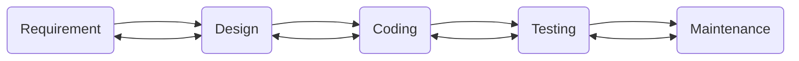
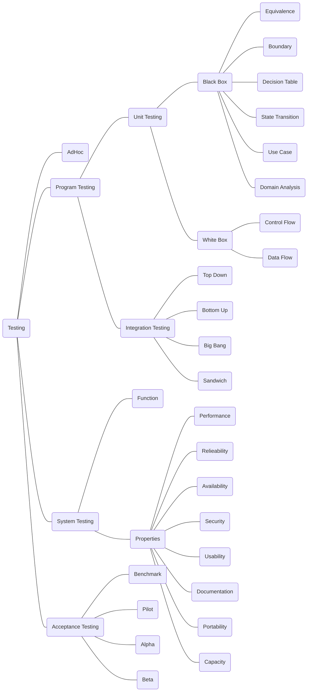
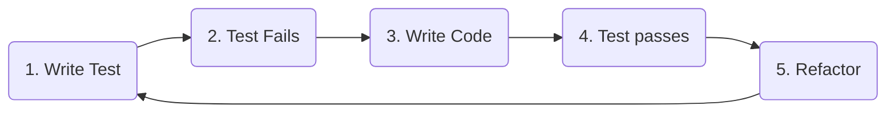

这是清华大学计算机系春季课程《软件工程》期中考试复习笔记。

<!--more-->

## 前端

### Typescript 初探

- `const` 和 `let` 的区别
  - 前者为常量，后者为变量
- `==`、`!=`、`===` 和 `!==`
  - 前两者会进行隐式转换，例如 `1 == true` 为真
  - 应尽量使用后两者
- `forEach`、`map` 和 `filter`
  - `arr.forEach((val, ind) => { })`，`val` 是值，`ind` 是下标
  - `arr.map(val => val * val)`，得到一个新的数组，其中每个元素为 `arr` 中对应下标元素的平方
  - `arr.filter(val => val % 2 == 0)`，得到一个新的数组，其中仅含偶数

### Next.js 路由

#### 基于文件系统的路由

```
src
└── pages
    ├── _app.tsx              // 入口文件
    ├── index.tsx             // /
    ├── login.tsx             // /login
    └── list
        ├── index.tsx         // /list
        ├── detail.tsx        // /list/detail
        └── edit.tsx          // /list/edit
```

#### `useRouter` Hook

**捕获路由参数**：`router.query.aaa` 对应着 `/list?aaa=bbb` 里的 `aaa` 字段，值为 `bbb`。

**实现页面跳转**：`router.push("/")` 和 `router.back()`。

### 副作用与网络请求

将耗时的数据获取操作从渲染本身中分离出来，这就是所谓的**副作用**。

#### `useEffect` Hook

```typescript
useEffect(() => {
    // 需要执行的副作用
    return () => {
        // 副作用的清除
    };
}, dependentList); // 依赖列表
```

`dependentList` 是一个数组，用于控制副作用何时被触发：

- 如果 `dependentList` 是 `undefined`，则副作用会在**每次渲染**时触发
- 如果 `dependentList` 是空数组 `[]`，则副作用只会在**第一次渲染**时触发
- 如果 `dependentList` 不为空，则副作用会在**第一次渲染**和 `dependentList` 中的变量**发生变化**时触发

#### 异步

声明为 `async` 的函数在调用时会**立即返回**，其函数体内容会在后台执行。

在一个异步函数的调用前面加上 `await` 关键字会**阻塞当前代码**，直到异步任务完成或报错。

因为 `await` 有阻塞代码执行的性质，所以**仅可以在异步函数体内使用**。

```typescript
request("/api/", "GET", false)
	.then((res) => {
    	// ...
    	return {};
	})
	.then((res) => {
    	// ...
    	return {};
	})
	.catch((err) => {
    	// ...
    })
	.finally(() => {});
```

## 后端

### Git 的使用

#### 基本概念

- 工作区：工作目录（你的代码所在的文件夹）；
- 暂存区：临时的缓存（做一个临时的标记）
- 分支：将暂存区中的内容提交到分支（做一次完整的记录）

#### main(master), HEAD

- main
- HEAD：指向工作区当前位置 commit 的指针，通常指向当前所在分支的最新的 commit

#### commit, merge

- commit：一次提交，每次 `git commit` 指令都会产生一个提交，该提交用一个独一无二的哈希值代表，伴随提交信息
- merge：合并指定分支到当前分支
  - Fast-Forward
    - 直接移动指针
  - Three-Way Merge
    - 考虑两次提交的最近公共祖先，这样就能看出差异点是由谁修改而成的，进而自动合并
  - Squash & Merge
    - 压缩分支的所有提交为一次

#### push, pull, fetch

- push：提交到远程仓库
- fetch：拉取远程仓库
- pull：拉取远程仓库并合并（=fetch+merge）

### 前后端交互中的鉴权问题

JWT（JSON Web Token）是一种开放标准（RFC 7519），用于安全地在两方之间传递信息作为 JSON 对象。

它可以用于身份验证和信息交换，提供了一种简洁的、自包含的方法用于在各方之间传递信息。

#### JWT 的结构

JWT 由三部分构成，并用 `.` 进行分割：`header.payload.signature`。

- **header**
  - 通常由两部分构成：令牌类型 `typ` 和加密算法 `alg`
  - 格式如下：
    ```json
    {
        "alg": "HW256",
        "typ": "JWT"
    }
    ```
  - 然后用 base64 编码
- **payload**
  - 载荷包含 JWT 的主要信息，比如用户的标识、令牌的签发时间等。
  - 可以包含多个预定义的字段，也可以包含自定义的字段。
  - 格式如下：
    ```json
    {
        "sub": "1234567890",
        "name": "John Doe",
        "iat": 1516239022
    }
    ```
  - 然后用 base64 编码
- **signature**
  - 签名用于验证消息的发送者身份并确保消息在传输过程中未被篡改。
  - 签名是通过对头部和载荷进行加密算法处理，并使用秘钥来生成。

#### 使用场景

- 身份验证
  - JWT 是进行身份验证的一种常见方法。当用户登录后，每个后续请求将包括 JWT，允许用户访问该令牌允许的路由、服务和资源
- 信息交换
  - JWT 是安全地在各方之间传输信息的好方法，因为可以验证每一部分的签名

## 敏捷开发

软件项目的“不可能三角”：同一个项目，在团队、效能水平一定的情况下，范围、时间、成本，三者只能取其二。

### 瀑布模型



在每一步骤完成之后才开始下一步骤。

**原因**：越早找到 bug，修复它的成本就越低。

**问题**：

- 软件的优势在于它能够快速修改（change）和适应（adapt）；但瀑布模型无法做到这一点
- 每个步骤用时很长，遇到问题时需要回溯到上一个步骤

### 敏捷开发的原则与特点

- Adaptive rather than predictive
  - 不要一开始就计划项目的绝大部分；应该增强软件开发的可修改性
- People-oriented rather than process-oriented
  - 合作共赢，享受合作开发的过程，利用人性；而非与其作对

#### 12 条原则

1. Our highest priority is to satisfy the customer through the early and continuous delivery of valuable software.
2. Welcome changing requirements, even late in development. Agile processes harness change for the customer’s competitive advantage.
3. Deliver working software frequently, from a couple of weeks to a couple of months, with a preference to the shorter timescale.
4. Business people and developers must work together daily throughout the project.
5. Build projects around motivated individuals. Give them the environment and support they need, and trust them to get the job done.
6. The most efficient and effective method of conveying information to and within a development team is face-to-face conversation.
7. Working software is the primary measure of progress.
8. Agile processes promote sustainable development. The sponsors, developers, and users should be able to maintain a constant pace indefinitely.
9. Continuous attention to technical excellence and good design enhances agility.
10. Simplicity–the art of maximizing the amount of work not done–is essential.
11. The best architectures, requirements, and designs emerge from self-organizing teams.
12. At regular intervals, the team reflects on how to become more effective, then tunes and adjusts its behavior accordingly.

#### 特点

合作共赢（Teamwork）；所有人向同一个目标奋斗，没有任何一个个体是独自工作的。

### 敏捷开发中的用户故事

$$
\text{Initiative} = n \cdot \text{Epics} = nm \cdot \text{Stories/Tasks} = nml \cdot \text{Subtasks}
$$

Stories 通常在 1~2 周内完成，Epic 通常在 1~3 个月内完成，Initiative 通常在 3~12 个月内完成。

#### 用户故事表达：卡片

**格式**：作为一名 `<角色>`，我可以 `<活动>`，使得 `<业务价值>`。

**例子**：

用户故事卡片：作为一名*消费者*，我希望能够*查看我的日常能源使用量*，从而我可以*降低能源支出和使用率*。

验收标准：

- 每 $10$ 秒钟读取 DecaWatt 计量表的数据，在门户上显示 $15$ 分钟的增量，在室内屏上显示每⼀读数；
- 随着新数据的产⽣读取 KiloWatt 计量表，并且每小时显示在门户上，在每次读取后显示在室内屏上。

#### INVEST 原则

- Independent（独立性）
  - 故事不依赖于其他故事，可以被单独地开发、测试甚至交付。
- Negotiable（可协商）
  - 故事不是详尽的需求说明书（系统应该完成的事），而是可协商的意向表达。
- Valuable（有价值）
  - 聚焦于由用户规定的价值，而非功能分解结构。
- Estimable（可估算）
  - 故事相对而言更容易估算，可以快速确定实现相关功能的工作量。
- Small（小型）
  - 故事代表有价值功能的小型增量，可以在一到两周内交付。
- Testable（可测试）
  - 清晰可测试。

### 敏捷开发中的 Scheduling

关键路径：项目用时的最长路径。

### 开发工具与敏捷开发概念的对应

|        Agile artifact | GitLab feature                     |
| --------------------: | :--------------------------------- |
|          User stories | Issues                             |
|                  Task | Task lists                         |
|                 Epics | Epics                              |
| Points and estimation | Issue weights                      |
|       Product backlog | Issue lists and prioritized labels |
|    Sprints/iterations | Milestones                         |
|       Burndown charts | Burndown charts                    |
|           Agile board | Issue boards                       |

### Release.Version.Revision

- Release Number：用户角度
- Version Number：开发者角度
- Revision Number：开发者角度
  - Change to a version that corrects only errors in the design/code, but does not affect the documented functionality.

### 版本控制

集中式版本控制的问题：每个版本都提交到中心，性能瓶颈，冲突解决

分布式版本控制的好处：在本地就可以做跟踪和回滚，大大减少提交的数量，对中心服务器的依赖减少；提升系统工作的性能

## 软件测试

软件测试就是为程序能够按预期设想运行而建立足够的信心。

- Verification（验证）：Did you build the thing right? 符合标准了吗？
- Validation（确认）：Did you build the right thing? 标准满足用户需求了吗？

测试用例：

- 输入数据：交由待测试程序代码进行处理的数据
- 前置条件：程序处理输入数据的运行上下文，即要满足前置条件
- 测试步骤：程序代码对输入数据的处理可能涉及到一系列的步骤，其中的某些步骤需要用户的进一步输入
- 预期输出：程序代码的预期输出结果

### Software Quality

Quality Assurance: Processes/standards to produce product and to improve quality over time.

Software Quality:

- Satisfies customers' needs
- Easy for developer to debug and enhance

### 软件测试方法分类



### 软件测试中的错误率恒定定律与规模代价平方定律

为了减少错误修复的成本，要尽可能早地发现错误，并在尽量小的范围内定位并修复错误。

#### 错误率恒定定律

对某一个程序员来说，不考虑其水平的成长，错误产出比在很长一段时间内（项目周期内）是个常数。

#### 规模代价平方定律

定位并修复一个 bug 所需的代价正比于目标代码规模的平方。

> 假设每 $100$ 行有 $10$ 个 bug，则每 $1000$ 行代码有 $100$ 个 bug。
>
> 假设找 $100$ 行代码中的 $1$ 个 bug 需要 $1$ 小时，则找 $1000$ 行代码中的 $1$ 个 bug 需要 $10^2 = 100$ 小时。
>
> 找 $1000$ 行代码中的 $50$ 个 bug：$50 \times 100 = 5000$ 小时。

### 测试驱动开发（Test Driven Development）循环



- Each new feature begins with writing a test.
- 在单测通过之前，不能写生产代码
- 新的单测写到让现有代码通不过即可
- 新的生产代码写到让现有单测通过即可

TDD uses same skills & techniques as conventional debugging - but more productive.

Writing tests before code takes more time up-front, but often less time overall.

### 软件测试的原则（FIRST 原则）

- Fast: Run (subset of) tests quickly (since you'll be running them all the time).
- Independent: No tests depend on others, so can run any subset in any order.
- Repeatable: Consistent results every run (to isolate bugs and enable automation).
- Self-checking: Test can automatically detect if passed (no human checking of output).
- Timely: Written about the same time as code under test (with TDD, written first!).

### 白盒测试：控制流测试

#### 判定覆盖（$C_1$）

分支整体取值为 `true` 和 `false` 都要覆盖到；如果为 `switch` 语句，则每一个 `case` 都需要被覆盖到。

在控制流图中，即为每条边都被遍历到。

#### 语句覆盖（$C_0$）

所有语句都要覆盖到。

在控制流图中，即为每个点都被遍历到。

### 黑盒测试：等价类测试

把不可穷举的数据，变成可穷举的类。

- 等价类是本质互斥的
- 等价类中的数据遵循“类似的行为”
- 测试数据由等价类派生而成

#### 弱测试和强测试

- 弱测试
  - 每行都覆盖到，每列都覆盖到
- 强测试
  - 每行且每列都覆盖到
- General Testing
  - 只有 valid 的测试点被覆盖到
- Robust Testing
  - 无论 valid 还是 invalid 的测试点都要被覆盖到

## 代码风格与重构

### 防御式编程的权衡取舍

Assume nothing. Unwritten assumptions continually cause faults, particularly as code grows.

- Encourage programmers to include as many checks as possible
  - Check the values of all data from external sources
  - Check the values of all input parameters
  - Decide how to handle bad inputs

|                      AGAINST | FOR                                                      |
| ---------------------------: | -------------------------------------------------------- |
|     影响代码运行性能（速度） | 节省了很多调试的时间                                     |
| 有些防御式编程需要额外的工作 | 速度慢但可靠的代码，比速度快但**有时出错**的代码更有意义 |

### 代码格式

代码是写给编译器、自己、**其他人**看的。

Good code does not require a lot of thinking to understand. If the code logic is not clear at the first glance, the code is probably not good enough.

#### The Big Deal

- Presentation makes a real impact on the quality of code.
- Programmers read meaning into code based on its layout.
  - Good presentation: Illuminate and support your code’s structure, helping reader understand what’s going on.
  - Bad presentation: Confuse, mislead, and hide the code's intent.
- Bad formatting not only makes code harder to follow; it may actually hide bugs from you.

#### Good Presentation

- Consistent
  - Keep the style consistent across the project.
- Conventional
  - To adopt one of the major styles currently in use in the industry rather than invent your own rules.
- Concise
  - Easy to follow and pick up.

### 命名规范

#### 要求

Accurate and easy-to-understand

**命名的作用**：

- Identity
- Behavior
  - Roles, relationships, and interactions
- Recognition
  - Elevate something from ethereal concept to well-defined reality

**如何命名**：

- Descriptive
- Technically correct
- Idiomatic
- Appropriate

**禁止**：

- Cryptic
- Verbose
- Inaccurate or misleading
- Ambiguous or vague

#### 好处

People naturally read the meaning out of something based on its name.

From the viewpoint of the use, hiding all the internal implementation.

### 自文档代码

#### 要求

- Write simple code with good presentation
  - Avoid too many nested statements
  - Be wary of optimizing code so that it's no longer a clear expression of a basic algorithm.
    - Never optimize code unless you've proved that it is a bottleneck to acceptable program function.
- Decompose into atomic functions
- Group related information
- Emphasize important code
- Choose meaningful names
- Choose descriptive types
- Name constants
  - Avoid magic numbers.

#### 好处

The only document that describes your code completely and correctly is the code itself.

Even the smallest, most beautiful functions will need later maintenance.

### 注释规范

#### 要求

We need to focus on comment quality, not quantity, so more important than the amount of comments we write are the contents of those comments.

- Explain 'why', not 'how'
- Don't describe the code
- Don't replace the code
- Keep it useful
  - Document the unexpected
  - Tell the truth
  - Are worthwhile
  - Are clear

#### 好处

Describe the intent of the code.

Summarize the whole block of code.

### 代码气味

- Continuous inspection
- Health
  - Duplicated code
  - Coding standards
  - Code complexity
  - Comments
  - Bugs
  - Security vulnerabilities

#### ABC Complexity

Assignments, Branches, Conditions.
$$
\sqrt{A^2 + B^2 + C^2} \le 20 \quad(\text{per method})
$$

#### 圈复杂度

Edge, Vertex, Decision, Region
$$
\text{Cycle Complexity} = |E| - |V| + 2 = |D| + 1 = |R|
$$

### 代码重构的定义

A software transformation that

- Preserves the external software behavior
- Improves the internal software structure  

Refactoring is a disciplined technique for restructuring an existing body of code, altering its internal structure without changing its external behavior.  

- To enhance some non-functional quality – simplicity, flexibility, understandability, performance
- Its heart is a series of small behavior-preserving transformations. The system is kept fully working after each refactoring
