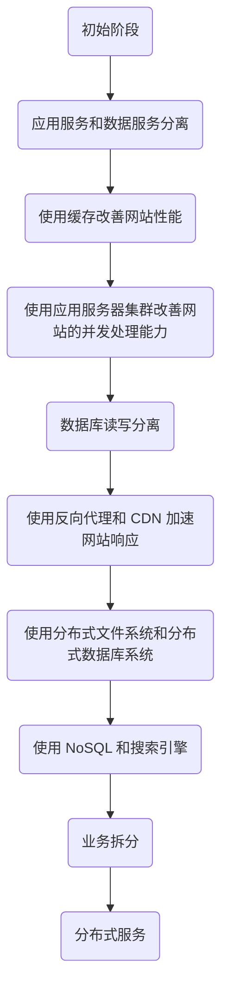
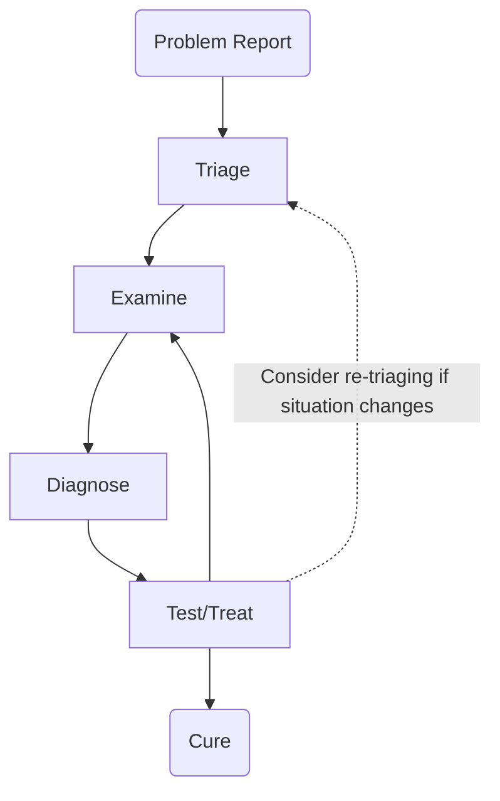

这是清华大学计算机系春季课程《软件工程》期末考试复习笔记。

<!--more-->

## 软件架构

### 大型网站架构的演化发展历程

#### 架构演化的价值观

- 大型网站架构技术的核心价值是随网站所需灵活应对
- 驱动大型网站技术发展的主要力量是网站的业务发展

#### 架构设计误区

- 一味追随大公司的解决方案
- 为了技术而技术
- 企图用技术解决所有的问题

#### 并发处理能力的改善

- 通过负载均衡调度服务器，可将来自用户浏览器的访问请求分发到应用服务器集群中的任何一台服务器上，服务器的负载压力不再成为整个网站的瓶颈。
- 部分数据库读操作（缓存访问不命中、缓存过期）和全部的写操作需要访问数据库。当负载压力过高时，数据库成为瓶颈。

#### 数据库读写分离

- 应用服务器在写数据的时候，访问主数据库，主数据库通过主从复制机制将数据更新同步到从数据库。
- 应用服务器在读数据的时候，直接通过从数据库获得数据。

### 流媒体应用架构

#### CDN

内容分发网络（Content Distribution Network, CDN）技术

**概念**

CDN 是一种分布式网络系统，通过在地理上分散的多个服务器节点上缓存和传输互联网上的内容，以提高内容传输的性能和可用性。

**特点**

CDN 会在 CDN 节点上存储内容的副本。

- 当用户请求内容时，服务提供商会返回一个清单文件（manifest）
  - 客户端根据这个清单文件，选择能够支持的最高码率来获取内容
  - 如果网络路径出现拥塞，客户端可以选择不同的码率或副本进行获取

#### DASH

动态自适应比特率视频流（Dynamic, Adaptive Streaming over HTTP, DASH）技术

**概念**

服务器端：

- 将视频文件划分为多个块
- 对每个块编码成多个不同的码率
- 不同码率的编码存储在不同的文件中
- 这些文件复制到各个 CDN 节点上
- 一个清单文件提供了不同块的 URL 地址

客户端：

- 定期估算服务器到客户端的带宽
- 根据清单文件，一次请求一个块
- 选择当前带宽所支持的最高编码码率
- 可以在不同时间点根据可用带宽选择不同的编码码率，并从不同的服务器获取

**特点**

DASH 的“智能”体现在，客户端决定：

- 何时请求视频块（以避免缓冲区耗尽或溢出）
- 请求何种编码码率（在带宽充足时请求更高质量）
- 从哪里请求视频块（可以选择离客户端较近或可用带宽较高的服务器 URL）

Streaming Video = Encoding + DASH + Playout Buffering

### Client-Server 和 P2P 架构

#### 两种架构的概念

**Client-Server 架构**

- 客户端发起请求，服务器响应多个客户端的请求
- 这种架构捕获了专业服务器和客户端的可重用行为，而不需要指定服务器和客户端的具体实现方式

**P2P 架构**

- 所有实体都同时扮演客户端和服务器的角色
- 这种架构更加灵活，但也使得实现专门做好客户端或服务器工作的软件变得更加困难

特点：

- 没有常时在线的服务器,而是任意的终端系统直接进行通信
- peers 向其他 peers 请求服务，并提供回报服务
- 具有自我扩展性——新的 peers 带来新的服务能力和新的服务需求
- peers 连接是间歇性的，IP 地址也会发生变化
- 管理更加复杂

例子：BitTorrent（文件共享），看看网（流媒体），Skype（VoIP）

#### 两种架构的区别

> 以软件分发问题为例。考虑将文件大小为 $F$ 的文件从一个服务器传输到 $N$ 个 clients/peers。记 $u_s$ 为服务器的上传速率，$u_i$ 为第 $i$ 个 client/peer 的上传速率，$d_i$ 为第 $i$ 个 client/peer 的下载速率。

**Client-Server 架构**

服务器端，上传 $N$ 个 copies 需要 $NF/u_s$ 的时间。

客户端，由于并行下载，所以下载一个 copy 的时间由拥有最小下载速率 $d_{\min}$ 的客户端决定，需要 $F/d_{\min}$ 的时间。

$$
t_{\text{Client-Server}} \ge \max\{\frac{NF}{u_s}, \frac{F}{d_\min}\},
$$
其中第一项随着 $N$ 线性增长。

**P2P 架构**

服务器端，至少需要上传 $1$ 个 copy，需要 $F/u_s$ 的时间。

客户端，每个客户端下载一个 copy 需要 $F/d_{\min}$ 的时间。由于所有客户端加起来需要下载 $NF$ 大小的文件，所以还需要考虑所有客户端（再加上服务器）累计上传的时间，总计 $NF/(u_s + \sum u_i)$。

$$
t_{\text{P2P}} \ge \max\{\frac{F}{u_s}, \frac{F}{d_{\min}}, \frac{NF}{u_s + \sum u_i}\},
$$
虽然最后一项分子随着 $N$ 线性增长，但是分母中的 $\sum u_i$ 也随着 $N$ 线性增长。

### 软件设计的五个原则

#### KISS = Keep It Simple and Stupid

**概念**

KISS 原则指的是在设计系统或解决问题时，应该保持设计的简单性和易懂性，避免过度复杂化。

**好处**

1. 提高可靠性和稳定性：简单的设计往往更加可靠，因为减少了复杂性所带来的潜在问题。
2. 降低维护成本：简单的设计更容易被理解和维护，减少了后期维护的负担。
3. 提高效率和灵活性：简单的设计通常更加高效,并且更容易进行修改和扩展。
4. 提高可读性和易用性：简单明了的设计更容易被使用者理解和掌握。
5. 更快的开发周期：简单设计的开发和测试过程通常更加快捷。

#### Modularity

**概念**

Dividing complex system into simpler components. 强内聚，松耦合。

**好处**

- 开发更容易进行规划
- 可以定义和交付软件增量
- 更容易适应变更
- 测试和调试可以更有效地进行
- 长期维护可以在没有严重副作用的情况下进行

#### Separation of Concerns（各司其职）

**概念**

“关注点分离”是一种软件设计原则，指的是将软件系统分解为相互独立的部分，每个部分负责特定的功能或职责。其主要包括：

1. 分解（Decomposition）
   - 将复杂的问题分解为多个相对独立的子问题或模块
   - 每个子问题或模块都应该是小规模的、简单的、可控的
2. 综合（Synthesis）
   - 将各个子问题或模块的解决方案组装成一个完整的系统解决方案
   - 各个模块之间通过定义良好的接口进行交互和协作

**好处**

可以提高软件的模块化、可维护性和可扩展性。各个模块专注于自己的核心职责，降低了整体复杂度，便于理解和修改。

#### Design for CHANGE

**概念**

将可能发生的变化纳入系统设计的考虑范畴。

具体而言，需要将可能发生变化的部分隔离到软件的特定模块中，使得变更仅限于这些小的模块，而不会影响到整个系统。

Modifiability：可修改性是指软件系统能够适应变更的程度，它与变更的成本直接相关。

**好处**

较高的可修改性有利于降低软件的长期运营成本，提高企业的敏捷性和竞争力。

#### Design for REUSE

**概念**

为了避免重复造轮子，我们需要遵循不重复自己（Don't Repeat Yourself, DRY）原则，避免重复劳动（Write Every Time, WET）。

软件开发是一项昂贵的工作，重用软件资产对于提高投资回报率（Return On Investment, ROI）至关重要。

可重用的软件资产包括：

- 设计、代码、测试用例
- 问题解决方案、设计解决方案
- 工具和流程
- 经验和最佳实践

**好处**

- 降低生产和维护成本
- 缩短交付周期
- 提高软件质量

### 高可用的两个关键概念

#### 可用性

可用性指的是系统掩藏或修复故障的能力，使得在指定时间间隔内累计服务中断时间不超过要求的值。

#### 容错性

容错（Fault Tolerance）是指即使硬件/软件/网络可靠性较低，分布式系统也能保持可用性。容错不应有用户或系统管理员参与，可以通过以下两种方式实现：

- Recovery (e.g., relying on equivalent services)
- Replication of components

### 网站的高性能架构

#### 对比不同视角下的网站性能

**用户视角**

用户在浏览器上直观感受到的网站响应速度。

- 用户计算机和网站服务器通信的时间
- 网站服务器处理的时间
- 用户计算机浏览器构造请求解析响应数据的时间

**开发人员视角**

应用程序本身及其相关子程序的性能。

- 响应延迟
- 系统吞吐量
- 并发处理能力
- 系统稳定性

**维护人员视角**

基础设施性能和资源利用率。

- 网络运行商的带宽能力
- 服务器硬件的配置
- 数据中心网络架构
- 服务器和网络带宽的资源利用率

#### 高性能缓存架构的三个问题

**缓存穿透**

缓存穿透是指缓存和数据库中都没有的数据，而用户不断发起请求，如发起为 ID 为 $-1$ 的数据或 ID 特别大而不存在的数据。这时的用户很可能是攻击者，攻击会导致数据库压力过大。

解决方案：

- 接口层增加校验，如用户鉴权校验，ID 做基础校验，ID $\le 0$ 的直接拦截；
- 从缓存取不到的数据，在数据库中也没有取到，这时也可以将 key-value 对写为 key-null，缓存有效时间可以设置短点，如 $30$ 秒（设置太长会导致正常情况也没法使用）。这样可以防止攻击用户反复用同一个 ID 暴力攻击。

**缓存雪崩**

当缓存失效（过期）后引起系统性能急剧下降的情况。当缓存过期被清除后，业务系统需要重新生成缓存，因此需要再次访问存储系统，再次进行运算，这个处理步骤耗时几十毫秒甚至上百毫秒。而对于一个高并发的业务系统来说，几百毫秒内可能会接到几百上千个请求。由于旧的缓存已经被清除，新的缓存还未生成，并且处理这些请求的线程都不知道另外有一个线程正在生成缓存，因此所有的请求都会去重新生成缓存，都会去访问存储系统，从而对存储系统造成巨大的性能压力。这些压力又会拖慢整个系统，严重的会造成数据库宕机，从而形成一系列连锁反应，造成整个系统崩溃。

解决方案：

- 缓存数据的过期时间设置随机，防止同一时间大量数据过期现象发生。
- 如果缓存数据库是分布式部署，将热点数据均匀分布在不同的缓存数据库中。
- 设置热点数据永远不过期。

**缓存热点**

虽然缓存系统本身的性能比较高，但对于一些特别热点的数据，如果大部分甚至所有的业务请求都命中同一份缓存数据，则这份数据所在的缓存服务器的压力也很大。例如，某明星微博发布“我们”来宣告恋爱了，短时间内上千万的用户都会来围观。

解决方案：

- 复制多份缓存副本，将请求分散到多个缓存服务器上，减轻缓存热点导致的单台缓存服务器压力。以微博为例，对于粉丝数超过 $100$ 万的明星，每条微博都可以生成 $100$ 份缓存，缓存的数据是一样的，通过在缓存的 key 里面加上编号进行区分，每次读缓存时都随机读取其中某份缓存。
- 缓存副本设计有一个细节需要注意，就是不同的缓存副本不要设置统一的过期时间，否则就会出现所有缓存副本同时生成同时失效的情况，从而引发缓存雪崩效应。正确的做法是设定一个过期时间范围，不同的缓存副本的过期时间是指定范围内的随机值。

#### 负载均衡技术及算法

在网站高并发访问的场景下，使用负载均衡技术为一个应用构建一个由多台服务器组成的服务器集群，将并发访问请求分发到多台服务器上处理，避免单一服务器因负载压力过大而响应缓慢，使用户请求具有更好的响应延迟特性。

- DNS 负载均衡
- 硬件负载均衡
- 软件负载均衡

**算法**

- 轮询
  - 服务器不宕机、服务器与负载均衡器不断连
- 加权轮询
  - 服务器性能有差异
- 负载最低优先
  - 连接数、请求数、CPU 负载、I/O 负载
  - 需要采样
- 性能最优优先
  - 处理速度
  - 需要采样
- Hash
  - 源地址
  - ID

**Web 前端性能优化**

- 浏览器访问优化
  - 减少 HTTP 请求
  - 使用浏览器缓存
  - 启用压缩
  - CSS 放在页面最上面，JavaScript 放在页面最下面
  - 减少 Cookie 传输
- CDN 加速
  - 内容分发网络，将数据缓存在离用户最近的地方，使用户以最快速度获取数据，即所谓网络访问第一跳
- 反向代理
  - 传统代理服务器位于浏览器一侧；反向代理位于网站机房一侧，代理网站 Web 服务器接收 HTTP 请求

**应用服务器性能优化**

- 异步操作
  - 使用消息队列将调用异步
    - 不使用消息队列，用户的请求数据直接写入数据库，在高并发的情况下，会对数据库造成巨大的压力，响应延迟加剧。
    - 使用消息队列后，用户请求的数据发送给消息队列后立即返回，再由消息队列的消费者进程从消息队列中获取数据，异步写入数据库。
  - 消息队列有很好的削峰作用
    - 通过异步处理，将短时间高并发产生的事务消息存储在消息队列中，从而削平高峰期的并发事务。
    - 在电子商务网站促销活动中，合理使用消息队列，可有效抵御促销活动刚开始大量涌入的订单对系统造成的冲击。

### 微服务架构

#### 微服务架构的概念、特点

**概念**

微服务架构是一种将单个应用程序开发为一套小型服务的方法，每个服务都在自己的进程中运行，并通过轻量级机制（通常是 HTTP 资源 API）进行通信。

这些服务是围绕业务功能构建的，可以通过完全自动化的部署机制独立部署。

**特点**

- 在已发布的接口中将服务作为构建块（组件）使用
- 围绕业务功能来组织
- 开发团队完全负责生产环境中的软件
- 智能端点和简单管道（Smart endpoints and dumb pipes）
- 语言的去中心化控制（Decentralized control of languages）
  - 例如，去中心化的数据库

#### 对比单体（Monolith）应用和微服务应用的区别（数据库部署）

## 软件需求

### 软件需求的概念

需求是对应当执行的任务的规范说明，描述系统的行为特性或属性，是一种对系统开发进程的约束。

开发软件系统的前提是要明确用户的期望和要求，即软件需求。

刻画软件边界，有所为有所不为：能做什么，不能做什么，哪些是力所能及的合理的期望，哪些是力所不及、而我们需要据理力拒的。然后把那些合理的期望描述清楚。

#### 需求工程的特点

- 知识密集型工作，需要交叉多学科的知识
- 多方共同参与
- 需求获取的多种形式和源头
- 持续迭代和逐步推进

### 用户需求的获取过程

- 确定干系人代表：干系人是指积极参与项目的某个人、群体或组织，可能会受项目过程和结果的影响或影响项目的过程和结果。
- 确定决策者：在软件项目中，需要在关键路径上做决定，或是解决一些冲突，接受（或拒绝）某个需求变更或者批准一组即将发布的需求。决策人或决策小组对决定工作方向、保证项目进度具有重要作用。
- 需求达成共识：对需求或其中某部分达成一致是客户-开发关系的核心。
  - 客户确认：需求描述了他们的需要
  - 开发人员确认：理解需求并且可以实现
  - 测试人员确认：需求是可验证的
  - 管理层确认：需求满足业务目标

### 泳道图绘制

每类用户在一个泳道上。纵向描述的是业务过程。 横向表示他们之间的交互，纵向表示顺序。 泳道图与实现无关。  

### 判定树绘制

### 用例的识别和分析

#### 识别

1. 确定角色，分析角色和系统交互活动
2. 分析业务过程，将场景概括为用例
3. 识别系统外部事件，并关联到角色和用例

#### 分析

**问题**

- 用例用户看不懂用例
- 用例过于复杂：应分解较长的流程
- 用例内含设计
- 用例内含数据定义：根据输入/输出关系区分功能，但用例说明中不应含有数据定义。
- 用例过多

**条件**

- 触发条件：事件，引发相关用例的执行
- 前置条件：系统开始执行用例之前必须满足的先决条件
- 后置条件：用例执行成功后系统的状态

### 顺序图绘制

主谓宾需要分清楚，把所有的主语和宾语全部拿出来作为每一列的名称，列与列之间用箭头来表示 $A \overset{\text{verb}}\to B$，$A$ 对 $B$ 进行了 $\text{verb}$。

### 定义良好的需求（Well-Formed Requirement）的三个要求

#### 概念

- 可验证（Verifiable）：可以被验证。
- 必要（Necessary）：指系统必须满足或拥有的条件，以解决利益相关方的问题或实现他们的目标。
- 可量化（Quantifiable）：通过可测量的条件和有约束条件来限定和限制某个特性或属性。

#### 需求改写

> When signal x is received [Condition], the system [Subject] shall set [Action] the signal x received bit [Object] within [Constraints] 2 seconds [Value].

> At sea state 1 [Condition], the Radar system [Subject] shall detect [Action] targets [Object] at ranges out to [Constraints] 100 nautical miles [Value].

> The Invoice system [Subject] shall display [Action] pending customer [Constraints] invoices [Object] in ascending order [Value] in which invoices are to be paid [Constraints].

### 需求缺陷的代价：戴维斯假设（Davis' Hypotheses）

The later in the life-cycle that a fault will be discovered, the more expensive it will be to fix it.

## 软件运维

### 软件运维在软件系统生命周期的开销占比

软件系统的生命周期中，使用阶段所占的时间比设计和实现阶段要长得多。软件系统总成本的 $40\%\sim 90\%$ 都发生在系统投入使用之后。

### SRE 的信条（Tenets of SRE）

Site Reliability Engineer（SRE）teams are capability of doing Ops Automation, with the goal of “making the service run and repair itself”.

通过合理分配资源，SRE 团队可以同时提高系统可靠性和团队效率。这种模式可以使得团队增长呈亚线性趋势。

- 保证持续对工程的关注
- 在不违反服务 SLO 的情况下，追求最大变更速度
- 监控的紧急程度：警报（Alerts）（立即行动）>工单（Tickets）（行动）>日志（FYI）
- 应急响应：
  - 可靠性取决于平均无故障时间（MTTF）和平均修复时间（MTTR）
  - 人工参与会增加响应延迟，尽可能实现自动化
  - 制定值班“手册”（可将 MTTR 变为原来的 $1/3$）和“灾难演练”
- 变更管理：
  - $70\%$ 的中断是由于对生产系统的变更引起的
  - 减少人工参与：
    - 实施渐进式发布
    - 快速准确地检测问题
    - 在出现问题时安全地回滚变更
- 需求预测和容量规划：
  - 确保有足够的容量和冗余，以满足未来预期需求并达到所需的可用性
  - 三个必要步骤：
    1. 准确的有机需求预测，覆盖获取容量所需的提前期
    2. 准确地将非有机需求纳入需求预测
    3. 定期进行系统负载测试，以关联原始容量（服务器、磁盘等）和服务容量
- 供给（Provisioning）：
  - 结合变更管理和容量规划
- 效率和性能：
  - 有效利用资源可以节省大量成本
  - 应密切监控并维护性能（响应速度）

### 拥抱风险原则

#### 可靠性（Reliability）

用户无法区分 high reliability 和 extreme reliability。

- 需要平衡“有不可用的风险”与“快速迭代”、“高效服务”
- 用”管理风险（managing risk）“原则来管理服务的可靠性
  - 降低系统出错的风险
  - 用于保证”可靠性“的成本，会随着目标可靠性的增加而非线性上升（所以，控制 $99.99\%$ 即可，不需要更高）
    - 多余的机器运行、计算成本
    - 机会成本（本来用这些资源可以去做 feature 的）
- 低可靠性会带来用户的不满意、不信任、资金、公司信誉等问题

#### MTBF 和 MTTR 的计算

MTBF 是 mean time between failures，MTTR 是 mean time to repair，也就是说，
$$
\begin{align*}
\text{MTBF} & = \frac{\text{uptime}}{\# \text{ of failures}}, \\
\text{MTTR} & = \frac{\text{downtime}}{\# \text{ of failures}}.
\end{align*}
$$

#### 基于时间的可用性（Time-Based Availability）

$$
\text{TBA} = \frac{\text{uptime}}{\text{uptime} + \text{downtime}}.
$$

等价地，$\text{TBA} = \text{MTBF}/(\text{MTBF} + \text{MTTR})$。

#### 合计可用性（Aggregate Availability）

$$
\text{AA} = \frac{\text{successful requests}}{\text{total requests}}.
$$

#### 错误预算

即容许错误次数，可以通过 SLO 来计算（总请求次数乘以 SLO 规定的比例）。好处在于可以决定发布版本的频率。

### 服务质量目标（Service Level Objectives）

#### 相关术语

- 服务水平指标（Service Level Indicator，SLI）：定量指标，用来测量某个方面的服务水平
  - 例如：请求延迟、错误率、系统吞吐量、可用性
  - 通常会在一个时间窗口内聚合计算，如速率、平均值或百分位数
- 服务水平目标（Service Level Objective，SLO）：针对某个 SLI 设定的目标值或值范围，应该是优先工作的主要驱动因素。
  - 例如：每个请求的平均延迟应该小于 $100\;\mathrm{ms}$
- 服务水平协议（Service Level Agreements，SLA）：与用户的明确或隐含的合同，包括达成 SLO 或未达成 SLO 的后果。

#### 实践中的指标

**哪些指标？**

- 面向用户的服务系统（例如前端）：可用性（availability），延迟（latency），吞吐量（throughput）。
- 存储系统：延迟、可用性、持久性（durability）。
- 大数据系统：吞吐量、端到端延迟（end-to-end latency）。

**如何收集？**

- 服务端：Prometheus/Zabbix/Borgmon 系统、周期性日志分析
- 客户端：客户端检测工具

### 琐事（Toil）

#### 概念

与运营生产服务相关的工作，它往往是手动的（manual）、重复性的（repetitive）、可自动化的（automatable）、战术性的（tactical），没有持久价值（devoid of enduring value），随着服务的增长而呈线性增长。

#### 尽量消除琐事（Eliminating Toil）的相关目标

将每个 SRE 消耗在琐事上的时间控制在 $50\%$ 以下。至少 $50\%$ 的时间应该花在要么减少未来琐事，要么增加服务 feature 的项目上。

**SRE 的典型活动类别**

- 软件工程：编写或修改代码，包括任何相关的设计和文档工作。
- 系统工程：配置生产系统，修改配置等。
- 琐事：直接与运行服务相关的重复性、手动等工作。
- 日常工作：不直接与运行服务相关的行政工作。

### 分布式系统的监控

#### 黑盒监控

症状导向，代表实际出现的而非预测的问题，表示"系统现在无法正常工作"。是在测试中外部可见的一些异常行为。

**四大黄金监控信号**

1. 延迟（Latency）：服务请求的响应时间。
2. 流量（Traffic）：系统承受的请求量，用一个高层系统特定指标来衡量。
3. 错误（Errors）：失败请求的比率。
4. 饱和度（Saturation）：系统使用率，关注最受限的资源。
   - 例如：通过监控 $1$ 分钟内的 $99\%$ 响应时间来快速检测饱和度。

#### 白盒监控

依赖于对系统内部的检查。可以检测即将到来的问题、被重试掩盖的故障等。

是一些内部指标，例如 logs：JVM logs，HTTP logs 等。

### 紧急警报的基本哲学（Fundamental Philosophy on Pages）

- 每当被 pager 唤醒时，我都应该以强烈的紧迫感做出反应。但一天之内只能有几次这种紧迫感，否则会疲惫不堪。
- 每次被 pager 唤醒都应该是可采取行动的（actionable）。
- 每次 page 都应该需要人类智能（human intelligence）。如果一次 page 只需要机器人式的响应，它就不应该触发 pager。
- Pages 应该关注一个全新的问题或以前未见过的事件。
- 应该找出问题的根源并消除它；如果无法解决根本问题，那么这种警报响应就应该被完全自动化。

### On-call 轮值原则（Being On-Call）

#### 概念

轮值工程师需要在工作时间和**非工作时间**都保持联系。

**例子**

- 接到 pager 通知后，轮值工程师需要立即进行问题诊断和解决，可能需要与其他团队成员协作，并根据需要进行升级。
- 目标 $99.99\%$ 可用性 $\to$ 每季度错误预算 $13\;\mathrm{min}$ 分钟 $\to$ $5\;\mathrm{min}$ 内启动操作
- 对于不紧急的事件，给予 $30\;\mathrm{min}$ 响应时间
- 非 page 事件在工作时间内以较低优先级处理

#### 作用

保持服务的可靠性和可用性。

### 有效的故障排查手段（Effective Troubleshooting）

#### 假说演绎法

#### 常见错误

- 关注不相关的症状，或误解系统指标的含义
- 误解如何改变系统、输入或环境来安全有效地验证假设
- 提出非常不太可能的错误理论，或者死死抓住过去问题的原因，认为既然发生过一次就一定又发生了
  - 在多种可能解释中优先选择较简单的解释（奥卡姆剃刀原则）

- 追踪虚假相关性，这可能只是巧合或由共同因素引起的相关性
  - **相关性并不等同于因果关系**

#### 过程

- Problem Report：有效的问题报告应包括预期行为、实际行为，以及尽可能重现问题的步骤。可以记录调查和修复活动的日志，方便未来参考。
- Triage：评估问题的严重程度，首要任务是止血：尽可能让系统在当前环境下运行得更好。
- Examine：检查系统中的每个组件，查看所有监控指标，例如各种 log。
- Diagnose：关注组件之间的连接关系，或者数据流，来判断每个组件是否正常工作。
  - 从系统的一端开始，逐步向另一端检查每个组件。
  - 找出 What（出现问题的功能在做什么）Why（为什么会有这样的表现）Where（数据资源从哪里获得的，被存放到了哪里）
  - 检查“最后改动了什么”。

#### 总结

**构建可观察性**

- 从根本上为每个组件都建立白盒指标和结构化日志
- 记录工作流程和变更情况
- 设计组件之间有良好理解和可观察的接口
- 确保系统内部信息以一致的方式可用，以加快问题诊断和恢复速度

**采取系统的故障排查方法**

- 不要依赖运气或经验，而是采用系统的方法
- 这可以帮助缩短服务恢复时间，提升用户体验

### 紧急事件响应（Emergency Response）

#### 类型

- Test (Controlled failures)-induced emergency  
- Change-induced emergency
- Process-induced emergency

#### 注意事项

**所有问题都有解决方案**

- 时间和经验都证明，系统不仅会出现故障，而且会以前所未有的方式出现故障
- 多与团队成员合作，寻求帮助，采取各种必要措施，但要尽快行动
- 在应急情况得到缓解后，一定要腾出时间进行清理、撰写事故报告

**从过去中吸取教训，不要重复犯错**

- 记录历史中断事件，记录预防策略和方法
- 提出大胆的“如果”假设性问题
- 鼓励主动进行测试
