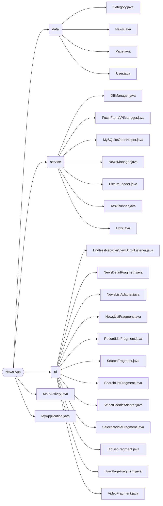

清华大学计算机系暑期课程《程序设计训练》(Java) 大作业报告（2023 夏）。

[NewsApp(头条大师) 下载地址](https://cloud.tsinghua.edu.cn/d/4757cf947e964d1797e4/files/?p=%2FNewsApp.apk)

GitHub repo 在 [LeverImmy/News-App](https://github.com/LeverImmy/News-App/)

**目录**

- News App(头条大师)
  - 作业描述
  - 代码结构
  - 具体实现
    - 新闻详情获取
    - 新闻列表上拉刷新下划加载
    - 图片展示和视频播放
    - 修改列表分类时的抖动特效
    - 新闻查找
    - 浏览记录以及收藏夹的本地存储以及新闻列表的展示顺序
    - 对手机“返回键”行为的处理
  - 遇到的问题及其解决方法
    - JDK 安装包重复导入的问题
    - 如何通过报错信息查找 bug
    - 查找新闻时的时间范围设置
    - 视频播放问题
    - repo 回滚
  - 总结和心得

<!--more-->

## 作业描述

互联网科技的发展让新闻的传播从报纸、广播、电视等方式发展到了网页以及最近几年兴起的手机 app 客户端，人们获取新闻的方式变得异常容易。手机上的新闻 app 让大家随时随地掏出手机即可看天下事，手机新闻 app 不再是一个简简单单的新闻获取工具，许多 app 已经利用数据挖掘构建出了新闻推荐引擎，为用户提供个性化、更有价值的新闻，例如 [今日头条](https://www.toutiao.com/)、[天天快报](http://www.ttkbao.com/) 等。

现在让我们也来尝试一下做一个新闻 app！本次大作业的任务就是实现一款浏览新闻的工具类软件。其中，抓取新闻由 [清华大学计算机系知识工程实验室](https://keg.cs.tsinghua.edu.cn/) 进行，并提供了访问新闻的接口，同学们根据网络接口文档和作业要求利用课上所学的 Java 和 Android 开发知识实现一个新闻客户端即可。

## 代码结构

代码结构如下图所示。



- `data`
  - `Category.java` 是一个枚举类，包含可被搜索的八个分类。
  - `News.java` 是一个类，用于描述一篇新闻，包含 `title`，`content` 等属性。
  - `Page.java` 是一个枚举类，包含当前页面可能处于的状态（如“新闻详情界面”“新闻列表界面”“搜索界面”等）。
  - `User.java` 是一个类，用于描述用户个性化信息（如选择的分类）的读写。
- `service`
  - `DBManager.java` 用于数据库管理。
  - `FetchFromAPIManager.java` 用于新闻详情获取。
  - `MySQLiteOpenHelper.java` 用于数据库管理。
  - `NewsManager.java` 用于新闻相关处理，包含已浏览新闻列表的读写。
  - `PictureLoader.java` 用于展示图片。
  - `TaskRunner.java` 用于管理进程。
  - `Utils.java` 是一个类，包含了很多辅助的函数，如将一个枚举数组转化为字符串等。
- `ui`
  - `EndlessRecyclerViewScrollListener.java` 是展示新闻列表所需要的 Listener。
  - `NewsDetailFragment.java` 是展示新闻详情的 Fragment。
  - `NewsListAdapter.java` 是辅助展示新闻列表的 Adapter。
  - `NewsListFragment.java` 是展示推荐界面新闻列表的 Fragment。
  - `RecordListFragment.java` 是展示浏览记录、收藏夹新闻列表的 Fragment。
  - `SearchFragment.java` 是搜索界面的 Fragment。
  - `SearchListFragment.java` 是展示搜索结果新闻列表的 Fragment。
  - `SelectPaddleAdapter.java` 是辅助修改分类界面的 Adapter。
  - `SelectPaddleFragment.java` 是修改分类界面的 Fragment。
  - `TabListFragment.java` 是推荐界面上方分类栏的 Fragment。
  - `UserPageFragment.java` 是用户主页的 Fragment。
  - `VideoFragment.java` 是播放视频的 Fragment。
- `MainActivity.java`
- `MyApplication.java`

## 具体实现

### 新闻详情获取

新闻详情获取部分我使用了 `URLConnection` 和 `JSONObject` 等库，这样能方便地向学校提供的接口发送请求，以及获取返回的 JSON 格式的数据。

```java
static JSONObject getUrlResponse(String url) {
    try {
        URLConnection connection = new URL(url).openConnection();
        BufferedReader reader = new BufferedReader(new InputStreamReader(connection.getInputStream()));
        StringBuilder builder = new StringBuilder();
        String line;
        while ((line = reader.readLine()) != null) {
            builder.append(line);
        }
        return new JSONObject(builder.toString());
    } catch (IOException | JSONException e) {
        e.printStackTrace();
        return new JSONObject();
    }
}
```

由于我在 `data/News.java` 这个类中重载了由 `JSONObject` 构造 `News` 的构造函数，所以可以在之后的过程中，直接由获取到的 JSONObject 中的 data 项构造每条新闻：

```java
try {
    JSONArray data = getUrlResponse(url).getJSONArray("data"); // 获取 data 项
    List<News> newsFeed = new ArrayList<>();
    for (int i = 0; i < data.length(); i++) {
        JSONObject jsonObject = data.getJSONObject(i);
        newsFeed.add(new News(jsonObject)); // 通过构造函数直接构造新闻
    }
    return newsFeed;
} catch (JSONException e) {
    e.printStackTrace();
    return null;
}
```

### 新闻列表上拉刷新下划加载

在 `ui/EndlessRecyclerViewScrollListener.java` 中，通过重载 `onScrolled()` 方法，来实现下划加载更多新闻的功能。

```java
@Override
public void onScrolled(RecyclerView view, int dx, int dy) {
    int lastVisibleItemPosition = 0;
    int totalItemCount = mLayoutManager.getItemCount();

    if (mLayoutManager instanceof StaggeredGridLayoutManager) {
        int[] lastVisibleItemPositions = ((StaggeredGridLayoutManager) mLayoutManager).findLastVisibleItemPositions(null);

        lastVisibleItemPosition = getLastVisibleItem(lastVisibleItemPositions);
    } else if (mLayoutManager instanceof GridLayoutManager) {
        lastVisibleItemPosition = ((GridLayoutManager) mLayoutManager).findLastVisibleItemPosition();
    } else if (mLayoutManager instanceof LinearLayoutManager) {
        lastVisibleItemPosition = ((LinearLayoutManager) mLayoutManager).findLastVisibleItemPosition();
    }

    if (totalItemCount < previousTotalItemCount) {
        this.currentPage = this.startingPageIndex;
        this.previousTotalItemCount = totalItemCount;
        if (totalItemCount == 0) {
            this.loading = true;
        }
    }
    
    
    if (loading && (totalItemCount > previousTotalItemCount)) {
        loading = false;
        previousTotalItemCount = totalItemCount;
    }

    if (!loading && (lastVisibleItemPosition + visibleThreshold) > totalItemCount) {
        currentPage++;
        onLoadMore.onLoadMore(currentPage, totalItemCount, view);
        loading = true;
    }
}
```

通过在 `ui/NewsListFragment.java` 和 `ui/SearchListFragment.java` 中对 `SwipeRefreshLayout` 和 `RecyclerView` 设置 Listener，程序就能在合适的情况下调用 `reloadNews()` 方法从而达到新闻列表刷新的效果。

### 图片展示和视频播放

图片展示使用的是 Glide 和 ImageView。在 `service/PictureLoader.java` 中，设置了随机占位图片，来解决图片还未加载出来时的图片显示问题。

视频播放使用的是 VideoView。`ui/VideoFragment.java` 中的 `onCreateView()` 重载如下：

```java
@Override
public View onCreateView(LayoutInflater inflater, ViewGroup container,
                            Bundle savedInstanceState) {

    View view = inflater.inflate(R.layout.fragment_video, container, false);

    try {
        VideoView videoView = view.findViewById(R.id.videoView);
        Uri uri = Uri.parse(videoWebPath);

        videoView.setVideoURI(uri);
        videoView.setMediaController(new MediaController(getContext()));
        videoView.requestFocus();
        videoView.setOnCompletionListener(mp -> {

        });
        videoView.setOnErrorListener((mp, what, extra) -> false);
        videoView.start();

        Log.d("VideoFragment", "isPlaying: " + videoView.isPlaying());
    } catch (Exception e) {
        Log.d("VideoFragment", "failed" );
    }

    return view;
}
```

### 修改列表分类时的抖动特效

我在 `res/anim/shake_animation.xml` 中设置了每个分类的抖动特效：

```xml
<?xml version="1.0" encoding="utf-8"?>
<set xmlns:android="http://schemas.android.com/apk/res/android"
    android:interpolator="@android:anim/cycle_interpolator">
    <rotate
        android:fromDegrees="0"
        android:toDegrees="5"
        android:pivotX="50%"
        android:pivotY="50%"
        android:duration="500"
        android:repeatCount="infinite"
        android:repeatMode="reverse" />
</set>
```

但若直接设置，会导致每个分类抖动的行为 **一模一样**。所以我在 `ui/SelectPaddleAdapter.java` 中设置了动画的持续时间为随机，这样就能够控制抖动的频率各不相同，实现 **随机抖动** 的效果：

```java
Random random = new Random();

Animation shakeAnimation = AnimationUtils.loadAnimation(mContext, R.anim.shake_animation);
shakeAnimation.setDuration(random.nextInt(200) + 300); // 设置随机的持续时间
view.setAnimation(shakeAnimation);
```

### 新闻查找

首先，我设置了一个 SearchView 文本输入框，来接受关键词查询。

其次，我设置了 **可复选的** 分类选择框。在查询时，多个分类用 `,`（半角逗号）隔开，可以同时查询“并”操作后的结果。

同时，我设置了比传统的 TextEdit **更加用户友好** 的 DatePicker 组件来接受查询的时间范围。

接收到了这些查询的信息之后，利用 `service/FetchFromAPIManager.java` 中的 `handleSearch()` 方法来获取新闻列表及详情。

### 浏览记录以及收藏夹的本地存储，以及新闻列表的展示顺序

具体的新闻详情使用 SQLite 数据库进行存储，`service/DBManager.java` 展示了这一过程。

程序使用 SharedPreference 来本地存储一个从新闻列表的 `newsID` 到最近一次访问/收藏它们的时间戳的 Map，`service/NewsManager.java` 中展示了这一过程。而通过一个新闻的 `newsID`，就可以在数据库中读取的数据中通过另一个 Map 来找到对应它新闻详情。

```java
private static Map<String, News> news = new HashMap<>(); // 从 newsID 到新闻的 Map
private static Map<String, Long> historyNews = new HashMap<>(); // 从 newsID 到时间戳的 Map
private static Map<String, Long> favoriteNews = new HashMap<>(); // 从 newsID 到时间戳的 Map
```

应用实现了按照最后一次访问时间降序来排列浏览记录，按照最后一次收藏时间来排列收藏夹。在展示这两个列表的时候，就按照这两个 Map 的 key 升序添加到列表中（那么就是降序从上到下展示的）即可。

```java
public List<News> getRecords(boolean mode) { // 0 for history, 1 for favorite

    Log.d("NewsManager", "Trying to get news records.");

    Map<String, Long> operand = mode ? favoriteNews : historyNews;
    List<Map.Entry<String, Long>> entryList = new ArrayList<>(operand.entrySet());
    entryList.sort(Comparator.comparingLong(Map.Entry::getValue));

    List<News> response = new ArrayList<>();

    for (Map.Entry<String, Long> entry : entryList) {
        response.add(getNews(entry.getKey()));
    }

    return response;
}
```

### 对手机“返回键”行为的处理

在 `app/MainAcitivity.java` 中，我重载了 `onBackButtonClicked()` 函数，用于处理在各个页面中按下“返回键”这一行为的处理方法。它的前提是，我使用 `MyApplication.page` 维护了当前页面是哪个页面。

对于推荐页面、搜索页面、用户页面，**按下“返回键”会提示“再按一次返回键退出”**，它能通过检查在此情况下 2 秒内连续两次按下返回键之间的时间间隔来判断是否应该退出程序。在 `app/MainActivity.java` 中维护了第一次按下“返回键”的时间戳 `firstTime`。

```java
long secondTime = System.currentTimeMillis();
if (secondTime - firstTime >= 2000) {
    Toast.makeText(MainActivity.this, "再按一次返回键退出", Toast.LENGTH_SHORT).show();
    firstTime = secondTime;
} else {
    finish();
}
```

对于其他页面，只需要正确维护 `MyApplication.page` 的值（比如，当前页是浏览记录新闻列表页面，那么就应该改为用户主页；当前页是收藏夹中的新闻详情，那么就应该改为收藏夹新闻列表页面），并且执行 `super.onBackPressed()` 方法即可。

## 遇到的问题及其解决方法

### JDK 安装包重复导入的问题

由于新版本的 JDK 移除了 `org.jetbrains.kotlin:kotlin-stdlib-jdk7:1.8.0` 和 `org.jetbrains.kotlin:kotlin-stdlib-jdk8:1.8.0`，但老版本的 Android 库仍在使用它们，所以在导入时会产生重复导入同一个安装包的问题。

经过查找相关资料，我通过 [运行Android项目时出现重复类错误 - 大数据知识库](https://www.saoniuhuo.com/question/detail-2652728.html) 和 [I get a Duplicate Class error when running my Android project - StackOverflow](https://stackoverflow.com/questions/76191980/i-get-a-duplicate-class-error-when-running-my-android-project) 两个网站检索到了解决方案。

在 `app/build.gradle.kts` 中添加以下代码即可解决此问题。

```kts
constraints {
    implementation("org.jetbrains.kotlin:kotlin-stdlib-jdk7:1.8.0") {
        because("kotlin-stdlib-jdk7 is now a part of kotlin-stdlib")
    }
    implementation("org.jetbrains.kotlin:kotlin-stdlib-jdk8:1.8.0") {
        because("kotlin-stdlib-jdk8 is now a part of kotlin-stdlib")
    }
}
```

### 如何通过报错信息查找 bug

查找 bug 以及调试的过程是非常复杂的。我最后使用 `Log.d(FILE_NAME, MSG);` 的方式在必要的步骤前进行日志的记录。其中 `FILE_NAME` 是当前文件名，这样我能知道日志信息的来源；`MSG` 是个性化的调试信息，一般为某个数据，或者是“Button Clicked”这样的信息。

### 查找新闻时的时间范围设置

我在为用户提供设置查找记录时间范围的功能时，使用了 [DatePicker](https://developer.android.com/reference/android/widget/DatePicker) 插件，但我希望能够 **使起始时间的 DatePicker 能够选择的范围不晚于结束时间的 DatePicker 显示的范围**。

最后的解决办法是，在结束时间的 DatePicker 上加一个 Listener，每当该 DatePicker 上的日期改变时，就检查开始时间的 DatePicker 上的时间是否不晚于结束时间的 DatePicker 上日期。如果晚于，则将开始时间的 DatePicker 的日期调整为结束时间。同时，每当结束时间的 DatePicker 的日期改变时，就将开始时间的 DatePicker 的最大选择日期改为结束时间的 DatePicker 的日期。这样设置，可以让搜索界面设置时间的功能对用户更加友好。

```java
endDatePicker.init(endDatePicker.getYear(), endDatePicker.getMonth(), endDatePicker.getDayOfMonth(), (view12, year, monthOfYear, dayOfMonth) -> {

    Calendar calendar1 = Calendar.getInstance();
    calendar1.set(startDatePicker.getYear(), startDatePicker.getMonth(), startDatePicker.getDayOfMonth());

    Calendar calendar2 = Calendar.getInstance();
    calendar2.set(year, monthOfYear, dayOfMonth);

    // 如果起始时间的 DatePicker 晚于结束时间的 DatePicker
    if (calendar1.compareTo(calendar2) > 0) {
        calendar1 = calendar2;
    }
    startDatePicker.setMaxDate(calendar2.getTimeInMillis());
    startDatePicker.updateDate(calendar1.get(Calendar.YEAR), calendar1.get(Calendar.MONTH), calendar1.get(Calendar.DAY_OF_MONTH));

});
```

### 视频播放问题

在完善视频播放功能时，我发现视频无法播放。通过 Logcat 我查询到了该视频的地址为 `http://flv3.people.com.cn/dev1/mvideo/vodfiles/2021/09/07/2eb63e58f8c0b6cee1c2c1dde92940ef_c.mp4`。这说明，获取视频地址的过程没有问题；问题出在 **播放视频** 的过程中。经过我查阅相关资料：

> 默认情况下，Android 9（API 级别 28）及更高版本不允许应用程序发送或接收不加密的网络流量（即明文流量）。
> 这是为了提高应用程序的安全性和数据保护，然而，某些情况下可能需要允许明文流量，例如 **与非加密的服务器通信或调试时**。

由于该视频以 `HTTP` 而非 `HTTPS` 传输，所以需要将 `res/xml/network_security_config.xml` 中的代码更改为：

```xml
<?xml version="1.0" encoding="utf-8"?>
<network-security-config>
    <base-config cleartextTrafficPermitted="true"/>
</network-security-config>
```

### 应用切换到后台时当前界面及数据如何保留

最初我遇到了一个 bug：如果当前处于新闻详情页面，在应用切换到后台后，再切换到前台，会导致页面展示分类选项栏。最后，我重载了 `ui/NewsDetailFragment.java` 中的 `onStop()` 和 `onResume()` 方法来控制分类选项栏的显示和隐藏。

```java
@Override
public void onStop() {

    super.onStop();
    Log.d("NewsDetailFragment", "onStop");
    MyApplication.getBottomNavigationView().setVisibility(View.VISIBLE);
    if (MyApplication.page == Page.NEWS)
        MyApplication.getTopFragmentContainer().setVisibility(View.VISIBLE);

}

@Override
public void onResume() {

    super.onResume();
    Log.d("NewsDetailFragment", "onResume");
    MyApplication.getBottomNavigationView().setVisibility(View.GONE);
    MyApplication.getTopFragmentContainer().setVisibility(View.GONE);

}
```

### repo 回滚

整个开发过程中，我将代码托管在了 GitHub 上 [LeverImmy/News-App](https://github.com/LeverImmy/News-App/)，并使用 Git 作为版本控制工具。临近开发结束时，我的程序出现了闪退的 bug，并且我逐步排查 Logcat 也毫无头绪。

虽然当时我没有找到解决办法，但幸亏我每次 commit 的信息都写得比较清楚，我最终选择 **直接回滚到一个没有出现这个 bug 的版本**，然后重新对比代码进行复查。最后我发现这是由于线程进度不同使得一个 listener 没有得到 notify 导致的。

## 总结和心得

在整个开发过程中，我遇到了 [许多困难](#遇到的问题及其解决方法)，但能够一步一步地在网络上查找资料并且最终摸索出解决办法的经历，是十分有教育意义的。通过这次大作业，我增加了对 Java 的熟练程度，并且初步认识到了 Android 应用开发的过程。在找身边的同学、朋友试用我的 App 并且反馈 bug 的过程中，我体会到了测试的重要性~~以及调试代码的艰辛~~。

感谢清华大学计算机系 [许斌](http://keg.cs.tsinghua.edu.cn/persons/xubin/) 老师的指导，助教们在微信群中的答疑，以及 [清华大学计算机系知识工程研究室](https://keg.cs.tsinghua.edu.cn/) 提供的 [新闻搜索接口](https://api2.newsminer.net/svc/news/queryNewsList?size=&startDate=&endDate=&words=&categories=&page=)。
